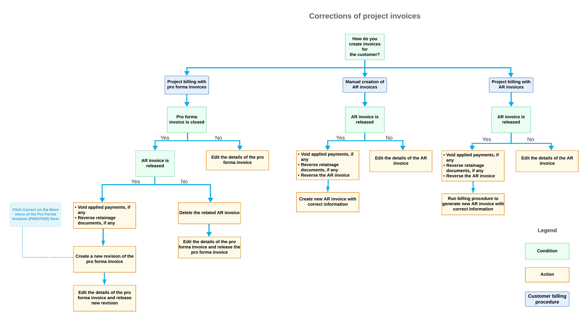

# Project Invoice Correction: General Information {#_7b5b562a-d352-4dec-afe6-77167523ae05 .concept}

In some cases, you may need to make corrections to the project invoices—that is, pro forma invoices and accounts receivable invoices that have been prepared for a project—to ensure accurate financial records.

## Learning Objectives { .section}

In this chapter, you will learn how to do the following:

-   Decide how a project invoice should be corrected
-   Correct a pro forma invoice depending on its current status
-   Correct an accounts receivable invoice that originates from a pro forma invoice

## Applicable Scenarios { .section}

You make corrections to pro forma invoices and accounts receivable invoices in the following cases:

-   You have found a mistake in the entry of customer details, invoice amounts, or other relevant information in the prepared project invoice.
-   A customer has asked you to change some details in the already-prepared project invoice.

## Types of Project Invoices { .section}

Depending on your company's business requirements, you may have the following types of project invoices in the system:

-   A direct AR invoice: This AR invoice is created directly during the project billing procedure; the invoice is related to a project that has the **Create Pro Forma Invoice on Billing** check box cleared on the **Summary** tab of the [Projects](PM_30_10_00.md) \(PM301000\) form. A direct AR invoice does not have a corresponding pro forma invoice.
-   An AR invoice that originates from a pro forma invoice: This AR invoice is created on release of the pro forma invoice. The pro forma invoice is created by the project billing procedure and is related to a project that has the **Create Pro Forma Invoice on Billing** check box selected on the **Summary** tab of the [Projects](PM_30_10_00.md) \(PM301000\) form.
-   Manual AR invoice: This AR invoice is related to the project but was not generated by the billing procedure; instead, a user has entered this invoice manually. A manual AR invoice does not have a corresponding pro forma invoice.

## Project Invoice Correction { .section}

The way you correct the project invoices depends on the type of the project invoices, current status of the documents, and the type of billing information included in the documents. The following list describes the main conditions that determine the way to correct the project invoice:

-   If a project invoice is not released yet, you edit its details on the following form:
    -   [Invoices and Memos](AR_30_10_00.md) \(AR301000\) if you need to correct a manual AR invoice or direct AR invoice
    -   [Pro Forma Invoices](PM_30_70_00.md) \(PM307000\) if you need to correct a pro forma invoice
-   If the document is a closed pro forma invoice, you correct it as follows:
    1.  If the related AR invoice has the *On Hold* or *Balanced* status, you can delete the AR invoice and then edit the settings of the pro forma invoice.
    2.  If the related AR invoice has been released, you can create a new revision of the pro forma invoice. To do this, you click **Correct** on the form toolbar of the [Pro Forma Invoices](PM_30_70_00.md) \(PM307000\) form. For more information, see [Correcting Pro Forma Invoices](Construction_PF_Correction_Mapref.md).
    3.  In all other cases, to correct the pro forma invoice, you need to perform the following steps:
        1.  Void the applied payments.
        2.  Reverse the retainage documents.
        3.  Reverse the AR invoice that has been created based on this pro forma invoice by clicking **Reverse** on the form toolbar of the [Invoices and Memos](AR_30_10_00.md) \(AR301000\) form. Then you will be able to edit the details of the pro forma invoice. For more information about AR invoice reversal, see [Project Invoice Correction: Reversing AR Documents](Projects_Correcting_Project_Invoices_Reversing_AR_Docs.md).
-   If the document is an open AR invoice with no corresponding pro forma invoice \(that is, it is either a manual invoice or a direct invoice\), you need to reverse this AR invoice by clicking **Reverse** on the form toolbar of the [Invoices and Memos](AR_30_10_00.md) \(AR301000\) form.
-   If the document is a closed AR invoice with no corresponding pro forma invoice \(that is, it is either a manual invoice or a direct invoice\), you need to do the following:
    1.  Void applied payments.
    2.  Reverse retainage documents.
    3.  Reverse the AR invoice by using the **Reverse** command on the form toolbar of the [Invoices and Memos](AR_30_10_00.md) \(AR301000\) form.
    4.  Either create a new manual AR invoice with the correct settings or run the billing procedure again and make the needed corrections to the resulting AR invoice.

The following diagram illustrates the possible ways to correct a project invoice and the conditions you consider to select the appropriate method.

**Parent topic:**[Correcting Project Invoices](../UserGuide/Projects_Correcting_Project_Invoices_Mapref.md)

