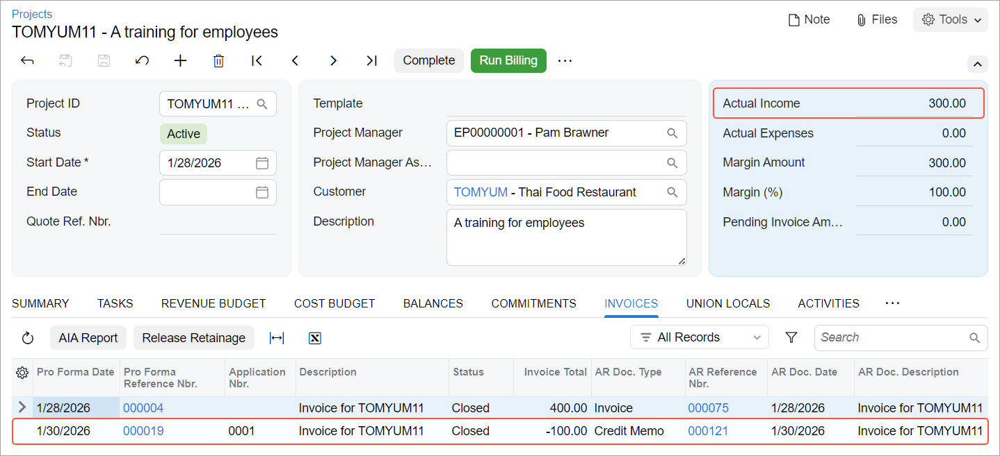

# Project Invoice Correction: To Prepare a Credit Memo for a Project {#_b7780e7e-a253-5571-9589-8ba50dc7ad77 .task}

In this activity, you will correct the actual amounts of a project that has been overcharged during the billing. To do this, you will create a credit memo for the project.

**Attention:** This activity is based on the *U100* dataset. If you are using another dataset or if any system settings have been changed in *U100*, these changes can affect the workflow of the activity and the results of the processing. To avoid issues, restore the *U100* dataset to its initial state.

## Story { .section}

Suppose that the Thai Food Restaurant customer recently ordered eight hours of training on how to use a juicer it had previously bought from the SweetLife Fruits &amp; Jams company. SweetLife's project accountant created a project for this training, a consultant of SweetLife provided the training, and the project accountant billed the customer.

Further suppose that the project accountant has realized that the consultant provided six hours of training instead of eight, so the company overcharged the customer by $100. Acting as the project accountant, you need to correct the actual amount of the project and create a credit memo for the project.

## Configuration Overview { .section}

In the *U100* dataset, the following tasks have been performed to support this activity:

-   On the [Enable/Disable Features](CS_10_00_00.md) \(CS100000\) form, the *Projects* feature has been enabled to provide support for the project management functionality.
-   On the [Projects](PM_30_10_00.md) \(PM301000\) form, the *TOMYUM11* project has been created and the *TRAINING* project task has been created for the project. On the **Summary** tab \(**Billing and Allocation Settings** section\), the **Create Pro Forma Invoice on Billing** check box has been selected for the project.
-   For the project, the *000004* pro forma invoice and the corresponding *000075* accounts receivable invoice have been created and released on the [Pro Forma Invoices](PM_30_70_00.md) \(PM307000\) and [Invoices and Memos](AR_30_10_00.md) \(AR301000\) forms, respectively.

## Process Overview { .section}

In this activity, on the [Projects](PM_30_10_00.md) \(PM301000\) form, you will update the pending invoice amount of the project with a negative amount and run project billing to prepare a pro forma invoice. On the [Pro Forma Invoices](PM_30_70_00.md) \(PM307000\) form, you will review the pro forma invoice and release it. You will then review the credit memo that was created based on the pro forma invoice and release the credit memo on the [Invoices and Memos](AR_30_10_00.md) \(AR301000\) form.

## System Preparation { .section}

To sign in to the system and prepare to perform the instructions of the activity, do the following:

1.  Launch the Acumatica ERP website and sign in as Pam Brawner using the *brawner* username and *123* password.
2.  In the info area at the upper-right corner of the top pane of the Acumatica ERP screen, make sure that the business date is set to *1/30/2026*. If a different date is displayed, click the Business Date menu button and select *1/30/2026* from the calendar. For simplicity, you'll create and process all documents in this activity using this business date.

## Step: Creating a Credit Memo for the Project { .section}

To create a credit memo for the extra $100 that was billed for the project, do the following:

1.  On the [Projects](PM_30_10_00.md) \(PM301000\) form, open the *TOMYUM11* project. In the Summary area, notice that the actual income of the project is $400.
2.  On the **Revenue Budget** tab, enter `–100` as the **Pending Invoice Amount** of the only revenue budget line that you are going to correct.
3.  Save your changes to the project.
4.  On the form toolbar, click **Run Billing**.

    The system creates a pro forma invoice and opens it on the [Pro Forma Invoices](PM_30_70_00.md) \(PM307000\) form. In the Summary area, notice that the **Invoice Total** is negative and equals the amount you have specified for the revenue budget line of the project \(*–100.00*\).

5.  On the form toolbar, click **Remove Hold** to assign the pro forma invoice the *Open* status, and then click **Release**. The system assigns the *Closed* status to the pro forma invoice.

    The **Invoice Total** of a pro forma invoice on the [Pro Forma Invoices](PM_30_70_00.md) form was negative, so the system creates an accounts receivable credit memo when the pro forma invoice was released.

6.  On the **Financial** tab, click the **AR Ref. Nbr.** link to open the credit memo that has been created for the pro forma invoice.
7.  On the form toolbar of the [Invoices and Memos](AR_30_10_00.md) \(AR301000\) form, which opens, click **Remove Hold** to assign the credit memo the *Balanced* status, and then click **Release**.
8.  On the [Projects](PM_30_10_00.md) form, open the *TOMYUM11* project and press Esc to refresh the form. In the Summary area, notice that the actual income of the project, which has been updated as a result of the billing, is $300.

    On the **Invoices** tab, notice that the credit memo with the corresponding pro forma invoice has appeared in the table \(see below\).

    

You have adjusted the overcharged actual income in the project. In the next step of the process in a production environment \(which is beyond the scope of this activity\), an accounts receivable clerk would apply the created credit memo to the original invoice that has been corrected.

**Parent topic:**[Correcting Project Invoices](../UserGuide/Projects_Correcting_Project_Invoices_Mapref.md)

