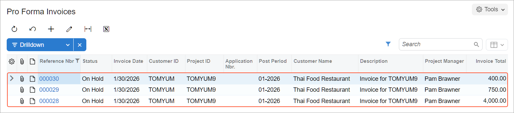

# Grouping of Invoices: Process Activity {#_c53c0234-16c1-4385-a86e-d9cecd34d4c0 .task}

This activity will walk you through the process of configuring project billing to create a single invoice for the project or to create multiple separate invoices. You will learn how to bill the project with different billing rules assigned to the project tasks, how to bill a project task separately from the other tasks of the project, and how to bill project transactions that are processed by particular steps of billing rules with a separate invoice.

**Attention:** This activity is based on the *U100* dataset. If you are using another dataset or if any system settings have been changed in *U100*, these changes can affect the workflow of the activity and the results of the processing. To avoid issues, restore the *U100* dataset to its initial state.

## Story { .section}

Suppose that the Thai Food Restaurant customer has ordered two juicers from the SweetLife Fruits &amp; Jams company, along with the following services: site review, installation, and employee training on operating the juicers. The project accountant of SweetLife has created the project to handle the tracking and billing of the provided materials and services. The project has three tasks that represent three phases of the project execution:

-   Phase 1: Installation of the first juicer
-   Phase 2: Installation of the second juicer
-   Phase 3: Training on operating the juicers

The juicers have been delivered and installed, and SweetLife's consultant has provided the training. Before each invoice is sent to the customer for payment, the customer has requested that a pro forma invoice be submitted for acceptance.

Acting as the project accountant, you will bill the customer with a single invoice. After the first billing, you will group the invoices in different ways based on the following customer's requests:

-   Create a separate invoice for the third phase
-   Create a separate invoice for the juicers

## Configuration Overview { .section}

In the *U100* dataset, the following tasks have been performed to support this activity:

-   On the [Enable/Disable Features](CS_10_00_00.md) \(CS100000\) form, the *Projects* feature has been enabled to support the project management functionality.
-   On the [Projects](PM_30_10_00.md) \(PM301000\) form, the *TOMYUM9* project has been created and three project tasks have been configured.
-   On the [Project Transactions](PM_30_40_00.md) \(PM304000\) form, the *PM00000005* batch of project transactions related to the project has been created and released.

## Process Overview { .section}

To bill a time and material project, you first will review and configure project invoices with the billing rule on the [Billing Rules](PM_20_70_00.md) \(PM207000\) form and with the project tasks on the [Projects](PM_30_10_00.md) \(PM301000\) form. Then you will bill the project on the [Projects](PM_30_10_00.md) form. Finally, you will review the created pro forma invoice on the [Pro Forma Invoices](PM_30_70_00.md) \(PM307000\) form.

## System Preparation { .section}

Before you begin performing the steps of this activity, perform the following instructions to prepare the system:

1.  Launch the Acumatica ERP website, and sign in to a company with the *U100* dataset preloaded; you should sign in as project accountant by using the *brawner* username and the *123* password.
2.  In the info area at the upper-right corner of the top pane of the Acumatica ERP screen, make sure that the business date is set to *1/30/2026*. If a different date is displayed, click the Business Date menu button and select *1/30/2026* from the calendar. For simplicity, you'll create and process all documents in this activity using this business date.

## Step 1: Billing a Project with Multiple Billing Rules { .section}

To bill the project with different billing rules assigned to the project tasks, do the following:

1.  On the [Projects](PM_30_10_00.md) \(PM301000\) form, open the *TOMYUM9* project.
2.  On the **Cost Budget** tab, review the cost budget of the project. Make sure that it includes:
    -   Three lines with the *PHASE1* project task
    -   Three lines with the *PHASE2* project task
    -   One line with the *PHASE3* project task
3.  On the **Tasks** tab, in the line with the *PHASE2* task, change the billing rule in the **Billing Rule** column to *TM*. When you bill the project, the system will use this billing rule to process unbilled transactions associated with this project task.
4.  Save your changes to the project.
5.  On the form toolbar, click **Run Billing**.

    The system creates a pro forma invoice and opens it on the [Pro Forma Invoices](PM_30_70_00.md) \(PM307000\) form.

6.  On the **Time and Material** tab, review the invoice lines and notice that lines related to all the project tasks are in the same invoice, even though the project tasks have different billing rules assigned. You need to reconfigure the billing to prepare a separate pro forma invoice for each project task.
7.  Delete the pro forma invoice, so you can bill this project again when you change the configuration of project billing.

## Step 2: Billing Project Tasks Separately { .section}

To bill the *PHASE3* project task separately from the other project tasks, do the following:

1.  On the [Projects](PM_30_10_00.md) \(PM301000\) form, open the *TOMYUM9* project.
2.  On the **Tasks** tab, do the following to add a needed table column to those displayed on the tab:
    1.  In the table, click the Column Configuration button, the leftmost icon among the column headers. The system opens the **Column Configuration** dialog box.
    2.  Search for the **Bill Separately** column and select the unlabeled check box for it.
    3.  Click **OK** to apply your changes to the list of columns and close the dialog box.
3.  In the row with the *PHASE3* task, select the check box in the **Bill Separately** column to bill the task with a separate invoice.
4.  Save your changes to the project.
5.  On the form toolbar, click **Run Billing**, and review the generated invoices on the Pro Forma Invoices \(PM3070PL\) list of records, which opens.

    The system created two pro forma invoices. One invoice includes the transactions related to the *PHASE3* project task, and the other invoice includes the transactions related to the other project tasks.

6.  Click the link in the **Reference Nbr.** column to open the pro forma invoice with the total amount of $4,750 on the [Pro Forma Invoices](PM_30_70_00.md) \(PM307000\) form. On the **Time and Material** tab, review the lines of the invoice. Notice that the invoice includes lines related to the *PHASE1* and *PHASE2* tasks.
7.  Delete the pro forma invoice. The system navigates you back to the Pro Forma Invoices list of records.
8.  Click the link in the **Reference Nbr.** column to open the pro forma invoice with the total amount of $400 on the [Pro Forma Invoices](PM_30_70_00.md) form. On the **Time and Material** tab, review the lines of the invoice. Notice that the invoice has a line related to only the *PHASE3* task.
9.  Delete the pro forma invoice.

You have deleted the pro forma invoices you created, so you are able to bill the project again when you change the configuration of project invoices again.

## Step 3: Grouping Invoices by Steps of Billing Rules { .section}

To create a separate invoice for the juicers whose costs are tracked within the *MATERIAL* account group, do the following:

1.  On the [Billing Rules](PM_20_70_00.md) \(PM207000\) form, open the *TM* billing rule.
2.  In the left pane, click the row with the *10 \(Material cost plus markup\)* step.
3.  On the **Billing Settings** tab of the right pane, enter `MATERIAL` in the **Invoice Group** box.

    This step of the billing rule is used for time and material billing of transactions associated with the *MATERIAL* account group.

4.  Save your changes to the *TM* billing rule.
5.  On the [Billing Rules](PM_20_70_00.md) form, open the *COMBINED* billing rule.
6.  In the left pane, click the row with the *20 \(Material cost plus markup\)* step.
7.  On **Billing Settings** tab of the right pane, enter `MATERIAL` in the **Invoice Group** box.

    This step of the billing rule is used for time and material billing of transactions associated with the *MATERIAL* account group.

8.  Save your changes to the *COMBINED* billing rule.

    When you bill the project by using these billing rules, the system will group invoice lines created with the steps of the billing rules with the *MATERIAL* account group in a separate invoice.

9.  On the [Projects](PM_30_10_00.md) \(PM301000\) form, open the *TOMYUM9* project.
10. On the form toolbar, click **Run Billing**.

    The system creates three pro forma invoices, and opens the Pro Forma Invoices \(PM3070PL\) list of records, as shown below. The system has created one more separate invoice based on unbilled transactions with the *MATERIAL* account group using the steps of the billing rules with the *MATERIAL* invoice group.

    

11. Click the link in the **Reference Nbr.** column to open the pro forma invoice with the total amount of $400 on the [Pro Forma Invoices](PM_30_70_00.md) \(PM307000\) form. On the **Time and Material** tab, notice that the invoice includes one line related to the *PHASE3* task. Click Back in the browser window to go back to the list of records.
12. Click the link in the **Reference Nbr.** column to open the pro forma invoice with the total amount of $750 on the [Pro Forma Invoices](PM_30_70_00.md) form. On the **Time and Material** tab, notice that the invoice includes four lines related to the *PHASE1* and *PHASE2* tasks except the lines with juicers. Click Back in the browser window to go back to the list of records.
13. Click the link in the **Reference Nbr.** column to open the pro forma invoice with the total amount of $4,000 on the [Pro Forma Invoices](PM_30_70_00.md) form. On the **Time and Material** tab, notice that the invoice includes two lines with juicers related to the *MATERIAL* account group.

You have configured the grouping of pro forma invoices for the project and performed project billing with the new billing settings.

**Parent topic:**[Grouping Invoices](../UserGuide/Projects_Grouping_Invoices_Mapref.md)

