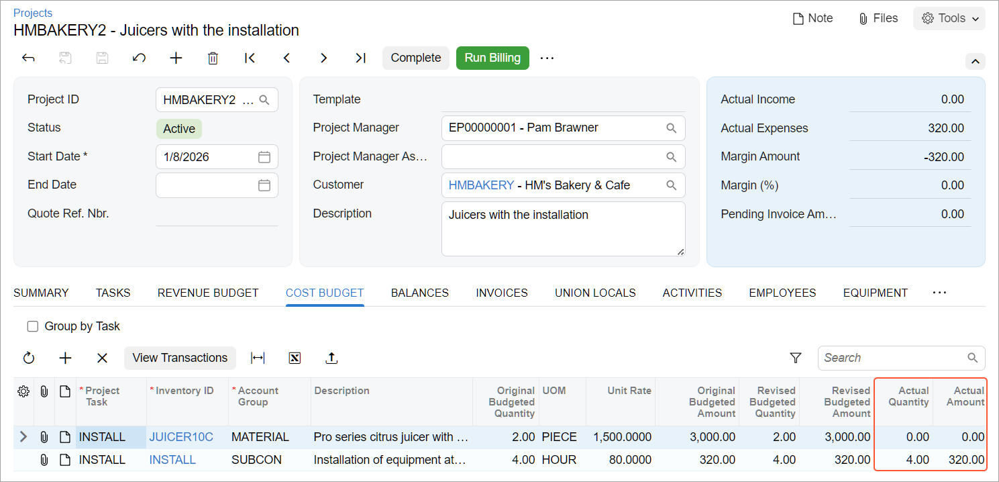

# Project Inventory Tracking by Warehouse Location: To Purchase Materials and Services for a Project {#_c53c0111-16c1-abb5-1234-d9cecd31d1c0 .task}

This activity will walk you through the process of purchasing materials and services to a project-specific warehouse location with a purchase order.

**Attention:** This activity is based on the *U100* dataset. If you are using another dataset or if any system settings have been changed in *U100*, these changes can affect the workflow of the activity and the results of the processing. To avoid issues, restore the *U100* dataset to its initial state.

## Story {#section_m3x_nn2_yrb .section}

Suppose that the HM's Bakery and Cafe customer has ordered two juicers, along with four hours of the installation service from the SweetLife Fruits &amp; Jams company. The SweetLife company contracted the Squeezo Inc. vendor to provide the juicers and perform the installation. SweetLife's project manager has created the project.

Acting as SweetLife's purchasing manager, you will process the purchase of materials and services for the project. When the vendor delivers the juicers to company's warehouse, you will process a purchase receipt for the juicers. When the vendor provides the installation service, you will process an accounts payable bill from the vendor for the delivered juicers and provided service.

## Configuration Overview { .section}

In the *U100* dataset, the following tasks have been performed to support this activity:

-   On the [Enable/Disable Features](CS_10_00_00.md) \(CS100000\) form, the following features have been enabled:
    -   *Projects*, which provides support for the project management functionality
    -   *Inventory and Order Management*, which provides the purchase order functionality
-   On the [Projects](PM_30_10_00.md) \(PM301000\) form, the *HMBAKERY2* project has been created and the *INSTALL* project task has been created for the project. This task is the default project task.
-   On the [Account Groups](PM_20_10_00.md) \(PM201000\) form, the *SUBCON* account group has been created. The *54200 \(Project Subcontract Expense\)* account has been mapped to the *SUBCON* account group.
-   On the [Warehouses](IN_20_40_00.md) \(IN204000\) form, the *EQUIPHOUSE* warehouse has been created, and the *HMBAKERY2* location has been created for the *INSTALL* task of the *HMBAKERY2* project.
-   On the [Vendors](AP_30_30_00.md) \(AP303000\) form, the *SQUEEZO* vendor has been created.
-   On the [Stock Items](IN_20_25_00.md) \(IN202500\) form, the *JUICER10C* stock item has been defined.
-   On the [Non-Stock Items](IN_20_20_00.md) \(IN202000\) form, the *INSTALL* non-stock item has been defined. On the **General** tab, the **Require Receipt** check box has been cleared. On the **GL Accounts** tab, *54200 \(Project Subcontract Expense\)* has been selected in the **Expense Account** box. On the **Price/Cost** tab, *Purchase* is selected in the **Post Cost to Expenses On** box.

## Process Overview { .section}

On the [Purchase Orders](PO_30_10_00.md) \(PO301000\) form, you will create a purchase order for the project, specifying the project and project task. Then you will create a purchase receipt and release it on the [Purchase Receipts](PO_30_20_00.md) \(PO302000\) form. You will bill the purchase order on the [Purchase Orders](PO_30_10_00.md) form and then release the bill on the [Bills and Adjustments](AP_30_10_00.md) \(AP301000\) form. Finally, you will review the project balances on the [Projects](PM_30_10_00.md) \(PM301000\) form.

## System Preparation { .section}

To sign in to the system and prepare to perform the instructions of the activity, do the following:

1.  Launch the Acumatica ERP website, and sign in to a company with the *U100* dataset preloaded; you should sign in as a project accountant by using the *brawner* username and the *123* password.
2.  In the info area at the upper-right corner of the top pane of the Acumatica ERP screen, make sure that the business date is set to *1/30/2026*. If a different date is displayed, click the Business Date menu button and select *1/30/2026* from the calendar. For simplicity, you'll create and process all documents in this activity using this business date.

## Step 1: Creating a Purchase Order for the Project { .section}

To create a purchase order for the project, do the following:

1.  On the [Purchase Orders](PO_30_10_00.md) \(PO301000\) form, create a new record.
2.  In the Summary area, specify the following settings:
    -   **Type**: *Normal*
    -   **Vendor**: *SQUEEZO*
    -   **Date**: *1/30/2026*
    -   **Project**: *HMBAKERY2*
    -   **Description**: `Purchase for HM's Bakery & Cafe`
3.  On the **Details** tab, add two purchase order lines that have the settings shown in the following table.

    |**Inventory ID**|**Order Qty.**|**Unit Cost**|**Cost Code**|
    |----------------|--------------|-------------|-------------|
    |*JUICER10C*|`2`|*1500*|*00-000*|
    |*INSTALL*|`4`|*80*|*00-000*|

    The system automatically inserts the *INSTALL* project task for each line when you select the *HMBAKERY2* project because this task is the default project task of the project. Also, in the line with the *JUICER10C* stock item, the *EQUIPHOUSE* warehouse is inserted automatically.

4.  In the Summary area, make sure that the **Order Total** value, which is the sum of the **Ext. Cost** of two lines \(*3,000.00* and *320.00*\), is *3,320.00*.
5.  Save the purchase order.
6.  On the form toolbar, click **Remove Hold**. The system assigns the purchase order the *Open* status.

## Step 2: Receiving the Purchased Materials to a Warehouse { .section}

To create a purchase receipt for the purchased materials, do the following:

1.  While remaining on the [Purchase Orders](PO_30_10_00.md) \(PO301000\) form with the purchase order selected, on the form toolbar, click **Enter PO Receipt**.

    The system creates a purchase receipt with the *Balanced* status for the *JUICER10C* item and opens it on the [Purchase Receipts](PO_30_20_00.md) \(PO302000\) form. The service item \(*INSTALL*\) does not require a purchase receipt and is not added to the created document.

2.  On the form toolbar, click **Release**.

    The system creates and releases an inventory receipt transaction based on the purchase receipt. On release of this transaction, the stock items are received to inventory. The purchase receipt is assigned the *Released* status.

## Step 3: Creating a Bill for the Purchase Order { .section}

To bill the purchase order, do the following:

1.  On the [Purchase Orders](PO_30_10_00.md) \(PO301000\) form, open the purchase order that you have created earlier in this activity.
2.  On the More menu \(under **Processing**\), click **Enter AP Bill** to create a bill for the purchase order.

    The system creates an accounts payable bill and opens the bill on the [Bills and Adjustments](AP_30_10_00.md) \(AP301000\) form. Make sure that both purchase order lines have been added to the bill.

3.  On the form toolbar, click **Remove Hold** to assign the AP bill the *Balanced* status, and then click **Release**.
4.  On the [Projects](PM_30_10_00.md) \(PM301000\) form, open the *HMBAKERY2* project.

    On the **Cost Budget** tab, review the actual values of the cost budget. Notice that the **Actual Quantity** and **Actual Amount** of the line with the *INSTALL* item have been updated and are now *4* and *320.00*, respectively \(see below\). The actual values for the line with the stock item \(*JUICER10C*\) are not updated yet: the system will record the cost of stock items to the project budget when the items are used for the project and issued from the project-specific warehouse location.

    

You have completed the processing of the purchase of materials and services for the project.

**Parent topic:**[Tracking Project Inventory by Warehouse Location](../UserGuide/Projects_Inventory_Locations_Mapref.md)

