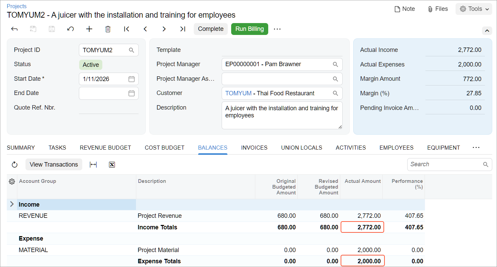

# Project Inventory Tracking by Warehouse Location: To Bill a Project {#_b7780e6e-0253-3331-9129-8ba40dc3ad3a .task}

This activity will walk you through the process of billing a project by using a combined billing rule that depends on the progress stage being billed.

**Attention:** This activity is based on the *U100* dataset. If you are using another dataset or if any system settings have been changed in *U100*, these changes can affect the workflow of the activity and the results of the processing. To avoid issues, restore the *U100* dataset to its initial state.

## Story { .section}

Suppose that the Thai Food Restaurant customer has ordered a juicer from the SweetLife Fruits &amp; Jams company, along with installation of the juicer and training of the company's employees on operating the juicer. The SweetLife project accountant has created a project to handle the tracking and billing of the juicer and the provided services. Both companies have agreed that the customer will be billed in two stages. At the end of the first stage, the customer will pay for 40 percent of the services, which have a fixed price, and for the juicer \(which is installed during the first stage\). At the end of the second stage \(after the project is completed\), the customer will pay for the remainder of the project.

Then suppose that on *1/30/2026*, the juicer has been delivered and installed. Acting as the project accountant, you need to update the progress of the project, process the issue of the juicer, and bill the customer for the first stage of the project.

## Configuration Overview { .section}

In the *U100* dataset, the following tasks have been performed to support this activity:

-   On the [Enable/Disable Features](CS_10_00_00.md) \(CS100000\) form, the following features have been enabled:
    -   *Projects*, which provides support for the project management functionality
    -   *Inventory and Order Management* feature, which provides the ability to maintain stock items and create and process sales orders and purchase orders
-   On the [Customers](AR_30_30_00.md) \(AR303000\) form, the *TOMYUM* customer has been defined.
-   On the [Projects](PM_30_10_00.md) \(PM301000\) form, the *TOMYUM2* project has been created for this customer, and two project tasks \(*PHASE1* and *PHASE2*\) have been added. Also, on the **Summary** tab, the **Create Pro Forma Invoice on Billing** check box is selected, indicating that a pro forma invoice is created when the project is billed.
-   On the [Billing Rules](PM_20_70_00.md) \(PM207000\) form, the *COMBINED* billing rule has been created; it has been assigned to both project tasks of the *TOMYUM2* project on the [Projects](PM_30_10_00.md) form.For an example of configuring a combined billing rule, see [Billing Rules: To Configure a Combined Billing Rule](Billing_Rules_Implem_Activity_Combined.md).
-   On the [Warehouses](IN_20_40_00.md) \(IN204000\) form, the *EQUIPHOUSE* warehouse has been created, and the *TOMYUM2* location has been created and associated with the *PHASE1* task of the *TOMYUM2* project.
-   On the [Stock Items](IN_20_25_00.md) \(IN202500\) form, the *JUICER15* stock item has been defined.

## Process Overview { .section}

You will issue the stock item for the project on the [Issues](IN_30_20_00.md) \(IN302000\) form to record the sale of a juicer. You will update the progress of the project on the [Projects](PM_30_10_00.md) \(PM301000\) form and run the project billing. You will review the created pro forma invoice and release it on the [Pro Forma Invoices](PM_30_70_00.md) \(PM307000\) form to create the corresponding accounts receivable invoice. On the [Invoices and Memos](AR_30_10_00.md) \(AR301000\) form, you will review the prepared accounts receivable invoice, and release the invoice. Finally, you will review the project to make sure that the release of the AR invoice has caused the system to correctly update the actual amounts of the project.

## System Preparation { .section}

To sign in to the system and prepare to perform the instructions of the activity, do the following:

1.  Launch the Acumatica ERP website, and sign in to a company with the *U100* dataset preloaded; you should sign in as Pam Brawner by using the *brawner* username and the *123* password.
2.  In the info area at the upper-right corner of the top pane of the Acumatica ERP screen, make sure that the business date is set to *1/30/2026*. If a different date is displayed, click the Business Date menu button and select *1/30/2026* from the calendar. For simplicity, you'll create and process all documents in this activity using this business date.

## Step 1: Issuing a Stock Item for the Project { .section}

To directly issue a stock item for the project \(to record that the juicer that has been delivered to the customer\) and capture the issued cost on the project, do the following:

1.  On the [Issues](IN_30_20_00.md) \(IN302000\) form, add a new record.
2.  In the Summary area, type `A juicer for Thai Food Restaurant` in the **Description** box.
3.  On the table toolbar of the **Details** tab, click **Add Row**, and specify the following settings in the row:

    -   **Tran. Type**: *Issue*
    -   **Inventory ID**: *JUICER15*
    -   **Warehouse**: *EQUIPHOUSE* \(inserted automatically\)
    -   **Location**: *TOMYUM2*
    -   **Quantity**: `1`
    -   **Unit Price**: `2,500`
    -   **Reason Code**: *INISSUEPROJ*
    -   **Inventory Source**: *Project Stock* \(inserted automatically\)
    -   **Project**: *TOMYUM2* \(inserted automatically\)
    -   **Project Task**: *PHASE1* \(inserted automatically\)
    -   **Cost Code**: *00-000*
    In the footer of the table, the system shows that one juicer is available for issue for the selected project and warehouse location. **Unit Cost** in the line is $2,000. This is the cost at which the item will be issued from inventory.

4.  Save the inventory issue, and release it.
5.  On the [Projects](PM_30_10_00.md) \(PM301000\) form, open the *TOMYUM2* project.
6.  On the **Cost Budget** tab, make sure that the line with the *PHASE1* project task and the *JUICER15* inventory item was created based on the inventory issue you have released. The **Actual Quantity** is `1` because you have issued one juicer from the project-specific location. The **Actual Amount** of the line is $2,000, which is the amount of the related project transaction \(that is, the cost of the juicer\).
7.  On the table toolbar of the tab, click **View Transactions**. On the [Project Transaction Details](PM_40_10_00.md) \(PM401000\) form, which opens, review the only row in the table. The **Amount** of the transaction is $2,000, the **Billable** check box is selected, and the **Billed** check box is cleared. This transaction will be billed by the time and material step of the billing rule assigned to the *PHASE1* project task.
8.  Close the form to return to the [Projects](PM_30_10_00.md) form.

## Step 2: Billing the Project { .section}

To update the progress of project completion and bill the project, do the following:

1.  While you are still viewing the *TOMYUM2* project on the [Projects](PM_30_10_00.md) \(PM301000\) form, on the **Revenue Budget** tab, specify `40` as the **Completed \(%\)** of each revenue budget line. Notice that the system calculates the **Pending Invoice Amount** for each line \($112 for the *PHASE1* project task, and $160 for the *PHASE2* project task\). This pending amount will be billed by the progress billing step of the billing rule assigned to the *PHASE1* and *PHASE2* project tasks.
2.  Save your changes to the project, and on the form toolbar, click **Run Billing**. The system creates a pro forma invoice and opens it on the [Pro Forma Invoices](PM_30_70_00.md) \(PM307000\) form. Review the invoice details and notice the following:
    -   On the **Progress Billing** tab, the **Amount to Invoice** in each line is equal to the **Pending Invoice Amount** of the corresponding revenue budget line of the *TOMYUM2* project on the **Revenue Budget** tab of the [Projects](PM_30_10_00.md) form.
    -   On the **Time and Material** tab, the system has generated a line with the *JUICER15* item. The **Amount to Invoice** in the line is the price of the juicer \($2,500\).
3.  On the form toolbar, click **Remove Hold** to assign the pro forma invoice the *Open* status, and then click **Release** to release the pro forma invoice. The system creates the accounts receivable invoice based on the pro forma invoice and assigns the *Closed* status to the pro forma invoice.
4.  On the **Financial** tab, click the **AR Ref. Nbr.** link to open the accounts receivable invoice that was created on the [Invoices and Memos](AR_30_10_00.md) \(AR301000\) form. The AR invoice has three lines: two lines with the **Inventory ID** column empty that have been generated with the progress billing step of the billing rule \(in the amounts of $112 and $160\), and a line generated by the time and material step with the *JUICER15* item and the amount of $2,500.
5.  On the form toolbar of the [Invoices and Memos](AR_30_10_00.md) form, click **Remove Hold** to assign the invoice the *Balanced* status, and then click **Release** to release the accounts receivable invoice.
6.  On the [Projects](PM_30_10_00.md) form, open the *TOMYUM2* project, and on the **Balances** tab, review the amounts in the budget lines that have been updated as the result of the billing \(see below\). **Actual Amount** for the *REVENUE* group is $2,772, which is the sum of the price of the juicer \($2,500\) and 40 percent of the price of the services \($112 + $160\); **Actual Amount** for the *MATERIAL* group is $2,000, which is the cost of the juicer.

    

You have finished billing the project with a combined billing rule.

**Parent topic:**[Tracking Project Inventory by Warehouse Location](../UserGuide/Projects_Inventory_Locations_Mapref.md)

