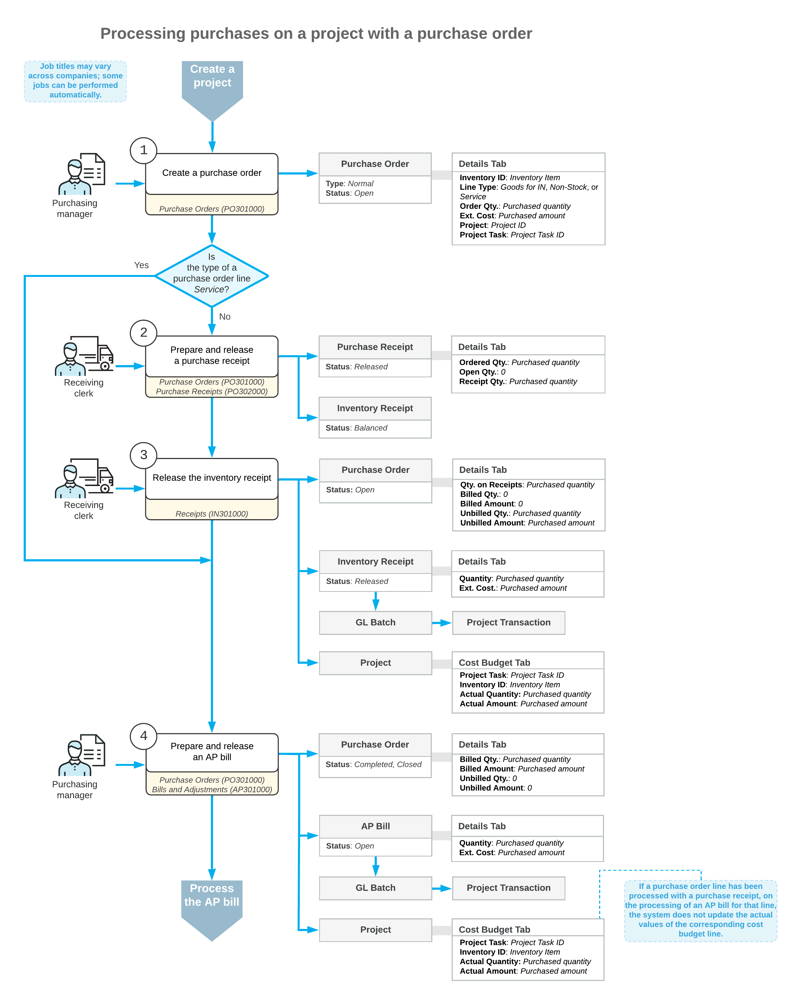

# Project Inventory Tracking by Warehouse Location: Purchases of Materials and Services {#_777935c4-458d-4663-ab7e-33ed0dd10f58 .concept}

In Acumatica ERP, you can purchase materials and services for a particular project so that these purchases will be recorded as commitments to the cost budget of the project. This helps you to track the amount of money and resources spent on the project against the budgeted values and the project profitability.

The following sections explain how you process purchases for a project in which separate warehouse locations are configured for each project task.

## Purchase of Materials and Services for a Project {#section_ewp_x4s_qqb .section}

To process a purchase of materials and services for a project with these items being received to a warehouse, you use a purchase order of the *Normal* type. On the **Details** tab of the [Purchase Orders](PO_30_10_00.md) \(PO301000\) form, to associate a purchase order line with a project, you specify the project and project task in the line. It is possible to process purchases for multiple projects with a single purchase order.

**Tip:** If you purchase some material from a vendor directly to a customer and do not need to receive the material to your warehouse, use a purchase order of the *Project Drop Ship* type for processing this purchase. For more information, see [Purchases to the Project Site: General Information](Projects_Purchase_to_Project_Site_GeneralInfo.md) and [Purchases to the Project Site with a Receipt: General Information](Projects_Purchase_with_Receipt_GeneralInfo.md).

The processing of a purchase order line depends on the type of the inventory item specified in this line. When you select an inventory item in a purchase order line, the system assigns the line one of the following types, depending on the selected item:

-   *Goods for IN* type: A stock item. For more information on processing purchases of stock items, see [Purchases of Stock Items: General Information](OrderMgmt_Standard_Inventory_Purchase_GeneralInfo.md).
-   *Non-Stock* type: A non-stock item that is configured so that the system requires a purchase receipt for it. For more information on purchasing non-stock items with receipts, see [Purchases of Non-Stock Items and Services with Receipts: General Information](OrderMgmt_Purchase_of_Non_Stock_Items_and_Services_with_Receipt_General_Info.md).
-   *Service* type: A non-stock item that is configured so that the system does not require a purchase receipt for it. For more information on purchasing services, see [Purchases of Services Without Receipts: General Information](OrderMgmt_Purchase_of_Services_without_Receipt_GeneralInfo.md).

When the items of a purchase order have been received to a warehouse, you create a purchase receipt by opening the purchase order and clicking **Enter PO Receipt** on the form toolbar of the [Purchase Orders](PO_30_10_00.md) form. The system automatically adds the purchase order lines of the *Goods for IN* and *Non-Stock* types to the created purchase receipt and opens it on the [Purchase Receipts](PO_30_20_00.md) \(PO302000\) form.

If the **Internal Cost Commitment Tracking** check box is selected on the [Projects Preferences](PM_10_10_00.md) \(PM101000\) form, when the purchase receipt is released and the corresponding inventory receipt is released on the [Receipts](IN_30_10_00.md) \(IN301000\) form, the system updates the committed values in the corresponding budget lines of the project on the **Cost Budget** tab of the [Projects](PM_30_10_00.md) \(PM301000\) form.

After the items have been received, you create an accounts payable bill for the purchase order selected on the [Purchase Orders](PO_30_10_00.md) form by clicking **Enter AP Bill** on the form toolbar. Then you release the prepared AP bill on the [Bills and Adjustments](AP_30_10_00.md) \(AP301000\) form.

When the bill is released, for the purchase order lines of the *Service* type, the system updates the actual values in the cost budget lines of the project with the same project budget key on the **Cost Budget** tab of the [Projects](PM_30_10_00.md) form.

**Tip:** For the stock items, the system will record the actual values in the cost budget lines of the project when the items will be used for the project \(that is, when the inventory issue with these items will be released\).

## Workflow of Purchasing Materials and Services for Projects {#section_i3l_d4p_mcb .section}

The following diagram illustrates the workflow of purchasing materials and services for projects using purchase orders.

**Parent topic:**[Tracking Project Inventory by Warehouse Location](../UserGuide/Projects_Inventory_Locations_Mapref.md)

