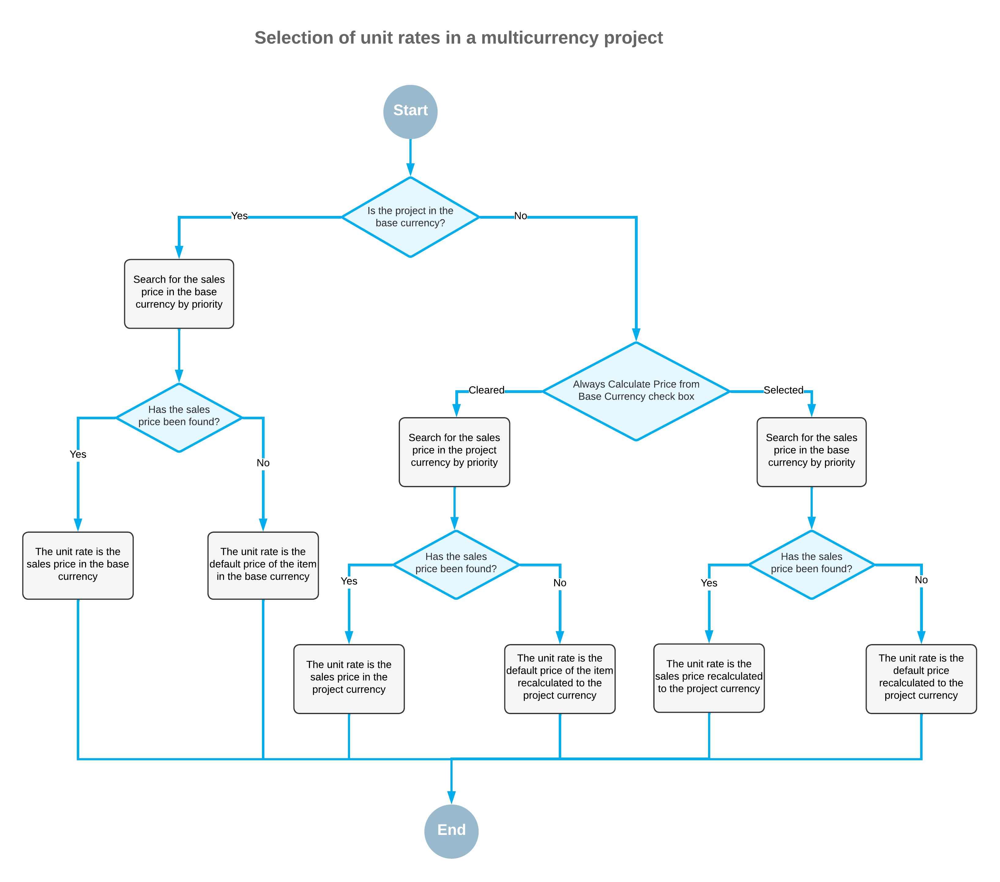

# Multicurrency Projects: Unit Rates in the Project Budget {#_43d811fa-89ba-46fc-9731-efd3f7900dc1 .concept}

This topic describes how the system selects unit rates in the project budget.

When you create a new project budget line on the **Revenue Budget** tab of the [Projects](PM_30_10_00.md) \(PM301000\) form, the system automatically fills in the unit rate of the line with the applicable price of the selected inventory item. The way the system searches for the applicable price depends on the system settings and currency settings of the project.

The following diagram illustrates how the system searches for unit rates for multicurrency projects.

If the project currency \(which is specified in the **Project Currency** box on the **Summary** tab\) is the same as the base currency, the system searches the sales prices in the system for an applicable price of the inventory item in the base currency that is effective on the document date or the start date of the project. For more details on how the system searches for the price, see [Sales Prices: Rules of Price Selection](Prices_Sales_Price_Selection_GeneralInfo.md). If the effective sales price was not found, the system specifies the default price of the item as the unit rate.

If the project currency differs from the base currency, the way the system searches for an applicable sales price depends on the state of the **Always Calculate Price from Base Currency Price** check box on the [Accounts Receivable Preferences](AR_10_10_00.md) \(AR101000\) form as follows:

-   If the check box is cleared, the system looks for an effective sales price of the item in the project currency and inserts this value as the unit rate.

    **Note:** The effective sales prices specified in the base currency are ignored during the search.

    If the sales price is not found, the system uses the default price of the item recalculated to the project currency using the rate that is effective on the start date of the project.

-   If the check box is selected, the system looks for an effective sales price of the item in the base currency, recalculates this price to the document currency by using the rate that is effective on the start date of the project, and inserts this value as the unit rate.

If no effective sales price is found, then regardless of the state of the check box, the system searches for the default price of the item. The system converts the default price from the base currency to the project currency by using the rate that is effective on the start date of the project and inserts this value as the unit rate.

If no default price has been found for the item, the system will insert *0* as the unit rate of the project budget line.

**Parent topic:**[Managing Multicurrency Projects](../UserGuide/Projects_Multicurrency_Projects_Mapref.md)

