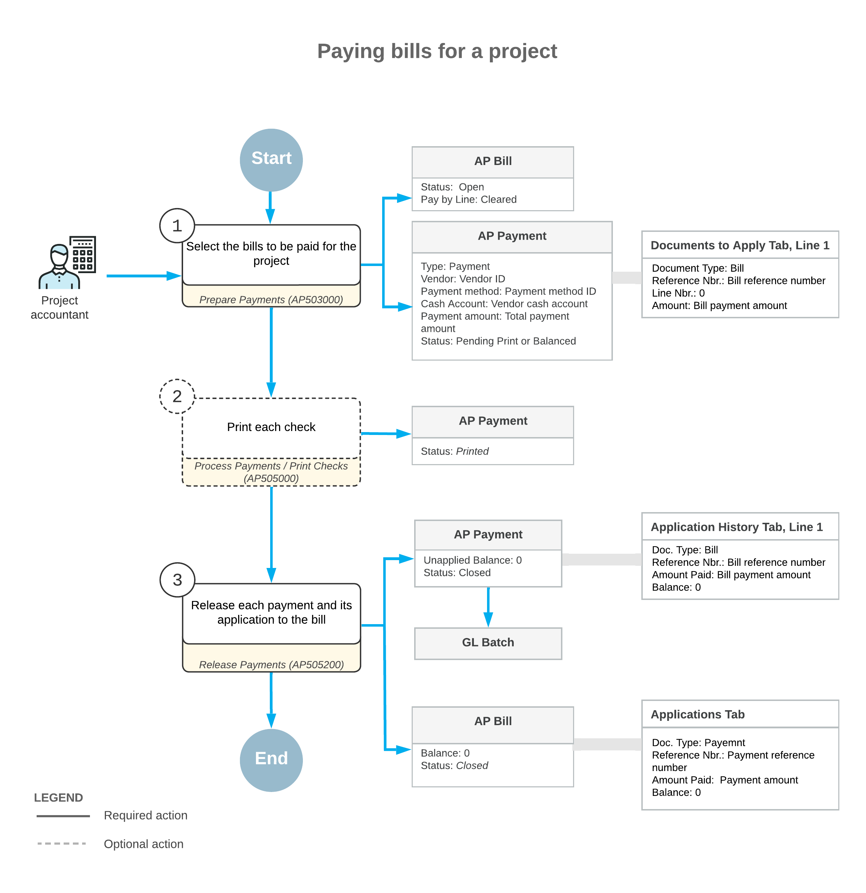
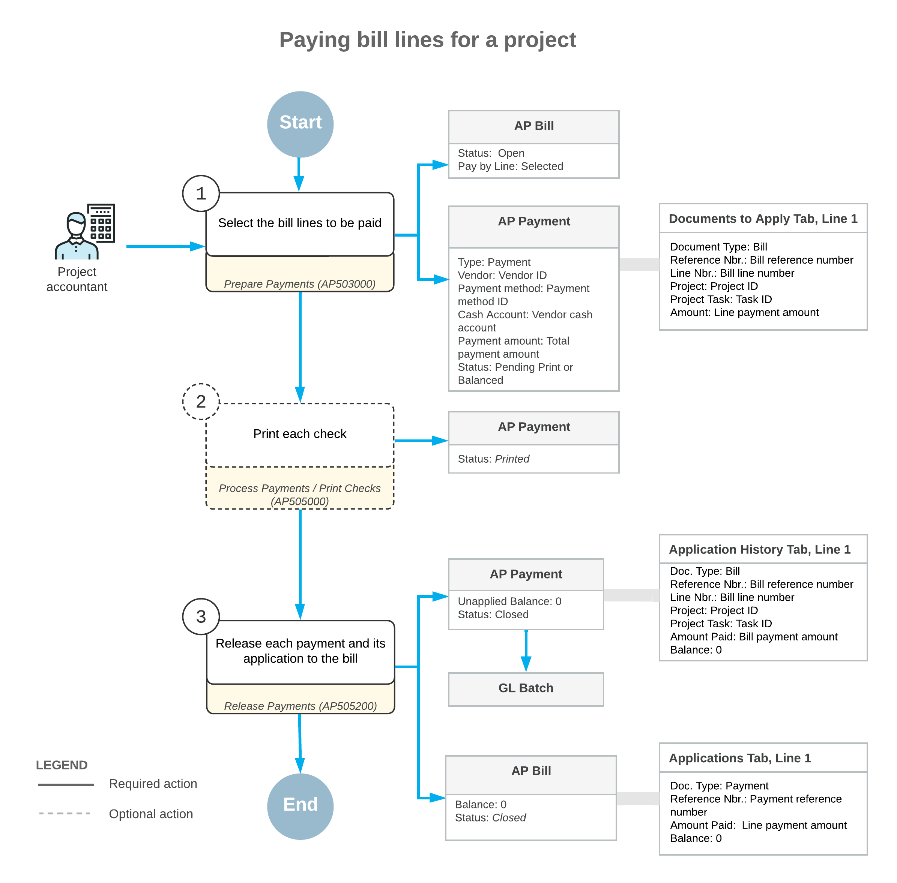

# Vendor Payments for a Project: General Information {#_065cec07-6152-4add-96c7-b50a480502ed .concept}

To pay for services provided by a vendor for a particular project in Acumatica ERP, you need to create an AP payment, which is a document that represents the payment in the system, and apply it to the corresponding AP bill or bills.

## Learning Objectives {#section_rqg_dtc_14b .section}

In this chapter, you will learn how to do the following:

-   Select the bills or bill lines to be paid
-   Prepare and release a payment for multiple bills for the same project

## Applicable Scenarios {#section_ck1_ftc_14b .section}

You may need to prepare and process a vendor payment for a project in Acumatica ERP when the vendor’s bill is due or multiple bills of this vendor related to the project are due on the same date. Also, when you prepare the payment, you may need to do one the following:

-   Pay multiple bills for a project with a single payment document
-   Pay particular lines of multiple bills with a single payment document
-   Pay multiple bills at the same time and prepare separate payment documents for some of these bills and a consolidated payment document for the rest of the bills

## Payment for Bills Related to a Project {#section_c3x_r5c_14b .section}

To speed the process of preparing and processing payments for a project, you initiate the payment process on the [Prepare Payments](AP_50_30_00.md) \(AP503000\) form. In the Selection area of the [Prepare Payments](AP_50_30_00.md) form, you select the project for which you want to list bills for possible payment generation. You can also filter the listed bills by payment date, cash account, payment method, vendor, and discount availability. Then in the table on the **Documents to Pay** tab, you select the bills to be paid \(the system inserts the full balance in the **Amount Paid** column, but you can instead specify a partial one to be paid\), and click **Process** on the form toolbar to generate the payments for the selected bills.

**Tip:** If you need to process a payment for one bill, you can manually create a payment on the [Checks and Payments](AP_30_20_00.md) \(AP302000\) form and process this payment to completion. For more information on creating a payment for a particular bill, see [AP Bill Payments: General Information](Finance_PayingAPBills_GeneralInfo.md).

The system generates an AP payment \(or multiple payments grouped by the vendor\) for the selected bills. If the payment method specified in any of the processed AP payments requires a check to be printed, the system opens the [Process Payments / Print Checks](AP_50_50_00.md) \(AP505000\) form with these payments listed; on this form, you select the payments for which the checks should be printed and click **Process** on the form toolbar. Then on the [Release Payments](AP_50_52_00.md) \(AP505200\) form, you mass-release the AP payments. The system releases the AP payments, applies the payment amount to the corresponding bill or bills, and decreases the open balance of these bills. Once the payment amount is applied in full, the payment is assigned the *Closed* status.

## Workflow of the Process of Paying Bills for a Project {#section_n1m_tfj_h4b .section}

The following diagram illustrates the workflow of processing payments for vendors’ bills related to a project.

## Payment for Separate Bill Lines for a Project {#section_kf3_55c_14b .section}

If your company needs to manage expenses and payments at a granular level, you can configure payment by document lines. If the *Payment Application by Line* feature is enabled on the [Enable/Disable Features](CS_10_00_00.md) \(CS100000\) form, you select the **Pay by Line** check box in the Summary area of the [Bills and Adjustments](AP_30_10_00.md) \(AP301000\) form to indicate that individual lines of the bill can be paid. For more information, see [Applying Payments to Particular Lines of AP Documents](Finance_AP_Payments_for_Particular_Lines_Mapref.md).

You can use the [Prepare Payments](AP_50_30_00.md) \(AP503000\) form to process bill lines just as you use it to process bills. You start by specifying selection criteria, which can include the vendor and the project, for the bills and bill lines to be listed. You can prepare and process payments that include both bills and individual bill lines. On the **Documents to Pay** tab of this form, bills or bill lines are listed for each included document, depending on the state of the **Pay by Line** check box of the [Bills and Adjustments](AP_30_10_00.md) form:

-   For each bill or retainage document for which the check box is cleared, the system displays one aggregated line. If you have selected a project in the Selection area of the current form and at least one line in the bill or retainage document contains the project, the document appears in the table as an aggregated line with the total amount for all lines of the bill.
-   For each bill for which the check box is selected, the system displays individual bill lines.

On the **Documents to Pay** tab of the [Prepare Payments](AP_50_30_00.md) form, you select the bills and individual lines for which you need to process payments and specify the amount to be paid for each bill or line. Then you click **Process** on the form toolbar to generate the AP payment or payments.

After that, you release each AP payment and payment application on the [Release Payments](AP_50_52_00.md) \(AP505200\) form; the system updates the open balances of the lines to which each payment was applied. When the payment is applied in full, it is assigned the *Closed* status.

## Workflow of the Process of Paying Bill Lines for a Project {#section_w4y_sfj_h4b .section}

The following diagram illustrates the workflow of processing payment for individual bill lines related to a vendor’s work on a project.

## Preparation of Separate Payments {#section_kmg_cxc_14b .section}

When you mass-create payments for multiple bills or bill lines of a project on the [Prepare Payments](AP_50_30_00.md) \(AP503000\) form, the system groups the prepared accounts payable payments by vendor. That is, a separate AP payment is created for all bills and bill lines of the same vendor. If the **Pay Separately** check box is selected for a vendor on the **Payment** tab of the [Vendors](AP_30_30_00.md) \(AP303000\) form, however, each vendor document is paid with a separate payment.

If you want to prepare a separate AP payment for a specific bill, select the **Pay Separately** check box in the line of the **Documents to Pay** tab on the [Prepare Payments](AP_50_30_00.md) form. When you process multiple bills at a time, the system prepares a separate AP payment for each document that has the **Pay Separately** check box selected, and a consolidated payment for the rest of the documents of the same vendor selected for processing.

When you prepare a payment for multiple bill lines at a time, if the **Pay Separately** check box is selected for at least one bill line, the system prepares a separate AP payment for this bill and includes in this AP payment all the bill lines that have been selected for processing. For the remaining bill lines and bills selected for processing that have this check box cleared and have the same vendor, the system creates a consolidated payment.

**Parent topic:**[Paying AP Bills by Project](../UserGuide/Projects_PayingAPBills_Mapref.md)

