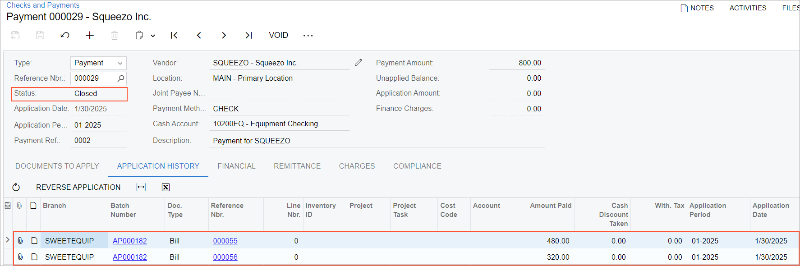

# Vendor Payments for a Project: To Process a Payment for Multiple Bills {#_7dc160fb-b24a-4102-ab26-882ffabfa7a2 .task}

In this activity, you will generate a payment for multiple bills for a project and apply this payment to bills.

**Attention:** This activity is based on the *U100* dataset. If you are using another dataset or if any system settings have been changed in *U100*, these changes can affect the workflow of the activity and the results of the processing. To avoid issues, restore the *U100* dataset to its initial state.

## Story {#section_itd_vbk_c4b .section}

Suppose that the HM's Bakery and Cafe requested 20 hours of employee training on operating juicers. SweetLife's project accountant has created a project to track the revenues and expenses for these services. Further suppose that the SweetLife project manager then decided to contract the Squeezo Inc. vendor to conduct the training.

On January 15, 2026, the SweetLife project accountant entered the first bill it received from the Squeezo Inc. for 12 hours of the employee training. Then on January 25, 2026, one more bill from Squeezo Inc. was received \(and entered by the project accountant\) for 8 hours of the provided training services. The vendor has requested that both bills be paid with one payment by the end of the month. Acting as SweetLife's project accountant, you need to pay the bills related to the project with one payment.

## Configuration Overview {#section_jtd_vbk_c4b .section}

In the *U100* dataset, the following tasks have been performed to support this activity:

-   On the [Enable/Disable Features](CS_10_00_00.md) \(CS100000\) form, the following features have been enabled:
    -   *Standard Financials*, which provides the standard financial functionality
    -   *Projects*, which provides the project accounting functionality
-   On the [Customers](AR_30_30_00.md) \(AR303000\) form, the *HMBAKERY* customer has been created.
-   On the [Projects](PM_30_10_00.md) \(PM301000\) form, the *HMTRAINING* project has been created for the *HMBAKERY* customer, and the *TRAINING* project task has been added to the project.
-   On the [Non-Stock Items](IN_20_20_00.md) \(IN202000\) form, the *TRAINING* non-stock item has been configured, which represents one hour of the training service.
-   On the [Vendors](AP_30_30_00.md) \(AP303000\) form, the *SQUEEZO \(Squeezo Inc.\)* vendor has been configured, and the *CHECK* payment method is specified as its default one.
-   On the [Bills and Adjustments](AP_30_10_00.md) \(AP301000\) form, two bills for the training services provided by *SQUEEZO* have been entered and released.

## Process Overview {#section_ktd_vbk_c4b .section}

You will find the bills related to the project and requiring payment on the [Prepare Payments](AP_50_30_00.md) \(AP503000\) form. Then you will prepare a single payment for these bills. Finally, you will print the check on the [Process Payments / Print Checks](AP_50_50_00.md) \(AP505000\) form and will release the payment on the [Release Payments](AP_50_52_00.md) \(AP505200\) form.

## System Preparation { .section}

To sign in to the system and prepare to perform the instructions of the activity, do the following:

1.  Launch the Acumatica ERP website, and sign in to a company with the *U100* dataset preloaded; you should sign in as project accountant by using the *brawner* username and the *123* password.
2.  In the info area at the upper-right corner of the top pane of the Acumatica ERP screen, make sure that the business date is set to *1/30/2026*. If a different date is displayed, click the Business Date menu button and select *1/30/2026* from the calendar. For simplicity, you'll create and process all documents in this activity using this business date.

## Step 1: Selecting the Bills to be Paid {#section_mtd_vbk_c4b .section}

To select the bills to be paid, do the following:

1.  Open the [Prepare Payments](AP_50_30_00.md) \(AP503000\) form.
2.  In the Selection area of the form, specify the following settings to filter the data shown in the table:
    -   **Branch**: *SWEETEQUIP* \(inserted by default\)
    -   **Payment Method**: *CHECK*
    -   **Cash Account**: *10200EQ - Equipment Checking*
    -   **Payment Date**: *1/30/2026*
    -   **Project**: *HMTRAINING*
3.  In the table, review the two AP bills of the *SQUEEZO* vendor for the amounts of $480 and $320.
4.  Select the unlabeled check box in the row of each of the bills, and make sure the **Selection Total** in the Summary area is $800. Also, make sure that the **Available Balance** is enough to pay this amount.

## Step 2: Preparing the Payments {#section_ntd_vbk_c4b .section}

To prepare the payments, do the following:

1.  While you are still on the [Prepare Payments](AP_50_30_00.md) \(AP503000\) form with the needed rows selected, click **Process** on the form toolbar.
2.  On the [Process Payments / Print Checks](AP_50_50_00.md) \(AP505000\) form, which is opened with the only AP payment listed in the table and the unlabeled check box selected, click **Process**. A separate browser tab is opened showing the printable version of the check.
3.  Review the printable check, which includes two bills, and close the browser tab.

    **Tip:** For the purposes of this process activity, you do not need to actually print the checks. In a production setting, you would click **Print** on the form toolbar to print the checks before closing the browser tab.

4.  On the [Release Payments](AP_50_52_00.md) \(AP505200\) form, which the system has opened after it printed the check, notice that the system has added a row with the payment and selected the unlabeled check box in the row. On the form toolbar, click **Process** to release the payment.
5.  In the **Processing** dialog box, which is opened, click the **Processed** tab, and click the link in the **Reference Nbr.** column for the *SQUEEZO* payment to open the payment on the [Checks and Payments](AP_30_20_00.md) \(AP302000\) form.
6.  On the **Application History** tab of the [Checks and Payments](AP_30_20_00.md) form, make sure both bills to which the payment has been applied are listed in the table, as shown in the following screenshot. The payment amount has been applied in full, so the payment is now assigned the *Closed* status.

    

You have prepared the payment and applied it to bills related to the particular project.

**Parent topic:**[Paying AP Bills by Project](../UserGuide/Projects_PayingAPBills_Mapref.md)

