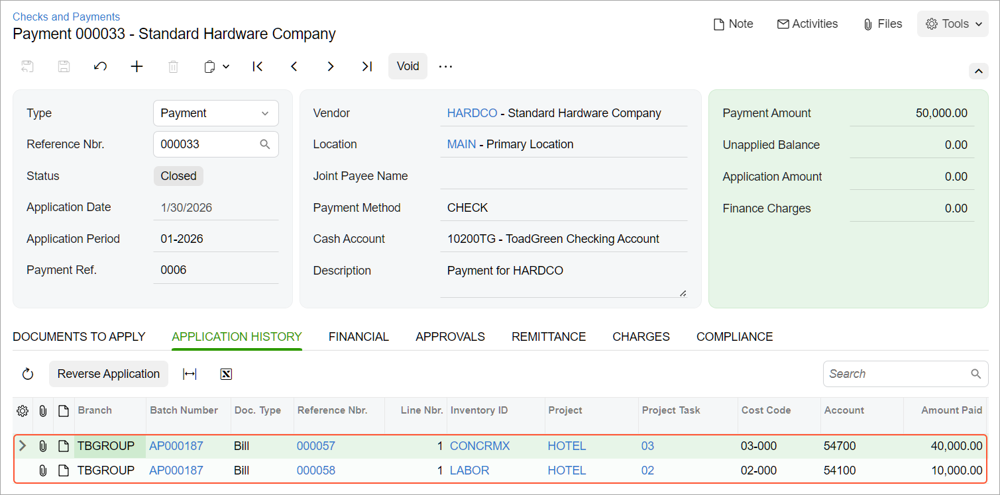

# Vendor Payments for a Project: To Process a Payment of Bill Lines {#_f6a73333-5058-4654-8d13-5921459be639 .task}

This activity will walk you through the generation of a payment for particular bill lines related to a project and the application of this payment to bills.

**Attention:** This activity is based on the *U100* dataset. If you are using another dataset or if any system settings have been changed in *U100*, these changes can affect the workflow of the activity and the results of the processing. To avoid issues, restore the *U100* dataset to its initial state.

## Story {#section_itd_vbk_c4b .section}

Suppose that the ToadGreen company is building a hotel for the Equity Group Investors customer; the ToadGreen project manager has created a project to handle the tracking and billing of the materials and services related to the hotel. On January 15, 2026, the ToadGreen company purchased 500 packages of concrete mix and 100 units of plastic pipes from the Standard Hardware Company vendor for the hotel being built. On January 17, 2026, the company also hired this vendor as a subcontractor to perform on-site work, which is broken into three phases.

On January 30, 2026, the concrete mix was delivered, and the first phase of the on-site work was performed. The ToadGreen project accountant entered into the system two bills received from the Standard Hardware Company: one \(with a date of 1/15/2026\) for all of the purchased materials, and another \(with a date of 1/17/2026\) for all three phases of the on-site work. Acting as the ToadGreen project manager, you need to prepare a payment for the materials and services that have been provided—that is, you will pay only particular lines of the bills.

## Configuration Overview {#section_jtd_vbk_c4b .section}

In the *U100* dataset, the following tasks have been performed to support this activity:

-   On the [Enable/Disable Features](CS_10_00_00.md) \(CS100000\) form, the following features have been enabled:
    -   *Payment Application by Line*
    -   *Construction*
-   On the [Projects](PM_30_10_00.md) \(PM301000\) form, the *HOTEL* project has been created for the Equity Group Investors customer, and multiple project tasks have been created for the project.
-   On the [Non-Stock Items](IN_20_20_00.md) \(IN202000\) form, the *LABOR*, *CONCRMX* and *PROJMATERIAL* non-stock items have been created.
-   On the [Vendors](AP_30_30_00.md#) \(AP303000\) form, the *HARDCO* vendor has been created. For this vendor, the *CHECK* payment method is specified as the default one; also, the **Pay by Line** check box is selected on the **Payment** tab.
-   On the [Bills and Adjustments](AP_30_10_00.md) \(AP301000\) form, two bills for the materials and labor provided by *HARDCO* \(one for the materials and one for the labor\) have been entered and released. Both bills have the **Pay By Line** check box selected in the Summary area of the form.

## Process Overview {#section_ktd_vbk_c4b .section}

You will find the bills related to the needed project and requiring payment on the [Prepare Payments](AP_50_30_00.md) \(AP503000\) form. Then you will prepare a single payment for particular lines of these bills. Finally, you will print the check on the [Process Payments / Print Checks](AP_50_50_00.md) \(AP505000\) form and will release the payment on the [Release Payments](AP_50_52_00.md) \(AP505200\) form.

## System Preparation {#section_ltd_vbk_c4b .section}

To prepare the system, do the following:

1.  Launch the Acumatica ERP website, and sign in to a company with the *U100* dataset preloaded. You should sign in as a project accountant by using the *bsanchez* username and the *123* password.
2.  In the info area at the upper-right corner of the top pane of the Acumatica ERP screen, make sure that the business date is set to *1/30/2026*. If a different date is displayed, click the Business Date menu button and select *1/30/2026* from the calendar. For simplicity, you'll create and process all documents in this activity using this business date.

## Step 1: Selecting the Bills to be Paid {#section_mtd_vbk_c4b .section}

To select the bills to be paid, do the following:

1.  Open the [Prepare Payments](AP_50_30_00.md) \(AP503000\) form.
2.  In the Selection area, specify the following settings to filter the data shown in the table:

    -   **Branch**: *TBGROUP* \(inserted by default\)
    -   **Payment Method**: *CHECK*
    -   **Cash Account**: *10200TG - ToadGreen Checking Account*
    -   **Payment Date**: *1/30/2026*
    -   **Vendor**: *HARDCO*
    -   **Pay Date Within** `7` **Days**
    In the table, the system lists the lines of the two bills of the *HARDCO* vendor: two lines for materials and three lines for services.

3.  Select the unlabeled check box in the row with the *CONCRMX* item of the first bill, and in the row with the *LABOR* item and a **Line Nbr.** of *1* of the second bill \(which is the first part of the works that have been performed and needs to be paid for\). Make sure the **Selection Total** in the Summary area is $50,000. Also, make sure that the **Available Balance** is enough to pay this amount.

## Step 2: Preparing the Payments {#section_ntd_vbk_c4b .section}

To prepare the payments, do the following:

1.  While you are still on the [Prepare Payments](AP_50_30_00.md) \(AP503000\) form with the needed rows selected, click **Process** on the form toolbar.
2.  On the [Process Payments / Print Checks](AP_50_50_00.md#) \(AP505000\) form, which opens, click **Process** to process the only selected line, which corresponds to the prepared payment. The system opens a printable version of the check.

    **Attention:** For the purposes of this activity, you do not need to actually print the document. In a production setting, you would click **Print** on the form toolbar to print the check before closing the browser tab.

3.  Close the printable check and return to the [Release Payments](AP_50_52_00.md#) \(AP505200\) form, that the system has opened. On the form, notice that the system has added a row with the payment and selected the unlabeled check box in the row.
4.  On the form toolbar, click **Process** to release the AP payment.
5.  In the **Processing** dialog box, which opens, click the **Processed** tab, and in the table, click the link in the **Reference Nbr.** column in the only line to open the payment on the [Checks and Payments](AP_30_20_00.md) \(AP302000\) form.
6.  On the **Application History** tab of the [Checks and Payments](AP_30_20_00.md) form, make sure both bill lines to which the payment has been applied are listed in the table, as shown below. The payment amount has been applied in full, so the payment is now assigned the *Closed* status.

    

You have prepared a payment for particular bill lines and applied this payment to these lines.

**Parent topic:**[Paying AP Bills by Project](../UserGuide/Projects_PayingAPBills_Mapref.md)

