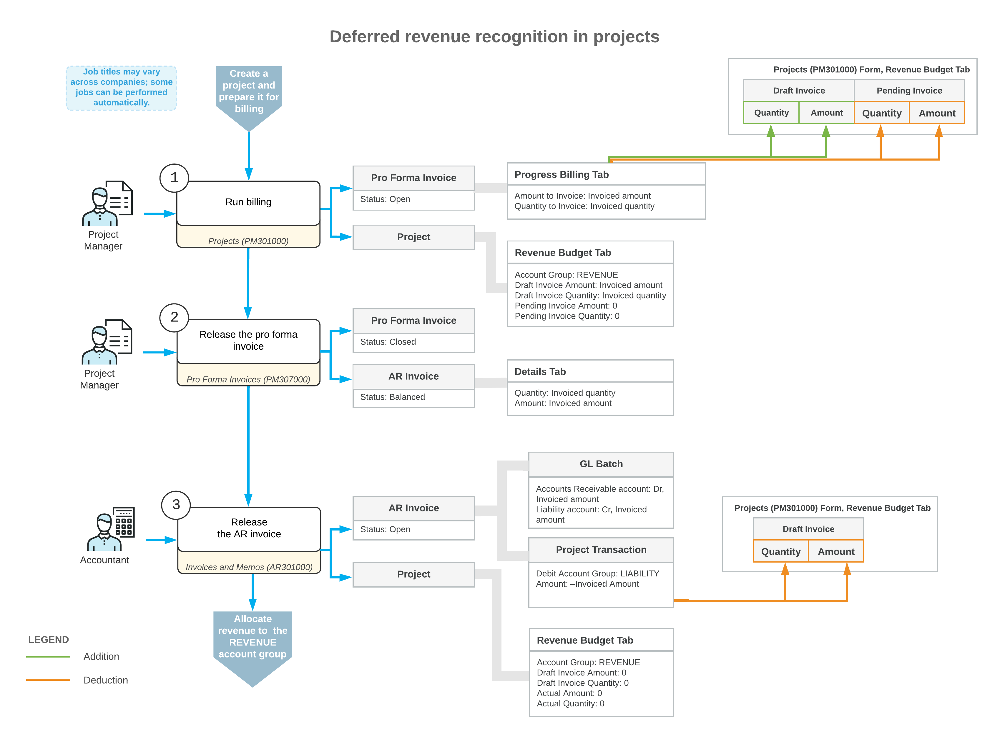

# Pro Forma Invoices: Deferred Revenue in Projects {#_b6e5f71f-2e7b-40e8-897a-9d8c9e5c876b .concept}

Depending on the revenue recognition method that is established in a company, you may need to account for revenue after the corresponding part of work on a project has actually been completed.

To do this, you need to set up the project and its billing to temporarily allocate the revenue to the liability account and clear this account as soon as the related portion of the revenue should be recognized. This topics explains how you can configure deferred revenue in projects.

## Setting Up a Project for Deferred Processing of Revenue { .section}

To configure the deferred processing of a project's revenue, you should do the following on the [Projects](PM_30_10_00.md) \(PM301000\) form:

1.  Define the project to use the pro forma invoice workflow—that is, select the **Create Pro Forma Invoice on Billing** check box on the **Summary** tab.
2.  In the revenue budget of the project on the **Revenue Budget** tab, define the project budget lines to use the account group of the *Income* type.
3.  In the **Default Sales Account** box on the **Defaults** tab, specify a sales account of the liability type. This sales account must be linked to an account group of the *Liability* type.
4.  Assign a progress billing rule to the project tasks on the **Tasks** tab of the [Projects](PM_30_10_00.md) form. In the billing rule step, specify *Project* in the **Use Sales Account From** box.

## Billing a Project with Deferred Revenue { .section}

When a pro forma invoice is created for a project that you have configured for deferred processing of revenue, the system updates the revenue budget lines on the **Revenue Budget** tab of the [Projects](PM_30_10_00.md) \(PM301000\) form as follows:

-   The **Pending Invoice Amount** and **Pending Invoice Quantity** are set to zero.
-   The **Draft Invoice Amount** and **Draft Invoice Quantity** are increased by the amount to invoice and quantity to invoice, respectively, of the corresponding pro forma invoice lines.

When you release the pro forma invoice on the [Pro Forma Invoices](PM_30_70_00.md) \(PM307000\) form, the system creates a corresponding accounts receivable invoice with all information copied from the pro forma invoice.

To release the accounts receivable invoice, you click **Release** on the form toolbar of the [Invoices and Memos](AR_30_10_00.md) \(AR301000\). On release of the accounts receivable invoice, the system generates a general ledger transaction and the corresponding project transaction. The general ledger transaction credits the liability account in the invoiced amount to record the unrecognized revenues.

On release of the project transaction, the system updates the revenue budget lines on the **Revenue Budget** tab of the [Projects](PM_30_10_00.md) form as follows:

-   The **Draft Invoice Amount** and **Draft Invoice Quantity** of the corresponding revenue budget line are set to zero, to indicate that the customer has been billed.
-   The **Actual Quantity** and **Actual Amount** of the corresponding revenue budget line are still set to zero because the revenue has been accumulated to the liability account.

The deferred revenue is recognized as earned revenue after the corresponding part of the project work is completed. To perform revenue recognition, you need to configure and run an allocation rule to allocate the earned revenue from the liability account group to the income account group. Then the system will update the **Actual Quantity** and **Actual Amount** of the corresponding revenue budget line with the recognized revenue amount and quantity.

## Workflow of Billing a Project with Deferred Revenue {#section_iy4_dkd_25b .section}

The following diagram illustrates the workflow of processing a pro forma invoice and an AR invoice with deferred revenue recognition.

**Parent topic:**[Processing Pro Forma Invoices](../UserGuide/Projects_Pro_Forma_Invoices_Mapref.md)

