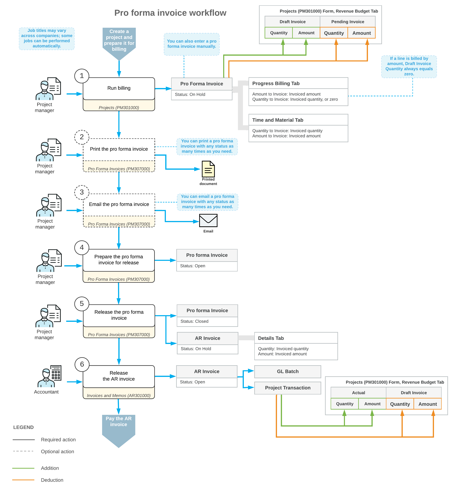

# Pro Forma Invoices: General Information {#_c17cd234-2ac9-412e-a687-fa3ccdaa1e16 .concept}

Acumatica ERP provides pro forma \(draft\) invoice capabilities for project billing. A pro forma invoice, which you can view on the [Pro Forma Invoices](PM_30_70_00.md) \(PM307000\) form, is a draft document that you can edit and correct without affecting the accounts receivable subledger. A pro forma invoice can be printed and sent to a customer as many times as is necessary until an agreement is reached. With this process, you minimize corrections that directly affect the accounts receivable subledger.

## Learning Objectives { .section}

In this chapter, you will learn how to do the following:

-   Turn on the pro forma invoice workflow for a project
-   Create a pro forma invoice during project billing
-   Print the pro forma invoice
-   Send the pro forma invoice as an email
-   Create a pro forma invoice manually
-   Add to the pro forma invoice an extra adjustment line that does not originate from project transactions
-   Postpone the billing of a pro forma invoice line
-   Write off a pro forma invoice line partially or fully
-   Create an accounts receivable invoice based on a pro forma invoice
-   Configure the deferral of project revenue on release of an accounts receivable invoice

## Applicable Scenarios { .section}

You create a pro forma invoice for a project if you need to reach agreement with the customer about the invoice. During negotiations, you modify the pro forma invoice as many times as is necessary until an agreement is reached, and then you prepare the accounts receivable invoice based on this pro forma invoice.

## Enabling of the Pro Forma Invoice Workflow for a Project {#section_qpw_2qd_25b .section}

A pro forma invoice is a document that can be created through the process of billing a particular project. The system creates pro forma invoices during billing for the projects for which the pro forma invoice workflow is turned on—that is, the projects that have the **Create Pro Forma Invoice on Billing** check box selected on the **Summary** tab of the [Projects](PM_30_10_00.md) \(PM301000\) form. By selecting or clearing this check box, you can turn on or turn off the pro forma invoice workflow for a project at any stage of the project execution.

**Tip:** You can also manually enter new pro forma invoices on the [Pro Forma Invoices](PM_30_70_00.md) \(PM307000\) form. For more information, see [Pro Forma Invoices: Manual Creation of Pro Forma Invoices](Projects_Pro_Forma_Invoices_Manual_Creation.md).

## Creation of Pro Forma Invoices { .section}

The system creates a pro forma invoice when you run project billing by clicking **Run Billing** on the form toolbar of the [Projects](PM_30_10_00.md) \(PM301000\) form. For a pro forma invoice created for a project, the system creates billable lines on the following tabs of the [Pro Forma Invoices](PM_30_70_00.md) \(PM307000\) form:

-   **Progress Billing**: The system creates these lines by using the *Progress Billing* steps of billing rules. The lines originate from the revenue budget lines of the project with a nonzero pending invoice amount or quantity.
-   **Time and Material**: The system creates these lines by using the *Time and Material* steps of billing rules; the lines originate from the project transactions.

    The *Time and Material* steps of billing rules support the aggregation of project transactions by date, employee, vendor, and inventory item. On the **Time and Material** tab of the [Pro Forma Invoices](PM_30_70_00.md) form, you can select a line and then click **View Transaction Details** on the table toolbar to drill down to the list of project transactions based on which the **Billed Quantity** and **Billed Amount** of the line have been calculated by using the formula of the billing rule.

    **Tip:** If the *Construction* feature is in use, you may need to prepare the American Institute of Architects \(AIA\) report that includes time and material amounts from the prepared pro forma invoice. For more information, see [Construction Reports: Time and Material Amounts in AIA Reports](Construction_Reports_AIA_TMLines.md).

As a result of the creation of the pro forma invoice, the system updates the revenue budget of the project on the **Revenue Budget** tab of the [Projects](PM_30_10_00.md) form as follows:

-   In the lines billed by amount, the system clears the amounts in the **Pending Invoice Amount** column, which the system has used to create progress billing lines of the pro forma invoice.
-   In the lines billed by quantity, the system clears the quantities in the **Pending Invoice Quantity** column and the amounts in the **Pending Invoice Amount** column, which the system has used to create progress billing lines of the pro forma invoice.
-   The amounts in the **Draft Invoice Amount** column are increased with the amount to invoice of the corresponding progress billing lines and time and material lines of the pro forma invoice.
-   The quantities in the **Draft Invoice Quantity** column are increased with the quantity to invoice of the corresponding progress billing lines of the pro forma invoice that have been billed based on quantity.

You can print a pro forma invoice with any status and email to the customer. To print the pro forma invoice, you click **Print** on the More menu of the [Pro Forma Invoices](PM_30_70_00.md) form. To email the pro forma invoice, you click **Email** on the More menu of the form.

## Release of Pro Forma Invoices { .section}

The pro forma invoices of a project can be released according to the following rules:

-   The pro forma invoices can be released only one by one, starting from the earliest one, on the **Invoices** tab of the [Projects](PM_30_10_00.md) \(PM301000\) form. The only exception is when multiple pro forma invoices segregated by invoice group have been generated during a single iteration of the billing process; in this case, these pro forma invoices can be released in any order.
-   A pro forma invoice can be released only after the accounts receivable invoice of the preceding pro forma invoice has been released.

The release of a pro forma invoice does not produce project transactions or general ledger transactions directly. When you release the pro forma invoice on the [Pro Forma Invoices](PM_30_70_00.md) \(PM307000\) form, the system creates a corresponding accounts receivable invoice or credit memo with all information copied from the pro forma invoice. The system copies the **Amount to Invoice** values from the pro forma invoice lines on the **Progress Billing** and **Time and Material** tabs of the [Pro Forma Invoices](PM_30_70_00.md) form to the **Amount** column in the invoice lines on the **Details** tab on the [Invoices and Memos](AR_30_10_00.md) \(AR301000\) form.

**Tip:** The system creates a credit memo on release of the pro forma invoice if the total amount of the pro forma invoice is negative. For more information, see [Project Invoice Correction: Credit Memos for Projects](Projects_Correcting_Project_Invoices_Credit_Memo_Billing.md).

The document lines of an unreleased accounts receivable invoice that originates from a pro forma invoice are displayed in read-only mode on the **Details** tab of the [Invoices and Memos](AR_30_10_00.md) form. You can edit only a salesperson in the **Salesperson ID** column. If you need to correct any other details, you can delete the accounts receivable invoice, adjust the pro forma invoice on the [Pro Forma Invoices](PM_30_70_00.md) form, and release the pro forma invoice to make the system generate the adjusted accounts receivable invoice.

**Tip:** To open a pro forma invoice that corresponds to an accounts receivable invoice you are viewing on the [Invoices and Memos](AR_30_10_00.md) form, click **Pro Forma Invoice** on the More menu \(under **Related Documents**\).

After you have reviewed the invoice details, you click **Release** on the form toolbar of the [Invoices and Memos](AR_30_10_00.md) form to release the accounts receivable invoice. On release of the accounts receivable invoice, the system generates a general ledger transaction and the corresponding project transaction. On release of the project transaction, the system updates the revenue budget of the corresponding project on the **Revenue Budget** tab of the [Projects](PM_30_10_00.md) form as follows:

-   The **Actual Quantity** and **Actual Amount** of the corresponding revenue budget line are increased by the line quantity and line amount of the released accounts receivable invoice.
-   The **Draft Invoice Amount** and **Draft Invoice Quantity** of the corresponding revenue budget line is decreased by the line amount and line quantity of the released accounts receivable invoice, respectively.

## Workflow of Pro Forma Invoices {#section_i3l_d4p_mcb .section}

The following diagram illustrates the workflow of processing a pro forma invoice.

**Parent topic:**[Processing Pro Forma Invoices](../UserGuide/Projects_Pro_Forma_Invoices_Mapref.md)

