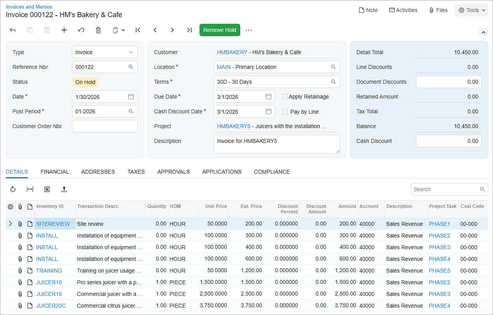

# Pro Forma Invoices: To Process a Pro Forma Invoice for a Project {#_c53c0234-16c1-4385-a12e-d9cecd34d4c0 .task}

In this activity, you will learn about the workflow of a pro forma invoice that has been prepared for a project.

**Attention:** This activity is based on the *U100* dataset. If you are using another dataset or if any system settings have been changed in *U100*, these changes can affect the workflow of the activity and the results of the processing. To avoid issues, restore the *U100* dataset to its initial state.

## Story { .section}

Suppose that the HM's Bakery and Cafe customer has ordered juicers from the SweetLife Fruits &amp; Jams company, along with the following services: site review, installation, and employee training on operating the juicers. SweetLife's project accountant has created a project that should be billed on demand as the juicers are installed and all the services are provided. Before the invoice is sent to the customer for payment, the customer has requested a pro forma invoice to be submitted for acceptance. The site review has taken place, the juicers have been delivered and installed, and SweetLife's consultant has provided the training. After that, the project accountant has entered project transactions and updated the progress of the project.

Acting as the project accountant, you will bill the customer, print the pro forma invoice, and email the invoice to the customer for approval on *1/30/2026*. Then you will release the pro forma invoice and the associated accounts receivable invoice.

## Configuration Overview { .section}

In the *U100* dataset, the following tasks have been performed to support this activity:

-   On the [Enable/Disable Features](CS_10_00_00.md) \(CS100000\) form, the *Projects* feature has been enabled to support the project management functionality.
-   On the [Projects](PM_30_10_00.md) \(PM301000\) form, the *HMBAKERY5* project has been created and the *PHASE1*, *PHASE2*, *PHASE3*, *PHASE4*, and *PHASE5* project tasks have been created for the project. The revenue budget level of the project is *Task and Item*. On the **Summary** tab \(**Billing and Allocation Settings** section\), the **Create Pro Forma Invoice on Billing** check box has been selected for the project. With this setting, the system creates a pro forma invoice for the project when you run project billing.
-   On the [Project Transactions](PM_30_40_00.md) \(PM304000\) form, the *PM00000008* batch of project transactions related to the project has been created and released.

## Process Overview { .section}

On the [Projects](PM_30_10_00.md) \(PM301000\) form, you will initiate the creation of a pro forma invoice for the project. Then you will review the created pro forma invoice on the [Pro Forma Invoices](PM_30_70_00.md) \(PM307000\) form. You will then print the pro forma invoice, email the invoice, and release it on the same form. On the [Invoices and Memos](AR_30_10_00.md) \(AR301000\) form, you will release the accounts receivable invoice created based on the pro forma invoice.

## System Preparation { .section}

To sign in to the system and prepare to perform the instructions of the activity, do the following:

1.  Launch the Acumatica ERP website, and sign in to a company with the *U100* dataset preloaded; you should sign in as project accountant by using the *brawner* username and the *123* password.
2.  In the info area at the upper-right corner of the top pane of the Acumatica ERP screen, make sure that the business date is set to *1/30/2026*. If a different date is displayed, click the Business Date menu button and select *1/30/2026* from the calendar. For simplicity, you'll create and process all documents in this activity using this business date.
3.  On the [Projects Preferences](PM_10_10_00.md) \(PM101000\) form, on the **General** tab \(**General Settings** section\), make sure *Detailed* is selected in the **Revenue Budget Update** box.

## Step 1: Creating and Processing a Pro Forma Invoice {#section_ugp_m1l_yqb .section}

To prepare and process a pro forma invoice for the project, do the following:

1.  On the [Projects](PM_30_10_00.md) \(PM301000\) form, open the *HMBAKERY5* project. On the **Cost Budget** tab, review the cost budget of the project. Notice that the **Actual Amount** of each line equals the original budgeted amount, which means the corresponding project transaction has been created and released.

    **Tip:** You can review the transactions that correspond to each cost budget line on the [Project Transaction Details](PM_40_10_00.md) \(PM401000\) form, which opens if you click the line and then click **View Transactions** on the table toolbar. The transactions have the **Billable** check box selected and the **Billed** check box cleared, which means the transactions are ready for billing and have not been billed yet.

2.  On the **Revenue Budget** tab, review the revenue budget lines of the project, and make sure that the **Pending Invoice Amount** of the revenue budget lines is nonzero. In the Summary area, notice that the **Pending Invoice Amount Total** is equal to *2,700.00*. You can bill the project for this amount.
3.  On the form toolbar, click **Run Billing**.

    The system creates a pro forma invoice and opens it on the [Pro Forma Invoices](PM_30_70_00.md) \(PM307000\) form.

4.  On the **Progress Billing** tab, make sure that the pro forma invoice includes five progress lines. Review the invoice lines that have been created based on the revenue budget lines of the project. The **Progress Billing Total** in the Summary area is *2,700.00*.
5.  In the Summary area, in the **Project** box, click the link to review how the creation of the pro forma invoice has affected the revenue budget of the project. The system opens the [Projects](PM_30_10_00.md) form with the *HMBAKERY5* project selected.

    On the **Revenue Budget** tab, notice that amounts from the **Pending Invoice Amount** column have been moved to the **Draft Invoice Amount** column, and now the **Pending Invoice Amount** of all the revenue budget lines is *0*. In the Summary area, notice that the **Pending Invoice Amount Total** is also *0*.

6.  Return to the [Pro Forma Invoices](PM_30_70_00.md) form with the pro forma invoice that you have prepared earlier.
7.  On the **Time and Material** tab, make sure that the pro forma invoice includes three time and material lines that have been created based on the transactions prepared for billing. The **Time and Material Total** in the Summary area must be *7,750.00*.

    **Tip:** You can review the transactions that correspond to each line in the **Transaction Details** dialog box, which opens if you click the line and then click **View Transaction Details** on the table toolbar.

8.  On the More menu, click **Print** to generate the printable version of the pro forma invoice. The system navigates to the [Pro Forma Invoice](PM_64_20_00.md) \(PM642000\) report and opens the printable version of the pro forma invoice.
9.  Click Back in the browser window to go back to the pro forma invoice on the [Pro Forma Invoices](PM_30_70_00.md) form, and on the More menu, click **Email** to send the invoice as an email to the customer.

    The system creates an email by using the notification template defined for the project on the **Mailing &amp; Printing** tab of the [Projects](PM_30_10_00.md) form, attaches the printed report, and sends the email to the customer by using the email address specified in the **Bill-To Contact** section on the **Addresses** tab of the [Pro Forma Invoices](PM_30_70_00.md) form, which is copied from the project from the **Bill-To Contact** section on the **Addresses** tab of the [Projects](PM_30_10_00.md) form.

10. On the form toolbar, click **Remove Hold** to assign the pro forma invoice the *Open* status.
11. On the form toolbar, click **Release**. The system creates the accounts receivable invoice based on the pro forma invoice and assigns the *Closed* status to the pro forma invoice.

## Step 2: Processing an AR Invoice {#section_vgp_m1l_yqb .section}

To process the accounts receivable invoice that was generated based on the pro forma invoice, do the following:

1.  While you are viewing the pro forma invoice on the [Pro Forma Invoices](PM_30_70_00.md) \(PM307000\) form, on the **Financial** tab, click the **AR Ref. Nbr.** link to open the accounts receivable invoice that was created.
2.  On the [Invoices and Memos](AR_30_10_00.md) \(AR301000\) form, which opens, notice that all progress billing and time and material lines of the pro forma invoice have been copied to the **Details** tab of the accounts receivable invoice \(see below\). The settings in these lines cannot be edited, except in the **Salesperson ID** column.

    

3.  On the form toolbar, click **Remove Hold** to assign the accounts receivable invoice the *Balanced* status, and then click **Release**.
4.  On the **Financial** tab, click the link in the **Batch Nbr.** box. On the [Journal Transactions](GL_30_10_00.md) \(GL301000\) form, which opens, review the created general ledger transactions.

    Notice that eight transaction lines have the project and project task specified. For these GL transactions, the system created the corresponding project transactions. For the transactions with the *X* project specified \(the non-project code\), the system created no project transactions.

5.  Return to the accounts receivable invoice that you have prepared on the [Invoices and Memos](AR_30_10_00.md) form.
6.  On the More menu \(under **Inquiries**\), click **Project Transactions** to review the corresponding project transactions.
7.  On the [Project Transaction Details](PM_40_10_00.md) \(PM401000\) form, which opens, review the project transactions related to the AR invoice. Notice that eight transactions have *AR Invoice* in the **Orig. Doc. Type** column and the reference number of the accounts receivable invoice you have released in the **Orig. Doc. Nbr.** column. These transactions also have the reference number of the general ledger batch you have just reviewed in the **GL Batch Nbr.** column.
8.  On the [Projects](PM_30_10_00.md) form, open the *HMBAKERY5* project, and review the **Invoices** tab. Notice that in the only line, the reference numbers of the prepared pro forma invoice and the corresponding accounts receivable invoice are shown in the **Pro Forma Reference Nbr.** and **AR Reference Nbr.** columns, respectively. The total billed amount in the **AR Doc. Orig. Amount** column is $10,450.
9.  On the **Revenue Budget** tab, make sure the **Actual Amount** of revenue budget lines was updated on release of the AR invoice. Also, make sure that the following new revenue budget lines have been created based on the billed project transactions:

    -   The line with the *PHASE2* project task and the *JUICER10* inventory item
    -   The line with the *PHASE3* project task and the *JUICER15* inventory item
    -   The line with the *PHASE4* project task and the *JUICER20C* inventory item
    Notice that the lines now have actual values and that the original budgeted values in these lines are *0*.

You have finished processing the pro forma invoice and the AR invoice for the project.

**Parent topic:**[Processing Pro Forma Invoices](../UserGuide/Projects_Pro_Forma_Invoices_Mapref.md)

