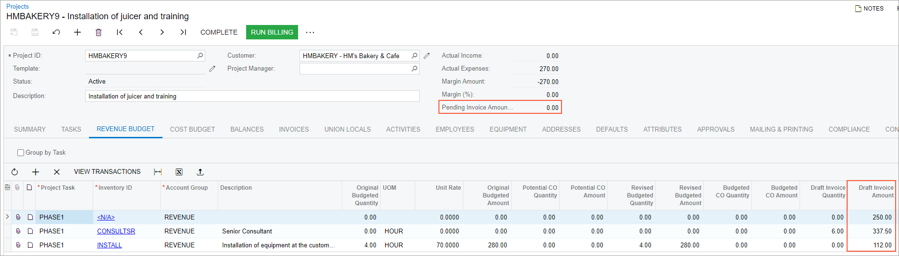

# Pro Forma Invoices: To Create a Pro Forma Invoice for a Project Manually {#_a012d150-6478-4462-b04b-d28480534aa7 .task}

The following activity will walk you through the process of creating a manual pro forma invoice for a project.

**Attention:** This activity is based on the *U100* dataset. If you are using another dataset or if any system settings have been changed in *U100*, these changes can affect the workflow of the activity and the results of the processing. To avoid issues, restore the *U100* dataset to its initial state.

## Story { .section}

Suppose that the HM's Bakery and Cafe customer has ordered juicer installation from the SweetLife Fruits &amp; Jams company, along with employee training on operating the juicers. SweetLife's project accountant has created a project that should be completed in two stages and billed monthly. The start date of the project is 1/15/2026.

Further suppose that on 1/30/2026, the customer has requested a pro forma invoice for the first part of the work to be submitted for acceptance. According to the billing schedule, the next billing date of the project is 2/15/2026. That is, the project accountant cannot prepare the pro forma invoice by running the billing procedure. The project accountant has decided to enter the pro forma invoice and include the following information in it:

-   Forty percent of installation services; this amount has a fixed price that has been agreed upon with the customer
-   A site review that was not initially budgeted and has been requested by the customer as an addition
-   Six hours of employee training provided on 1/25/2026 by a senior consultant

Acting as the project accountant, you will enter a manual pro forma invoice and review how the project budget has been affected.

## Configuration Overview { .section}

In the *U100* dataset, the following tasks have been performed to support this activity:

-   On the [Enable/Disable Features](CS_10_00_00.md) \(CS100000\) form, the *Projects* feature has been enabled to support the project management functionality.
-   On the [Projects](PM_30_10_00.md) \(PM301000\) form, the *HMBAKERY9* project has been created and the *PHASE1* and *PHASE2* project tasks have been created for the project. The revenue budget of the project includes a line with the *PHASE1* task and the *INSTALL* inventory item; in the line, *40* is specified in the **Completed \(%\)** column. On the **Summary** tab \(**Billing and Allocation Settings** section\), the **Create Pro Forma Invoice on Billing** check box has been selected for the project, and the **Billing Period** is *Month*.
-   On the [Billing Rules](PM_20_70_00.md) \(PM207000\) form, the *COMBINED* billing rule has been created; it has been assigned to both project tasks of the *HMBAKERY9* project on the [Projects](PM_30_10_00.md) form.

## Process Overview { .section}

You will create a pro forma invoice for the project on the [Pro Forma Invoices](PM_30_70_00.md) \(PM307000\) form. You will add time and material line and progress billing lines to the pro forma invoice and release it. Finally, you will review the corresponding project on the [Projects](PM_30_10_00.md) \(PM301000\) form and review how the pro forma has affected the project budget.

## System Preparation { .section}

To sign in to the system and prepare to perform the instructions of the activity, do the following:

1.  Launch the Acumatica ERP website, and sign in to a company with the *U100* dataset preloaded; you should sign in as a project accountant by using the *brawner* username and the *123* password.
2.  In the info area at the upper-right corner of the top pane of the Acumatica ERP screen, make sure that the business date is set to *1/30/2026*. If a different date is displayed, click the Business Date menu button and select *1/30/2026* from the calendar. For simplicity, you'll create and process all documents in this activity using this business date.

## Step 1: Creating a Project Transaction { .section}

To enter the project transaction for the provided training, perform the following steps:

1.  On the [Project Transactions](PM_30_40_00.md) \(PM304000\) form, add a new record.
2.  In the Summary area, specify the following description: `6 hours of training for HMBAKERY9`.
3.  In the table, add a transaction line by clicking **Add Row** on the table toolbar and specifying the following settings in the row:
    -   **Project**: *HMBAKERY9*
    -   **Project Task**: *PHASE1*
    -   **Cost Code**: *00-000*
    -   **Account Group**: *LABOR*
    -   **Description**: `Employee training, 6 hours`
    -   **Inventory ID**: *CONSULTSR*
    -   **Quantity**: `6`
    -   **Unit Rate**: `45.00`
    -   **Date**: *1/25/2026*
4.  In the Summary area, make sure that the total billable amount is $270.
5.  Save your changes.
6.  On the form toolbar, click **Release** to release the project transactions.

## Step 2: Creating a Pro Forma Invoice { .section}

Create the pro forma invoice for the project by doing the following:

1.  On the [Pro Forma Invoices](PM_30_70_00.md) \(PM307000\) form, add a new record.
2.  In the Summary area of the form, specify the following settings:
    -   **Project**: *HMBAKERY9*
    -   **Invoice Date**: *1/30/2026*
    -   **Post Period**: 01-2026
    -   **Description**: `January pro forma invoice: site review, installation, and training`
3.  On the **Progress Billing** tab, click **Load Lines**. The system uploads the only budgeted line in the amount of 112 \(which is 40% of the completion amount that was specified in the project budget\).
4.  Add one more progress billing line that represents site review, and specify the following settings:
    -   **Account Group**: *REVENUE*
    -   **Project Task**: *PHASE1*
    -   **Description**: `Site review performed`
    -   **Total Completed \(%\)**: `100`
    -   **Amount**: `250`
5.  Save the pro forma invoice.
6.  On the **Time and Material** tab, click **Upload Unbilled Transactions**.
7.  In the **Upload Unbilled Transactions** dialog box, which opens, select the unlabeled check box in the only line, which is the project transaction that represents 6 hours of training provided on 1/25/2026. Click **Upload &amp; Close**. The system adds a time and material line for the project transaction to the pro forma invoice. Make sure that the **Amount to Invoice** in the line is *337.50*.
8.  In the Summary area, make sure that the pro forma invoice total amount in the **Invoice Total** box is *699.50*.
9.  On the form toolbar, click **Remove Hold**, and then click **Release** to release the pro forma invoice. The system has released the pro forma invoice and generated the corresponding AR invoice.

## Step 2: Reviewing the Project Budget { .section}

Review how the entered and released pro forma invoice has affected the project budget by doing the following:

1.  On the [Projects](PM_30_10_00.md) \(PM301000\) form, open the *HMBAKERY9* project.
2.  On the **Invoices** tab, make sure that the pro forma invoice that you have entered is now shown in the table.
3.  On the **Revenue Budget** tab, notice that two new revenue budget line have appeared, as the following screenshot shows. Also notice that **Pending Invoice Amount Total** in the Summary area is *0*; the pending invoice amount for the 40% of completion of the revenue budget line for installation was moved to **Draft Invoice Amount** when you created and processed the manual pro forma invoice.

    

You have manually entered a pro forma invoice. Now you can send it to the customer for acceptance.

**Parent topic:**[Processing Pro Forma Invoices](../UserGuide/Projects_Pro_Forma_Invoices_Mapref.md)

