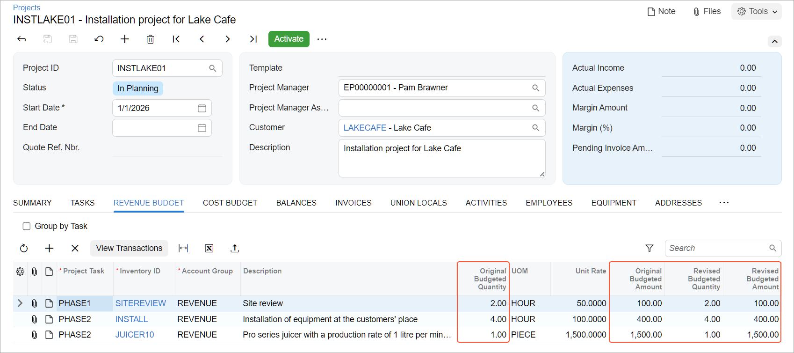

# Project Creation and Processing: To Create a Fixed-Price Project {#_6163391d-d61e-45ac-b5c4-17cd736cf370 .task}

This activity will walk you through the process of initial creation of a simple fixed-price project.

**Attention:** This activity is based on the *U100* dataset. If you are using another dataset or if any system settings have been changed in *U100*, these changes can affect the workflow of the activity and the results of the processing. To avoid issues, restore the *U100* dataset to its initial state.

## Story { .section}

Suppose that the Lake Cafe customer has ordered a juicer from the SweetLife Fruits &amp; Jams company, along with two hours of site review and four hours of installation services. The work will start on *1/1/2026* and must be completed by *1/30/2026*. SweetLife's project accountant has decided to create a project to track costs and revenues for the performed work. The project will be completed in two phases: Phase 1 will be the site review, and phase 2 will involve the sale and installation of the juicer. To track the progress of each phase separately, the project accountant has decided to define the phases as separate project tasks. Also, the project accountant will specify the revenue budget information for each project task and inventory item.

The project will be billed once, when both of the project tasks are completed. Also, the project accountant has decided to skip the creation of pro forma invoices, because all amounts have already been budgeted and agreed upon with the customer, so the direct AR invoice will be created during the billing process.

Acting as the project accountant, you will create the new project and specify all needed settings.

## Configuration Overview { .section}

In the *U100* dataset, the following tasks have been performed to support this activity:

-   On the [Enable/Disable Features](CS_10_00_00.md) \(CS100000\) form, the *Projects* feature has been enabled to support the project management functionality.
-   On the [Stock Items](IN_20_25_00.md) \(IN202500\) form, the *JUICER10* stock item has been defined.
-   On the [Non-Stock Items](IN_20_20_00.md) \(IN202000\) form, the *SITEREVIEW* and *INSTALL* non-stock items have been defined.
-   On the [Billing Rules](PM_20_70_00.md) \(PM207000\) form, the *PROGRESS* billing rule has been defined. This rule is configured for gradually billing the projects at a fixed contract amount.

## Process Overview { .section}

On the [Projects](PM_30_10_00.md) \(PM301000\) form, you will create a new project and specify its general settings on the **Summary** tab. Then on the **Tasks** tab, you will add the project tasks that will be performed during the completion of a project. On the **Revenue Budget** tab, you will define the planned revenue budget for the project.

## System Preparation { .section}

To sign in to the system and prepare to perform the instructions of the activity, do the following:

1.  Launch the Acumatica ERP website, and sign in to a company with the *U100* dataset preloaded; you should sign in as Pam Brawner by using the *brawner* username and the *123* password.
2.  In the info area, in the upper-right corner of the top pane of the Acumatica ERP screen, make sure that the business date in your system is set to *1/1/2026*. If a different date is displayed, click the Business Date menu button, and select 1/1/2026 on the calendar.

## Step 1: Creating a Project and Specifying Its General Settings { .section}

To create a new project and specify basic settings for it, do the following:

1.  On the [Projects](PM_30_10_00.md) \(PM301000\) form, create a new record.
2.  In the Summary area, specify the following settings:
    -   **Project ID**: `INSTLAKE01`
    -   **Customer**: *LAKECAFE \(Lake Cafe\)*
    -   **Start Date**: *1/1/2026*
    -   **End Date**: *1/30/2026*
    -   **Project Manager**: *EP00000001 \(Pam Brawner\)*
    -   **Description**: `Installation project for Lake Cafe`
3.  On the **Summary** tab, specify the following settings:
    -   **Revenue Budget Level**: *Task and Item*

        You select this option to include more detail in the revenue budget structure. With this setting, you will be able to select an inventory item in a revenue budget line.

    -   **Cost Budget Level**: *Task and Item*

        You select this option to include more detail in the cost budget structure. With this setting, you will be able to select an inventory item in a cost budget line.

    -   **Change Order Workflow**: Cleared

        You clear this check box because for this simple fixed-price project, no changes will be required.

    -   **Billing Currency**: *USD* \(selected automatically\)
    -   **Billing Period**: *On Demand*

        You select the *On Demand* billing period to indicate that the billing can be performed at any time.

    -   **Billing Rule**: *PROGRESS*

        This predefined rule will be specified by default in all project tasks added to the project.

        **Tip:** For details on configuring billing rules for billing by progress, see [Billing Rules: Progress Billing](Billing_Rules_Progress_Billing.md) and [Billing Rules: To Configure a Progress Billing Rule](Billing_Rules_Implem_Activity_Progress.md).

    -   **Create Pro Forma Invoice on Billing**: Cleared

        You are clearing this check box because you want to create accounts receivable invoices when you bill the project without preliminary creation of pro forma invoices.

4.  Save your changes to the project \(which currently has the *In Planning* status shown in the **Status** box of the Summary area\).

## Step 2: Adding Project Tasks { .section}

To add project tasks to the project, do the following:

1.  On the **Tasks** tab, add to the project the two tasks listed in the following table by clicking **Add Row** on the table toolbar for each and specifying the listed identifier, task type, and description in the row.

    |**Task ID**|**Type**|**Description**|
    |-----------|--------|---------------|
    |`PHASE1`|*Cost and Revenue Task*|`Site review`|
    |`PHASE2`|*Cost and Revenue Task*|`Installation`|

    Notice that the *PROGRESS* billing rule has been automatically specified for both added tasks.

2.  On the table toolbar, click **Activate Tasks** to change the status of the added tasks from *In Planning* to *Active*.
3.  Save your changes to the project.

    Notice that the project still has the *In Planning* status even though you have activated both of its project tasks.

## Step 3: Specifying the Project Revenue Budget { .section}

To specify the project revenue budget, do the following:

1.  On the **Revenue Budget** tab, add each line of the project revenue budget that is listed in the following table by clicking **Add Row** and specifying the listed settings in the row.

    |**Project Task**|**Inventory ID**|Account Group|**Original Budgeted Quantity**|**Unit Rate**|
    |----------------|----------------|-------------|------------------------------|-------------|
    |*PHASE1*|*SITEREVIEW*|*REVENUE*|`2.00`|`50.00`|
    |*PHASE2*|*JUICER10*|*REVENUE*|`1.00`|`1,500.00`|
    |*PHASE2*|*INSTALL*|*REVENUE*|`4.00`|`100.00`|

2.  Save your changes to the project.
3.  Make sure that the original and revised values in the revenue budget lines have been calculated, as shown below.

    

    For each budget line, the system automatically calculated the **Original Budgeted Amount** as the **Original Budgeted Quantity** multiplied by the **Unit Rate**. The system also filled in the **Revised Budgeted Quantity** and **Revised Budgeted Amount** columns with the values of **Original Budgeted Quantity** and **Original Budgeted Amount** columns, respectively.

    You have not configured the cost budget for the project because you do not need to track if the project expenses are within the budgeted values. When you enter project transactions that represent the project expenses, the system will automatically populate the cost budget with the actual values.

You have finished configuring the project. Now you can complete the [Project Creation and Processing: To Process a Fixed-Price Project](Projects_Process_Process_Activity_Fixed_Price.md) activity to practice completing the project lifecycle.

**Parent topic:**[Creating and Processing Projects](../UserGuide/Projects_Process_Mapref.md)

