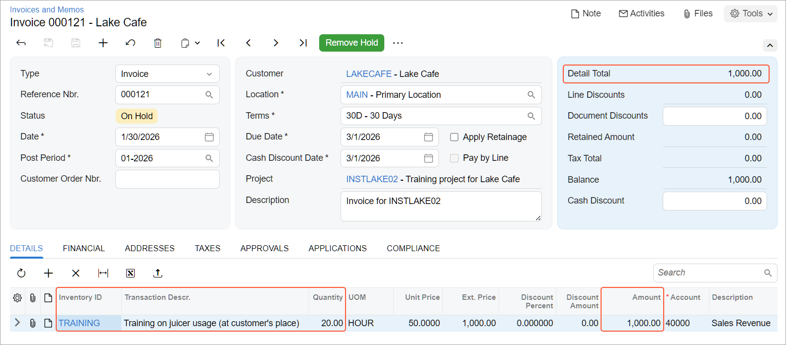

# Project Creation and Processing: To Process a Cost-Plus Project {#_ff5069e7-47b7-4b20-9884-8d64dc6aed51 .task}

This activity will walk you through the life cycle of a cost-plus project.

## Story { .section}

Suppose that the Lake Cafe customer has ordered training of employees from the SweetLife Fruits &amp; Jams company. SweetLife's project accountant has created a cost-plus project to account for the provided services. Twenty hours of training sessions have been conducted in the period from *1/1/2026* through *1/30/2026*.

Acting as the project accountant, you need to support the project during the entire project life cycle.

## Configuration Overview { .section}

For the purposes of this activity, on the [Enable/Disable Features](CS_10_00_00.md) \(CS100000\) form, the *Projects* feature has been enabled to support the project management functionality.

## Process Overview { .section}

You will activate the project to indicate that it has been started. Then you will create project-related transactions on the [Project Transactions](PM_30_40_00.md) \(PM304000\) form to record the provided services. You will run project billing for the project on the [Projects](PM_30_10_00.md) \(PM301000\) form and review the prepared AR invoice. Then you will complete the project.

## System Preparation { .section}

To sign in to the system and prepare to perform the instructions of the activity, do the following:

1.  Download the [INSTLAKE02\_Project\_Transactions.xlsx](Files/INSTLAKE02_Project_Transactions.xlsx) file to your computer.
2.  Create the *INSTLAKE02* project, as described in [Project Creation and Processing: To Create a Cost-Plus Project](Projects_Process_Implem_Activity_Cost_Plus.md).
3.  Launch the Acumatica ERP website, and sign in to a company with the *U100* dataset preloaded; you should sign in as Pam Brawner by using the *brawner* username and the *123* password.
4.  In the info area at the upper-right corner of the top pane of the Acumatica ERP screen, make sure that the business date is set to *1/30/2026*. If a different date is displayed, click the Business Date menu button and select *1/30/2026* from the calendar. For simplicity, you'll create and process all documents in this activity using this business date.

## Step 1: Activating the Project { .section}

To indicate that the *INSTLAKE02* project has been started, do the following:

1.  On the [Projects](PM_30_10_00.md) \(PM301000\) form, open the *INSTLAKE02* project, which you have created in [Project Creation and Processing: To Create a Cost-Plus Project](Projects_Process_Implem_Activity_Cost_Plus.md).
2.  On the form toolbar, click **Activate**. The system assigns the project the *Active* status.

## Step 2: Uploading Project Transactions { .section}

To upload and process the transactions of this project, do the following:

1.  On the [Project Transactions](PM_30_40_00.md) \(PM304000\) form, add a new record.
2.  In the Summary area, make sure that *PM* is selected as the **Source**.
3.  In the **Description** box, type `The conducted training for the INSTLAKE02 project`.
4.  On the table toolbar of the **Details** tab, click **Load Records from File**.
5.  In the **Import Data** dialog box, which opens, click **Upload File**, and select the file path to the `INSTLAKE02_Project_Transactions.xlsx` file.
6.  On the Specify Common Settings page, which opens, leave the default settings, and click **Next**.
7.  On the Map Properties to Columns page, which opens, leave the current column mapping, and click **Finish**. The system uploads the transaction row.
8.  Make sure that the **Total Quantity** and **Total Amount** in the Summary area are *20* and *800.00*, respectively.
9.  On the form toolbar, click **Save**, and then click **Release**.
10. On the [Projects](PM_30_10_00.md) \(PM301000\) form, open the *INSTLAKE02* project, and make sure that the **Actual Expenses** box in the Summary area now shows *800.00*.

    On the **Cost Budget** tab, review the cost budget line that has been updated on release of the project transaction. The quantity and amount that were initially planned \(*16* and *640.00*\) are shown as the **Original Budgeted Quantity** and **Original Budgeted Amount**, while the **Actual Quantity** and **Actual Amount** columns have been populated with the amounts from the released project transactions \(*20* and *800*, respectively\).

## Step 3: Billing a Project { .section}

To create an accounts receivable invoice for the project, do the following:

1.  While you are still reviewing the *INSTLAKE02* project on the [Projects](PM_30_10_00.md) \(PM301000\) form, on the form toolbar, click **Run Billing**. The system creates an AR invoice, which should look like the one shown below, and opens it on the [Invoices and Memos](AR_30_10_00.md) \(AR301000\) form.

    Because the *TM* billing rule specified for the project task defines the line amount as the project transaction amount multiplied by 1.25, the customer is billed in the amount of $1,000.

    

2.  On the form toolbar, click **Remove Hold** to assign the accounts receivable invoice the *Balanced* status, and then click **Release**.
3.  Return to the [Projects](PM_30_10_00.md) form with the *INSTLAKE02* project opened, and press Esc to refresh the form. Notice that the **Actual Income** box in the Summary area now shows *1,000.00*, which is the amount the customer has been billed. The calculated margin for the project is 20%, as has been planned. On the **Revenue Budget** tab, the revenue line with the *TRAINING* task and the **Actual Amount** of $1,000 has been added.

## Step 4: Completing the Project { .section}

To complete the project, do the following:

1.  While you are still reviewing the *INSTLAKE02* project on the [Projects](PM_30_10_00.md) \(PM301000\) form, on the **Tasks** tab, specify the following settings in the only table row:
    -   **Status**: *Completed*
    -   **Completed \(%\)**: `100` \(the system specifies this percentage automatically when you change the task’s status to *Completed*\)
    -   **End Date**: *1/30/2026* \(the system specifies the current business date automatically when you change the task’s status to *Completed*\)
2.  Save your changes to the project.
3.  On the form toolbar, click **Complete**. The system assigns the project the *Completed* status.

You have finished working with the project.

**Parent topic:**[Creating and Processing Projects](../UserGuide/Projects_Process_Mapref.md)

