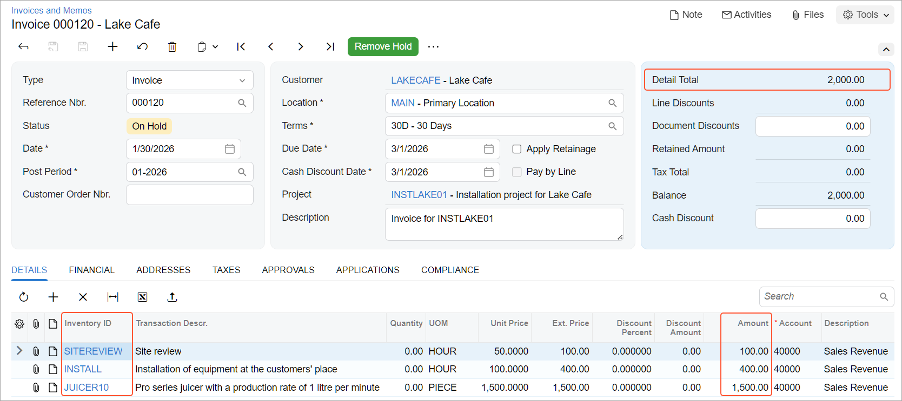

# Project Creation and Processing: To Process a Fixed-Price Project {#_ddda9c6e-f038-4142-afcc-87025b72daa4 .task}

This activity will walk you through the lifecycle of a fixed-price project.

## Story { .section}

Suppose that the Lake Cafe customer has ordered a juicer from the SweetLife Fruits &amp; Jams company, along with the site review and installation services. SweetLife's project accountant has created a fixed-price project to account for this work. In January 2026, the company employees have performed work related to the project tasks.

Acting as the project accountant, you need to support the project during the entire project lifecycle.

## Configuration Overview { .section}

For the purposes of this activity, on the [Enable/Disable Features](CS_10_00_00.md) \(CS100000\) form, the *Projects* feature has been enabled to support the project management functionality.

## Process Overview { .section}

You will activate the project to indicate that it has been started. Then you will create and release a project transaction on the [Project Transactions](PM_30_40_00.md) \(PM304000\) form to record the provided services. You will bill the project on the [Projects](PM_30_10_00.md) \(PM301000\) form and review the prepared AR invoice on the [Invoices and Memos](AR_30_10_00.md) \(AR301000\) form. Then you will close the project and review its amounts.

## System Preparation { .section}

To sign in to the system and prepare to perform the instructions of the activity, do the following:

1.  Download the [INSTLAKE01\_Project\_Transactions.xlsx](Files/INSTLAKE01_Project_Transactions.xlsx) file to your computer.
2.  Create the *INSTLAKE01* project, as described in [Project Creation and Processing: To Create a Fixed-Price Project](Projects_Process_Implem_Activity_Fixed_Price.md).
3.  Launch the Acumatica ERP website, and sign in to a company with the *U100* dataset preloaded; you should sign in as Pam Brawner by using the *brawner* username and the *123* password.
4.  In the info area at the upper-right corner of the top pane of the Acumatica ERP screen, make sure that the business date is set to *1/30/2026*. If a different date is displayed, click the Business Date menu button and select *1/30/2026* from the calendar. For simplicity, you'll create and process all documents in this activity using this business date.

## Step 1: Activating the Project { .section}

To indicate that the *INSTLAKE01* project has been started, do the following:

1.  On the [Projects](PM_30_10_00.md) \(PM301000\) form, open the *INSTLAKE01* project, which you have created in [Project Creation and Processing: To Create a Fixed-Price Project](Projects_Process_Implem_Activity_Fixed_Price.md).
2.  On the form toolbar, click **Activate**. The system assigns the project the *Active* status.

## Step 2: Uploading Project Transactions { .section}

To upload and process the transactions of this project, do the following:

1.  On the [Project Transactions](PM_30_40_00.md) \(PM304000\) form, add a new record.
2.  In the Summary area, specify the following settings:
    -   **Module**: *PM*
    -   **Description**: `The services for the INSTLAKE01 project`
3.  On the table toolbar of the **Details** tab, click **Load Records from File**.
4.  In the **Import Data** dialog box, which opens, click **Upload File**, select the file path to the `INSTLAKE01_Project_Transactions.xlsx` file.
5.  On the Specify Common Settings page, which opens, leave the default settings, and click **Next**.
6.  On the Map Properties to Columns page, which opens, leave the current column mapping, and click **Finish**.
7.  Make sure that the **Total Amount** in the Summary area is *1,600.00*.
8.  On the form toolbar, click **Save**, and then click **Release**.
9.  On the [Projects](PM_30_10_00.md) \(PM301000\) form, open the *INSTLAKE01* project, and make sure that the **Actual Expenses** box in the Summary area now shows *1,600.00*.

    On the **Cost Budget** tab, notice that the system has updated the cost budget of the project—that is, three cost budget lines have been added based on the project transaction that you have released. Also, the **Actual Quantity** and **Actual Amount** columns have been populated with the amounts from the corresponding lines of the project transaction.

## Step 3: Billing the Project { .section}

To create an accounts receivable invoice for the project, do the following:

1.  While you are still viewing the *INSTLAKE01* project on the [Projects](PM_30_10_00.md) \(PM301000\) form, on the **Revenue Budget** tab, specify `100.00` as the **Completed \(%\)** in each of three revenue budget lines to indicate that the project tasks have been fully completed.

    The system calculates the **Pending Invoice Amount** of the revenue budget lines as $100, $400, and $1,500. The **Pending Invoice Amount Total** in the Summary area is $2,000.

2.  Save your changes to the project. Because the project is billed on demand and has a nonzero pending invoice amount, you can now bill the project.
3.  On the form toolbar, click **Run Billing**. The system creates an AR invoice, which should look like the one shown below, and opens it on the [Invoices and Memos](AR_30_10_00.md) \(AR301000\) form. The system creates the invoice lines based on the revenue budget lines of the corresponding project with amounts that are equal to the pending invoice amounts. The invoice total, which is $2,000, is equal to the pending invoice total.

    

4.  On the form toolbar of the [Invoices and Memos](AR_30_10_00.md) form, click **Remove Hold** to assign the *Balanced* status to the accounts receivable invoice, and then click **Release**.
5.  Return to the [Projects](PM_30_10_00.md) form with the *INSTLAKE01* project opened, and press Esc to refresh the details. In the Summary area, make sure that the **Actual Income** box now shows *2,000.00*, which is the amount the customer has been billed.

## Step 4: Closing the Project { .section}

To complete the project and analyze its profitability, do the following:

1.  While you are still viewing the *INSTLAKE01* project on the [Projects](PM_30_10_00.md) \(PM301000\) form, on the **Tasks** tab, specify the following settings for both lines in the table:
    -   **Status**: *Completed*
    -   **Completed \(%\)**: `100` \(inserted automatically when you change the task’s status to *Completed*\)
    -   **End Date**: *1/30/2026* \(inserted automatically when you change the task’s status to *Completed*\)
2.  On the form toolbar, click **Complete**. In the **Status** box of the Summary area, the system changes the status of the project from *Active* to *Completed*.
3.  In the Summary area, notice that the actual income is $2,000 and the calculated profit margin is $400 \(20%\).

You have finished working with the project.

**Parent topic:**[Creating and Processing Projects](../UserGuide/Projects_Process_Mapref.md)

