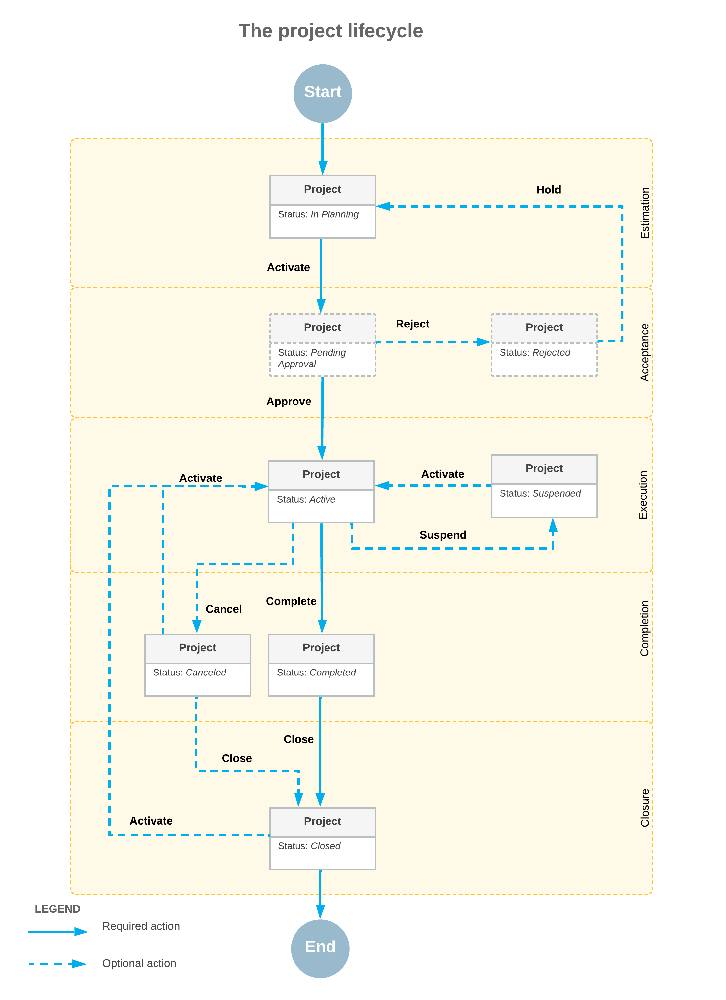

# Project Creation and Processing: A Project’s Lifecycle {#_900d3bea-1fea-4dba-8abc-21e8ff5d6473 .concept}

In Acumatica ERP, a project is a one-time or recurring endeavor with a specific scope, time frame, and budget. The following sections describe the common stages of a project’s lifecycle: estimation, acceptance, execution, completion, and closure.

## Project Stages and Statuses { .section}

The following diagram shows the stages a project goes through and the statuses it is assigned from the project’s initiation to its closure.

## Project Estimation { .section}

During the project estimation stage, you specify project settings on the [Projects](PM_30_10_00.md) \(PM301000\) form, define activities, plan the project tasks, estimate the time required for the completion of each project task, and populate the project record with employees, resources, and equipment. The system assigns each new project and its tasks the *In Planning* status once it has been saved.

Users cannot select projects and project tasks with the *In Planning* status in any records, except for the following types of records that are available for planning:

-   Employee activities on the [Activity](../Shared/../UserGuide/CR_30_60_10.md) \(CR306010\) form
-   Tasks on the [Task](../Shared/../UserGuide/CR_30_60_20.md) \(CR306020\) form
-   Email activities on the [Email Activity](../Shared/../UserGuide/CR_30_60_15.md) \(CR306015\) form
-   Purchase orders on the [Purchase Orders](../Shared/../UserGuide/PO_30_10_00.md) \(PO301000\) form
-   Subcontracts on the [Subcontracts](../Shared/../UserGuide/SC_30_10_00.md) \(SC301000\) form

For instance, you can add an employee activity for planning budgets for project tasks, or record a project commitment. However, if your user account does not have the *Project Accountant* role assigned on the [User Roles](../Shared/../UserGuide/SM_20_10_05.md) \(SM201005\) form, these documents can be processed further only after the *Active* status is assigned to the project task.

If your user account has the *Project Accountant* role, you can release employee activities with project tasks that have the *In Planning* status.

## Project Acceptance { .section}

The acceptance stage involves reaching an agreement with all the stakeholders, including customers and employees, as well as estimating the budget for the project and the expenditures it will entail. If the approval of projects is not required in your system, the project manager takes the project off hold to assign it the *Active* status. If the approval of projects is required in your system, the system submits the project for approval and assigns it the *Pending Approval* status once it is taken off hold.

If all assigned employees have approved the project on the [Approvals](EP_50_30_10.md) \(EP503010\) form or on the [Projects](PM_30_10_00.md) \(PM301000\) form, the system assigns it the *Active* status. If at least one of assigned employees has rejected the project, it is assigned the *Rejected* status. You can assign the *In Planning* status to the project again so that you can edit its details and resubmit it for approval. For more information on approvals, see [Specific Approvals: Projects, Project-Related Documents, and Time Activities](../ImplementationGuide/Projects_Process_Project_Approval.md).

## Project Execution { .section}

During the execution stage, the project retains the *Active* status, indicating that it is in progress and project transactions can be posted to it. Users can select active projects and their project tasks on the forms of the functional areas in which the projects are visible.

**Attention:** A user can select the project tasks with the *Completed*, *Canceled*, or *In Planning* status on data entry forms only if this user has the *Project Accountant* role assigned to their user account on the [User Roles](../Shared/../UserGuide/SM_20_10_05.md) \(SM201005\) form.

By default, in newly created transactions and documents, the system inserts the non-project code. When you create a project-related transaction or document, you need to specify the particular project and project task to indicate that this transaction or document must be tracked within the project; also, you can specify whether the transaction or document is billable. If the non-project code is specified in these transactions, they are not tracked in any project.

If any budget changes occur during the course of the project, the system preserves the initial budget amounts, and tracks the revised figures for the project budget.

If your company has decided to temporarily pause all activities on the project, you can assign this project the *Suspended* status. A suspended project is not available for selection on data entry forms, except for forms where employee activities and project commitments can be entered. When work on the project resumes, you can reactivate the suspended project.

## Project Completion { .section}

The statuses of individual project tasks do not directly affect the status of the corresponding project. Thus, the system does not automatically set a project’s status to *Completed* if all of its project tasks have been completed. However, to be able to complete the project, you first need to complete all project tasks included in this project. For more information about project task completion, see [Project Tasks: Tracking Task Completion](Project_Tasks_Task_Completion.md).

Once the project is finished, the project accountant completes it by manually assigning it the *Completed* status, and then analyzes the project profitability. Project transactions can no longer be posted to a project with the *Completed* status.

**Tip:** To simplify the tracking of the project completion percentage, you can create a separate dedicated task and use it exclusively to manually specify the project completion percentage, which you evaluate by using all the information available about the progress of project tasks and project-related transactions.

Alternatively, a project can be canceled. The *Canceled* status indicates that the project has been stopped before its actual completion. A canceled project can be activated again.

## Project Closure { .section}

If a project is completed \(or canceled\) and you don’t expect further activity on it, you click **Close** on the form toolbar of the [Projects](PM_30_10_00.md) \(PM301000\) form. The system checks whether the project has any related unprocessed documents. If it doesn’t find any—meaning that the project is ready to be closed—it does the following:

-   Assigns the *Closed* status to the project.
-   Makes the project's settings, including user-defined fields, and most of the More menu commands read-only on the [Projects](PM_30_10_00.md) form.
-   Makes the project tasks' settings read-only on the [Project Tasks](PM_30_20_00.md) \(PM302000\) and [Projects](PM_30_10_00.md) forms.
-   Hides the project from lookup tables on data entry forms with the **Project** box or column.
-   Excludes the project from billing. As a result, you can't run billing for it on the [Run Project Billing](PM_50_30_00.md) \(PM503000\) and [Projects](PM_30_10_00.md) forms.
-   Excludes the project from allocation—that is, you can't run allocation on the [Run Allocations by Projects](PM_50_25_00.md) \(PM502500\), [Run Allocations by Tasks](PM_50_20_00.md) \(PM502000\), or [Projects](PM_30_10_00.md) form.
-   Excludes the project from balance recalculation. As a result, you can't recalculate its balance on the [Recalculate Project Balances](PM_50_40_00.md) \(PM504000\) or [Projects](PM_30_10_00.md) form.

These changes help to prevent unintended updates and streamline work by removing closed projects from workflows that involve only ongoing work.

**Tip:** If work restarts on a closed project, click **Activate** on the form toolbar of the [Projects](PM_30_10_00.md) form. The project is assigned the *Active* status again, becomes visible on data entry forms, and can be billed or included in allocation.

**Parent topic:**[Creating and Processing Projects](../UserGuide/Projects_Process_Mapref.md)

