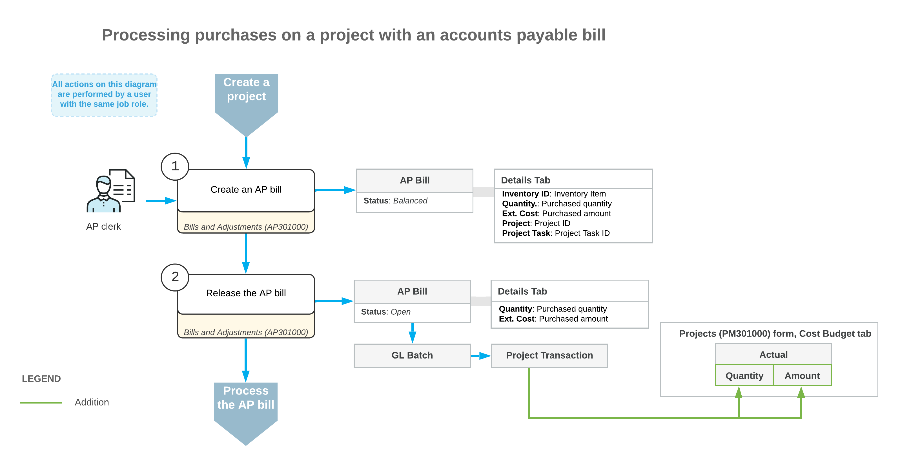

# Purchasing Services for Projects: General Information {#_c17cd234-2ca9-1ca8-a687-fa3ccdaa1e16 .concept}

In Acumatica ERP, you can purchase services for projects without using purchase orders, so that these purchases affect the cost budget of the projects. You can later bill the customer for the purchased services, based on the expenses recorded to the cost budget.

## Learning Objectives { .section}

You will learn how to do the following:

-   Enter the accounts payable bill for the project
-   Specify the services to be purchased, and release the bill
-   Review the project and GL transactions that are generated during the processing of a purchase

## Applicable Scenarios { .section}

You process a purchase of services for a project by using accounts payable bills without processing purchase orders to update the actual values of the project budget with the cost of the purchased services. You may need this, for example, if the *Inventory and Order Management* group of features is not included in your license or if you want to simplify the process of purchasing services.

## Purchasing of Services for Projects { .section}

You purchase services—non-stock items that are configured so that the system does not require a purchase receipt for them—for projects using accounts payable bills. On the **Details** tab of the [Bills and Adjustments](AP_30_10_00.md) \(AP301000\) form, you add a line for each non-stock item representing a service. To associate each bill line with a non-stock item with a project, you specify the project and project task.

When you release the accounts payable bill with lines related to a project, the system updates the budget lines of the project with the same project task, account group, and inventory item on the **Cost Budget** tab of the [Projects](PM_30_10_00.md) \(PM301000\) form. The system updates the **Actual Quantity** and **Actual Amount** of these cost budget lines with the billed quantity and amount.

For more information on processing accounts payable bills, see [AP Bills: General Information](Finance_ProcessingAPBills_GeneralInfo.md).

## Workflow of Purchasing Services for Projects { .section}

The following diagram illustrates the workflow of purchasing services for projects using accounts payable bills.

**Parent topic:**[Purchasing Services for Projects](../UserGuide/Projects_Project_Purchases_AP_Bill.md)

