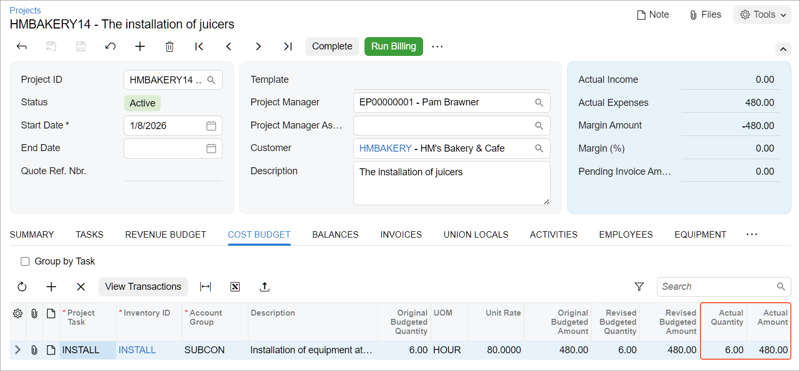

# Purchasing Services for Projects: Process Activity {#_c53c0444-16c1-4385-1234-d9cecd34d4c0 .task}

This activity will walk you through the process of purchasing services for a project from a subcontractor with accounts payable bills.

**Attention:** This activity is based on the *U100* dataset. If you are using another dataset or if any system settings have been changed in *U100*, these changes can affect the workflow of the activity and the results of the processing. To avoid issues, restore the *U100* dataset to its initial state.

## Story {#section_u1m_qn2_yrb .section}

Suppose that the HM's Bakery and Cafe customer has ordered the installation service for previously bought juicers from the SweetLife Fruits &amp; Jams company. The SweetLife company has contracted the Squeezo Inc. vendor to provide six hours of the installation service. SweetLife's project manager has created the project. To simplify the process of purchasing services, SweetLife's AP clerk has decided to skip the entering of a purchase order for the purchase. Acting as SweetLife's AP clerk, you will process the project-related purchase by using an accounts payable bill.

## Configuration Overview { .section}

In the *U100* dataset, the following tasks have been performed to support this activity:

-   On the [Enable/Disable Features](CS_10_00_00.md) \(CS100000\) form, the *Projects* feature has been enabled to support the project management functionality.
-   On the [Projects](PM_30_10_00.md) \(PM301000\) form, the *HMBAKERY14* project has been created, and the *INSTALL* project task has been created for the project. This task is the default project task.
-   On the [Non-Stock Items](IN_20_20_00.md) \(IN202000\) form, the *INSTALL* non-stock item of the *Service* type has been defined. On the **General** tab \(**Item Defaults** section\), the **Require Receipt** check box has been cleared. On the **Price/Cost** tab \(**Standard Cost** section\), the **Current Cost** of the item has been set to *80.00*. On the **GL Accounts** tab, the *54200 \(Project Subcontract Expense\)* account has been selected in the **Expense Account** box.
-   On the [Account Groups](PM_20_10_00.md) \(PM201000\) form, the *SUBCON* account group has been created, and the *54200 \(Project Subcontract Expense\)* account has been mapped to the account group.
-   On the [Vendors](AP_30_30_00.md) \(AP303000\) form, the *SQUEEZO* vendor has been created.

## Process Overview { .section}

You will create a bill on the [Bills and Adjustments](AP_30_10_00.md) \(AP301000\) form, and specify the project and project task in the bill lines. Then you will release the bill. Finally, you will review the project balances on the [Projects](PM_30_10_00.md) \(PM301000\) form.

## System Preparation { .section}

To sign in to the system and prepare to perform the instructions of the activity, do the following:

1.  Launch the Acumatica ERP website, and sign in to a company with the *U100* dataset preloaded; you should sign in as project accountant by using the *brawner* username and the *123* password.
2.  In the info area at the upper-right corner of the top pane of the Acumatica ERP screen, make sure that the business date is set to *1/30/2026*. If a different date is displayed, click the Business Date menu button and select *1/30/2026* from the calendar. For simplicity, you'll create and process all documents in this activity using this business date.

## Step: Creating a Bill for the Project { .section}

To create an accounts payable bill for the project, do the following:

1.  On the [Bills and Adjustments](AP_30_10_00.md) \(AP301000\) form, add a new record.
2.  In the Summary area, specify the following settings:
    -   **Vendor**: *SQUEEZO*
    -   **Date**: *1/30/2026*
    -   **Description**: `Services for HM's Bakery & Cafe`
3.  On the **Details** tab, click **Add Row** on the table toolbar, and add a row with the following settings:

    -   **Inventory ID**: *INSTALL*
    -   **Quantity**: `6`
    -   **Project**: *HMBAKERY14*
    -   **Project Task**: *INSTALL* \(selected by default\)
    -   **Cost Code**: *00-000*
    The system selects *54200 \(Project Subcontract Expense\)* as the **Account** of the bill line, because this is the expense account of the selected item.

4.  On the form toolbar, click **Remove Hold** to assign the bill the *Balanced* status, and then click **Release** to release the bill.
5.  Open the [Project Transaction Details](PM_40_10_00.md) \(PM401000\) form.
6.  In the Selection area of the form, select *HMBAKERY14* as the **Project**, and make sure the **Account Group** and **Project Task** boxes are cleared. Review the project transaction that has updated the actual values in the budget line. The debit account group in the transaction \(*SUBCON*\) is the group that is mapped to the *54200* expense account of the *INSTALL* non-stock item specified in the line.
7.  On the [Projects](PM_30_10_00.md) \(PM301000\) form, open the *HMBAKERY14* project, and review the cost budget on the **Cost Budget** tab. Notice that the **Actual Quantity** and **Actual Amount** of the corresponding budget line have been updated \(to *6* and *480.00*, respectively\), as shown below.

    

You have completed the processing of the purchase of services for the project and captured the cost of services to the project budget.

**Parent topic:**[Purchasing Services for Projects](../UserGuide/Projects_Project_Purchases_AP_Bill.md)

