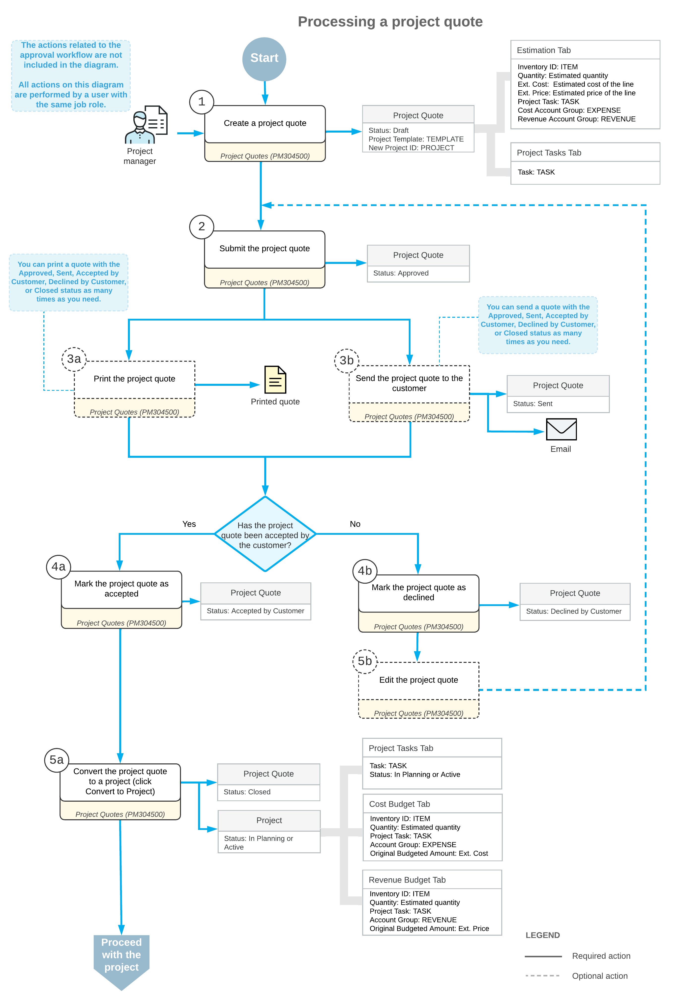

# Project Quotes: General Information {#_9270d45a-8a6b-2434-8a73-5031ccc3b8a6 .concept}

In Acumatica ERP, you use a project quote for planning purposes before you create the corresponding project in the system and begin billing and accounting for revenues and costs. You can create a project quote to estimate the revenue and costs of a potential project and then send this quote to the customer for acceptance. You can modify the project quote as many times as is necessary until an agreement is reached. After the customer agrees to the terms of a quote, you convert the accepted quote to a project.

## Learning Objectives { .section}

In this chapter, you will learn how to do the following:

-   Create a project quote from scratch
-   Create a project quote based on an opportunity
-   Specify the settings of a project quote by using a project template
-   Estimate the potential revenue and costs of a possible project
-   Print the project quote and send it by email
-   Create a project based on a project quote

## Applicable Scenarios { .section}

You create a project quote if you want to send a proposal to the customer or potential customer before you create a project, or if you need to agree with the customer about the terms of a potential project before creating the project.

## Creation of Project Quotes from Scratch {#section_fdf_x42_p2b .section}

You create project quotes on the [Project Quotes](PM_30_45_00.md) \(PM304500\) form. In a new project quote, which initially has the *Draft* status, you specify the following settings:

-   The description of the project quote.
-   The project template, which the system uses to populate the project tasks, attributes, and project manager of the project quote. You can change these default settings, if needed.
-   The business account associated with the project quote.

    Based on the settings specified for the selected business account, the system inserts the financial settings on the **Financial** tab and the contact information on the **Addresses** tab. You can override these settings, if needed.

-   Optional: The project tasks on the **Project Tasks** tab, which are copied from the selected project template by default \(but you can modify the project tasks that are inserted based on the template\). You can also add common tasks to the project quote.
-   The estimated labor and material costs and prices on the **Estimation** tab. These lines represent the estimated revenue and costs of a project quote. When you create a project based on the project quote, the system converts the estimation lines to lines of the revenue and cost budgets based on the settings specified in each line:
    -   An estimation line with an account group specified in the **Revenue Account Group** column establishes revenue; the **Ext. Price** of the line is the estimated revenue amount.
    -   An estimation line with an account group specified in the **Cost Account Group** column establishes costs; the **Ext. Cost** of the line is the estimated cost amount.
    -   Estimation lines with both the **Revenue Account Group** and the **Cost Account Group** specified establish revenue and costs at the same time.

## Project Quote Processing { .section}

When you have finished modifying the project quote settings, you submit the quote by clicking **Submit** on the form toolbar of the [Project Quotes](PM_30_45_00.md) \(PM304500\) form. A submitted project quote is assigned the *Approved* status and is ready for further processing.

If you have decided to email a submitted project quote to the customer, you click **Send** on the More menu. The system creates the corresponding email activity, attaches the printable version of the quote to this email activity, and sends it to the recipient. The project is then assigned the **Sent** status.

If you need to track a project quote that has been accepted or declined by the customer, you can use the following commands on the More menu:

-   **Mark as Accepted**: Click this command to assign the project quote the *Accepted by Customer* status. The project quote can be printed, sent, and converted to a project.
-   **Mark as Declined**: Click this command to assign the project quote the *Declined by Customer* status. You can then edit the details of the declined project quote and send it for customer review again. To modify a project quote, click **Edit** on the form toolbar. The quote is assigned the *Draft* status and can be modified.

    If you need to modify an existing project quote but also want to leave its original version intact \(for example, to have a complete history of the submitted quotes\), you can create a copy of the project quote by clicking the **Copy** command; you then modify the copy.

You can convert a project quote with the *Approved*, *Accepted by Customer*, or *Sent* status to a project. To be able to do this, you should specify the project template and business account in the Summary area of the form. If auto-numbering is disabled for the *PROJECT* segmented key on the [Segmented Keys](CS_20_20_00.md) \(CS202000\) form, you must also specify the identifier of the project to be created.

After you have specified the required settings, you click **Convert to Project** on the form toolbar of the [Project Quotes](PM_30_45_00.md) form. In the **Convert to Project** dialog box, which opens, you specify the settings to be used for the created project and click **OK**. The system opens the project created based on the project quote on the [Projects](PM_30_10_00.md) \(PM301000\) form; it also assigns the project quote the *Closed* status. In the created project, a link to the project quote is displayed in the **Quote Ref. Nbr.** box in the Summary area of the [Projects](PM_30_10_00.md) form.

**Tip:** If you delete the project, the system changes the status of the project quote from *Closed* to *Approved*, so you can assign the *Draft* status to the project quote, edit it, and again create a project based on the project quote.

## Workflow of Project Quotes {#section_i3l_d4p_mcb .section}

The following diagram illustrates the workflow of a project quote being processed.

**Parent topic:**[Processing Project Quotes](../UserGuide/Projects_Project_Quotes_Mapref.md)

