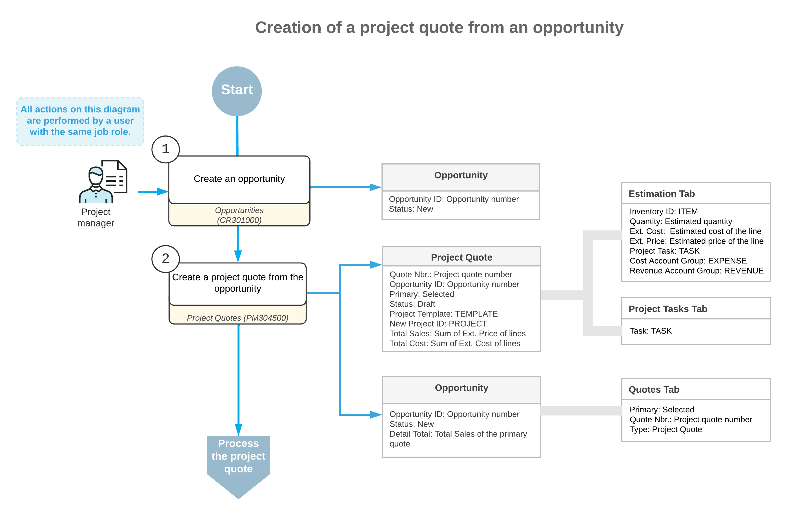

# Project Quotes: Creation of Project Quotes from Opportunities {#_9270d45a-8a6b-7171-8a73-5031ccc3b8a6 .concept}

In Acumatica ERP, an opportunity represents a potential sale to a new or existing customer. You can create a project quote based on an opportunity and then create a project based on this project quote.

The following sections describe the project quotes creation based on opportunities. For more information on working with opportunities, see [Managing Opportunities](CRM_Sales_Managing_Opportunities_Mapref.md).

## Creation of a Project Quote Based on an Opportunity { .section}

To create a project quote based on an opportunity, you open the opportunity on the [Opportunities](CR_30_40_00.md#) \(CR304000\) form, and click **Create Quote** on the form toolbar. In the **Create Quote** dialog box, which the system opens, you select *Project Quote* in the **Quote Type** box to indicate the type of quote to be created based on the opportunity. Then you specify the basic settings and initiate the creation of the quote by clicking **Create and Review**.

The system creates the project quote and opens it on the [Project Quotes](PM_30_45_00.md) \(PM304500\) form. In the Summary area, the system inserts the identifier of the opportunity in the **Opportunity ID** box and copies the business account, the description, and the owner from the opportunity to the quote.

Once you save the project quote associated with the opportunity, on the [Opportunities](CR_30_40_00.md#) form, the project quote is listed on the **Quotes** tab along with any other project and sales quotes associated with the opportunity.

The following diagram illustrates the creation of a project quote from an opportunity.

After the project quote has been created based on the opportunity, its workflow is the same as that of a project quote that has been created from scratch. For information, see [Project Quotes: General Information](Projects_Project_Quotes_GeneralInfo.md).

## Primary Project Quotes { .section}

If you create a project quote for an opportunity, and the opportunity does not have any other quotes, the system sets this project quote as the primary by selecting the **Primary** check box in the following places:

-   In the Summary area on the [Project Quotes](PM_30_45_00.md) \(PM304500\) form
-   In the row that has the settings of the project quote on the **Quotes** tab of the [Opportunities](CR_30_40_00.md) \(CR304000\) form

If you create a new project quote and set it as primary, the previous primary quote of this opportunity becomes non-primary.

If multiple quotes are created for an opportunity, one of the quotes must be set as the primary. You can set a project quote as a primary quote for a non-closed opportunity either by clicking **Set as Primary** on the [Project Quotes](PM_30_45_00.md) form toolbar or during creation of a new project quote.

**Tip:** The **Details** tab on the [Opportunities](CR_30_40_00.md) form is not displayed if a project quote has been created for an opportunity and set as primary.

You can create a project from an opportunity-based project quote if this quote has been set as primary. To create a project based on a project quote, you click **Convert to Project** on the form toolbar of the [Project Quotes](PM_30_45_00.md) form. The created project is associated with the opportunity and can be used for the creation of sales orders, invoices, and service orders.

## Project Quote Addresses { .section}

When you create a project quote based on an opportunity, the system inserts the location-related information in the project quote on the [Project Quotes](PM_30_45_00.md) \(PM304500\) form as follows:

-   Copies the address settings from the **Ship-To Address** section on the **Shipping** tab of the [Opportunities](CR_30_40_00.md) \(CR304000\) form to the **Project Address** section on the **Addresses** tab of the [Project Quotes](PM_30_45_00.md) form for the project quote. If you need to change the project address in the project quote, you can select the **Override** check box in the **Project Address** section and update the information in the section.
-   Copies the contact settings from the **Contact** section on the **Contact** tab of the [Opportunities](CR_30_40_00.md) form to the **Bill-To Contact** section on the **Addresses** tab of the [Project Quotes](PM_30_45_00.md) form for the project quote.
-   Copies the address information from the **Address** section on the **Contact** tab of the [Opportunities](CR_30_40_00.md) form to the **Bill-To Address** section on the **Addresses** tab of the [Project Quotes](PM_30_45_00.md) form for the project quote.

If you specify a different business account in the **Business Account** box of the Summary area, or a location in the **Location** box of the **Financial** tab of the [Project Quotes](PM_30_45_00.md) form, the system displays a dialog box in which you need to confirm the replacement of the existing settings in the quote with the new settings.

**Parent topic:**[Processing Project Quotes](../UserGuide/Projects_Project_Quotes_Mapref.md)

