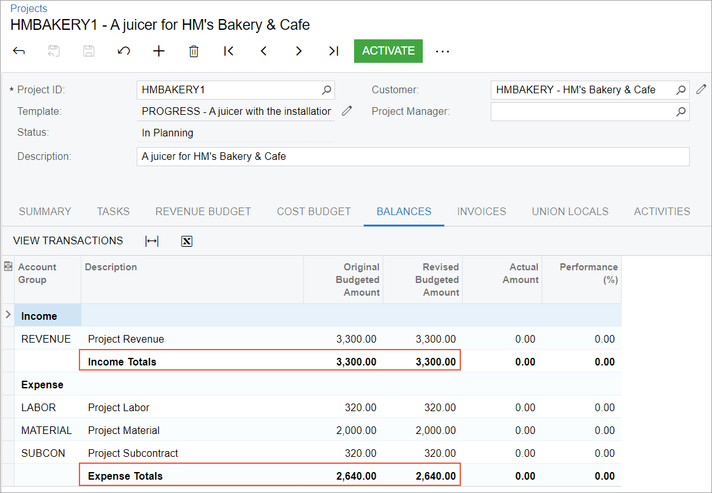

# Project Quotes: To Process a Project Quote Based on an Opportunity {#_fb10511a-7654-46fd-9fe8-df66c3cfb01b .task}

This activity will walk you through the process of creating a project quote from an opportunity and creating a project based on the project quote.

**Attention:** This activity is based on the *U100* dataset. If you are using another dataset or if any system settings have been changed in *U100*, these changes can affect the workflow of the activity and the results of the processing. To avoid issues, restore the *U100* dataset to its initial state.

## Story { .section}

Suppose that the HM's Bakery and Cafe customer has ordered a juicer for one of its restaurants, along with the installation and training services from the SweetLife Fruits &amp; Jams company. The sales manager of SweetLife has created an opportunity for the provision of the juicer and the services. Acting as SweetLife's estimator, you will create a project quote for this opportunity, and confirm the project quote with the customer.

Then you will convert the project quote to the project.

## Configuration Overview { .section}

In the *U100* dataset, the following tasks have been performed to support this activity:

-   For the purposes of this activity, the following features have been enabled on the [Enable/Disable Features](CS_10_00_00.md) \(CS100000\) form:
    -   *Projects*, which provides support for the project management functionality
    -   *Project Quotes*, which provides the ability to create project quotes
    -   *Customer Management*, which provides the customer relation management \(CRM\) functionality, including management of opportunities
-   On the [Opportunities](CR_30_40_00.md) \(CR304000\) form, the *000001* opportunity has been created. A note and a file have been attached to the opportunity.
-   On the [Project Templates](PM_20_80_00.md) \(PM208000\) form, the *PROGRESS* project template has been configured with the *PHASE1* and *PHASE2* project template tasks.
-   On the [Account Groups](PM_20_10_00.md) \(PM201000\) form, the *REVENUE*, *MATERIAL*, *SUBCON*, and *LABOR* account groups have been created.
-   On the [Stock Items](IN_20_25_00.md) \(IN202500\) form, the *JUICER15* stock item has been configured.
-   On the [Non-Stock Items](IN_20_20_00.md) \(IN202000\) form, the *INSTALL* and *TRAINING* non-stock items have been configured.

## Process Overview { .section}

On the [Opportunities](CR_30_40_00.md) \(CR304000\) form, you will initiate the creation of a project quote for the opportunity created for the customer. On the [Project Quotes](PM_30_45_00.md) \(PM304500\) form, you will then create the project quote and specify all required settings, including the estimation lines and the project template to be used for project creation. You will also print the project quote and email it to the customer for review.

Once the project quote has been confirmed with the customer, you will convert the project quote to a project.

## System Preparation { .section}

Before you begin performing the steps of this activity, perform the following instructions to prepare the system:

1.  Launch the Acumatica ERP website, and sign in to a company with the *U100* dataset preloaded; you should sign in as project accountant by using the *brawner* username and the *123* password.
2.  In the info area at the upper-right corner of the top pane of the Acumatica ERP screen, make sure that the business date is set to *1/30/2026*. If a different date is displayed, click the Business Date menu button and select *1/30/2026* from the calendar. For simplicity, you'll create and process all documents in this activity using this business date.

## Step 1: Creating a Project Quote { .section}

To create a project quote for an opportunity, do the following:

1.  On the [Opportunities](CR_30_40_00.md) \(CR304000\) form, open the *000001* opportunity, and in the Summary area, notice that the amount in the **Detail Total** box is equal to *3,500.00*.
2.  On the form toolbar, click **Create Quote**.
3.  In the **Create Quote** dialog box, which opens, do the following:

    1.  Select *Project Quote* as the **Quote Type**.

        Notice that the **Set New Quote as Primary** check box is selected.

    2.  Click **Create &amp; Review**.
    The system creates a project quote based on the opportunity and opens the project quote on the [Project Quotes](PM_30_45_00.md) \(PM304500\) form. Notice the following:

    -   In the Summary area, the **Primary** check box is selected, which means that the project quote is the primary quote of the opportunity, whose identifier is shown in the **Opportunity ID** box. The description of the quote has been copied from the opportunity.
    -   On the form title bar, the icon to the left of **Notes** is shaded in yellow, and *\(1\)* is shown after **Files**, indicating that the project quote has a note and an attached file, which have been copied from the opportunity.
4.  In the Summary area of the [Project Quotes](PM_30_45_00.md) form, specify the following settings:

    -   **Project Template**: *PROGRESS*
    -   **New Project ID**: `HMBAKERY1`
    When you select the project template, the system fills in the relevant elements of the project quote with the settings specified for the template.

5.  On the **Project Tasks** tab, make sure that two tasks have been copied from the selected project template. Notice that the **Default** check box is selected for the *PHASE1* task. The project task is specified as the default task of the project quote because this task is the default task of the selected project template.

## Step 2: Estimating the Revenue and Costs of the Project Quote { .section}

To estimate the revenue and costs of the project quote based on the customer's order, do the following:

1.  While you are still viewing the project quote on the [Project Quotes](PM_30_45_00.md) \(PM304500\) form, on the **Estimation** tab, add a line with the following settings:
    -   **Inventory ID**: *JUICER15*
    -   **Quantity**: `1`
    -   **Project Task**: *PHASE1* \(inserted automatically\)
    -   **Cost Code**: *00-000*
    -   **Cost Account Group**: *MATERIAL* \(inserted automatically\)
2.  Add a second line with the following settings:
    -   **Inventory ID**: *INSTALL*
    -   **Quantity**: `4`
    -   **Project Task**: *PHASE1* \(inserted automatically\)
    -   **Cost Code**: *00-000*
    -   **Cost Account Group**: *SUBCON* \(inserted automatically\)
3.  Add a third line with the following settings:

    -   **Inventory ID**: *TRAINING*
    -   **Quantity**: `8`
    -   **Project Task**: *PHASE2*
    -   **Cost Code**: *00-000*
    -   **Cost Account Group**: *LABOR* \(inserted automatically\)
    The added lines specify estimated costs by project task and inventory item.

4.  In each of the added lines, change **Ext. Price** to `0`, and make sure the **Revenue Account Group** column is empty. When this quote is converted to a project, the system will convert these lines to cost budget lines of the project.
5.  On the same tab, add a revenue line with the following settings:
    -   **Description**: `The juicer with installation`
    -   **Ext. Price**: `2900`
    -   **Project Task**: *PHASE1* \(inserted automatically\)
    -   **Cost Code**: *00-000*
    -   **Revenue Account Group**: *REVENUE*
6.  On the same tab, add second revenue line with the following settings:

    -   **Description**: `Training of employees`
    -   **Ext. Price**: `400`
    -   **Project Task**: *PHASE2*
    -   **Cost Code**: *00-000*
    -   **Revenue Account Group**: *REVENUE*
    Notice that for each of the added revenue lines, the **Ext. Cost** is *0* and the **Cost Account Group** column is empty. When this quote is converted to a project, the system will convert these lines of the quote to revenue budget lines of the project.

7.  Save your changes to the project quote.

    In the Summary area, notice that the amount in the **Total Sales** box is *3,300.00*, which is the total of the values in the **Ext. Price** column on the **Estimation** tab. The amount in the **Total Cost** box is *2,640.00*, which is the total of the values in the **Ext. Cost** column on the **Estimation** tab. The gross margin amount of the quote is $660 \(20%\).

8.  On the [Opportunities](CR_30_40_00.md) form, again open the *000001* opportunity, and notice the following:
    -   In the Summary area, the **Detail Total** of the opportunity has been changed to the total sales of the created project quote \(*3,300.00*\).
    -   On the **Quotes** tab, where the project quote you created is listed in the table, the total sales of the quote is shown in the **Detail Total** column \(*3,300.00*\). Also, the check box in the **Primary** column is selected, which means that this is the primary project quote of the opportunity.

## Step 3: Confirming the Project Quote with the Customer { .section}

To confirm the project quote, do the following:

1.  On the [Project Quotes](PM_30_45_00.md) \(PM304500\) form, open the project quote that you have created earlier in this activity.
2.  On the form toolbar, click **Submit**. The system changes the status of the quote to *Approved*; you can no longer edit the quote's settings.
3.  On the form toolbar, click **Send** to send the project quote to the customer. The system changes the status of the project quote to *Sent*.
4.  On the **Activities** tab, click the link in the **Summary** column of the only line. The system opens the email on the [Email Activity](CR_30_60_15.md) \(CR306015\) form. On the form title bar, notice that *\(1\)* is shown after **Files**: the system has generated the ready-to-print version of the quote and attached the generated PDF to the email. The email has been sent to the customer's email address, which is specified on the **Addresses** tab of the [Project Quotes](PM_30_45_00.md) form.
5.  Close the form and return to the project quote on the [Project Quotes](PM_30_45_00.md) form.
6.  On the form toolbar, click **Print** to print the project quote.

    The system navigates to the [Project Quote](PM_60_45_00.md) \(PM604500\) report, which is the same report as has been attached to the email. The printed form lists the estimated revenue of the project quote, which the customer needs to review and agree to.

7.  Click Back in the browser window to return to the project quote on the [Project Quotes](PM_30_45_00.md) form.
8.  On the More menu, click **Mark as Accepted**. The project quote is assigned the *Accepted by Customer* status.

Now you can convert the agreed quote to a project.

## Step 4: Creating a Project Based on the Project Quote { .section}

To create a project based on the project quote, do the following:

1.  While you are still viewing the project quote on the [Project Quotes](PM_30_45_00.md) \(PM304500\) form, on the form toolbar, click **Convert to Project** to convert the quote to a project.
2.  In the **Convert to Project** dialog box, which opens, select the following check boxes:
    -   **Copy Notes to Project**
    -   **Copy Files to Project**
3.  Leave the other check boxes cleared, and click **OK**.

    The system closes the dialog box, changes the status of the project quote to *Closed*, creates a project based on the project quote, and opens the created project on the [Projects](PM_30_10_00.md) \(PM301000\) form.

    On the form title bar, notice that the icon to the left of **Notes** is shaded in yellow, and that *\(1\)* is shown after **Files**, indicating that the project has a note and an attached file, which have been copied from the project quote \(and were previously copied from the opportunity\).

4.  Make sure that the needed settings have been specified for the created *HMBAKERY1* project as follows:
    -   In the Summary area, the **Template** box shows the project template based on which the project quote has been created \(*PROGRESS*\).
    -   On the **Summary** tab, in the **Quote** section, the number of the corresponding project quote is shown in the **Quote Ref. Nbr.** box.
    -   On the **Tasks** tab, two project tasks have been copied from the project quote. Notice that the check box in the **Default** column is selected for the *PHASE1* task, indicating that it is the default task of the created project.
    -   On the **Revenue Budget** tab, two revenue budget lines have been created based on the estimation lines of the project quote with the specified revenue account group.
    -   On the **Cost Budget** tab, three cost budget lines have been created based on the estimation lines of the project quote with the specified cost account group.
    -   On the **Balances** tab \(see the following screenshot\), the **Income Totals** matches the total sales of the project quote \($3,300\), and the **Expense Totals** matches the total cost of the project quote \($2,640\).

        

5.  On the [Opportunities](CR_30_40_00.md) \(CR304000\) form, open the *000001* opportunity, and on the **Activities** tab, make sure that the email created for the project quote is listed in the table.
6.  On the **Quotes** tab, in the **Project ID** column, make sure that the identifier of the created project \(*HMBAKERY1*\) is shown.

You have created a project quote based on an opportunity and converted this project quote to a project.

**Parent topic:**[Processing Project Quotes](../UserGuide/Projects_Project_Quotes_Mapref.md)

