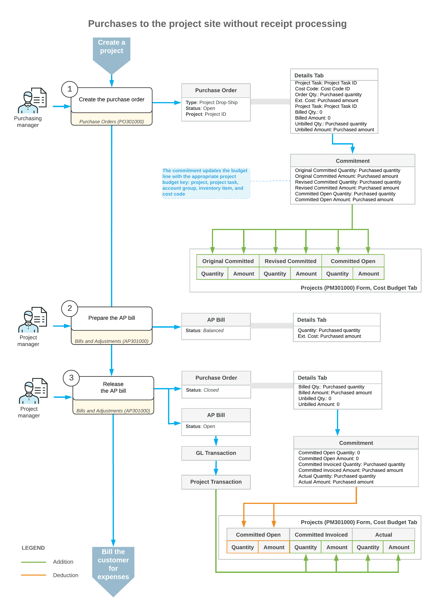

# Purchases to the Project Site: General Information {#_af8100ed-e571-4570-a6ec-5fe68243a61d .concept}

In some businesses, the project manager purchases items for a project from a vendor and requests that the ordered items be delivered directly to the site where the project-related work is performed. For example, you may need the construction materials to be delivered to the construction site. As another example, you might be purchasing materials that are needed to provide some project-related services, and you may ask the vendor to deliver the items directly to the customer location.

If you do not need to track the actual receipt of items, you can process a purchase in which items are drop-shipped from the vendor to the project site without the processing of a purchase receipt. In this case, the accounts payable bill serves as proof that the items were delivered.

## Learning Objectives { .section}

In this chapter, you will learn how to do the following:

-   Define a project for which drop-ship purchases do not require receipt
-   Create a drop-ship purchase order for the project
-   Process a vendor return of drop-ship purchases
-   Prepare an accounts payable bill for the purchase order to record the expenses to the project budget
-   Review the generated project transactions and GL transactions

## Applicable Scenarios { .section}

You process a purchase with drop shipment for a project without receipt when you need the purchased materials to be delivered directly to the project site instead of being received in your warehouse, and you do not need to record detailed information about the receipt of the items to the project site.

## Project Configuration {#section_vsl_k1t_4qb .section}

In Acumatica ERP, you can define a project so that for purchase orders of the *Project Drop-Ship* type, the processing of purchase receipts will not be required. You can then use purchase orders of this type to process the purchases of materials for the project, with drop shipping of these items directly to the project site.

In the settings of a project for which you want to process drop-ship purchases of items without the generation of a purchase receipt, *Skip Receipt Generation* must be specified in the **Drop-Ship Receipt Processing** box on the **Defaults** tab \(**Purchases** section\) of the [Projects](PM_30_10_00.md) \(PM301000\) form. This setting causes the system to insert *On Bill Release* in the **Record Drop-Ship Expenses** box of this section, indicating that the system will capture this project's expenses on release of the accounts payable bill.

## A Drop-Ship Purchase for a Project Without Purchase Receipt Processing {#section_py2_51y_4qb .section}

To process a purchase of items for a project with the items shipped directly to the project site and no receipt processing, you create a purchase order of the *Project Drop-Ship* type on the [Purchase Orders](PO_30_10_00.md) \(PO301000\) form. In the purchase order, you first select the vendor and the project for which the purchase will be performed.

In this purchase order, because you have selected the *Project Drop-Ship* type, the system inserts *Project Site* in the **Shipping Destination Type** box on the **Shipping** tab. The system also copies the shipping contact and address from the selected project to the purchase order to indicate that all purchased items should be delivered to the project site.

On the **Details** tab, you list the stock items \(to which the system assigns the *Goods for Project* type\) and non-stock items \(to which the system assigns the *Non-Stock for Project* type\) to be purchased from the vendor. In each line, you specify the project task \(and cost code, if applicable\) with which the purchase is associated.

**Tip:** In the lines of a project drop-ship order, a warehouse does not need to be specified; thus, the **Warehouse** column is hidden on the **Details** tab of the [Purchase Orders](PO_30_10_00.md) form for this type of purchase orders.

When you save the purchase order with the *Open* status, the system creates a commitment for each purchase order line in the amount of the extended cost of the line; it also updates the original committed, revised committed, and committed open values of the corresponding budget line of the project on the **Cost Budget** tab of the [Projects](PM_30_10_00.md) form.

To record the expenses to the project, you create an accounts payable bill for the purchase order by clicking **Enter AP Bill** \(under **Processing**\) on the More menu of the [Purchase Orders](PO_30_10_00.md) form. The system copies the applicable settings and lines from the purchase order to the bill and opens it on the [Bills and Adjustments](AP_30_10_00.md) \(AP301000\) form. Then you release the prepared bill. After all the lines in the purchase order have been billed in full, the system assigns the purchase order the *Closed* status.

When the bill is released, the system generates a general ledger transaction; on release of this GL transaction, the corresponding project transaction is generated. The project transaction updates the cost budget lines of the project with the same project budget key \(that is, with the same project, project task, account group, inventory item, and cost code, if applicable\) on the **Cost Budget** tab of the [Projects](PM_30_10_00.md) form. The system updates the committed invoiced, committed open, and actual values of these cost budget lines with the billed quantity and amount.

After the processing of the purchase is completed, you run project billing to prepare the invoice for the customer for the expenses related to the purchase.

## Avalara Tax Calculation for Project Drop-Ship Type Orders { .section}

If the *External Tax Calculation Integration* feature is enabled on the [Enable/Disable Features](CS_10_00_00.md) \(CS100000\) form and Avalara tax calculation is used in the system, the taxes in the *Project Drop-Ship* purchase orders are calculated based on the project's tax zone.

For such purchase orders, the address in Avalara is copied from the following settings: the **Ship-To Address** on the **Shipping** tab on the [Purchase Orders](PO_30_10_00.md) \(PO301000\) form is copied from the address of the related project, which is specified on the **Addresses** tab of the [Projects](PM_30_10_00.md) \(PM301000\) form.

-   **From**: **Vendor Address** section on the **Vendor Info** tab of the [Purchase Orders](PO_30_10_00.md) form
-   **To**: **Ship-To Address** section on the **Shipping** tab of the [Purchase Orders](PO_30_10_00.md) form

If an AP bill line is related to a *Project Drop-Ship* purchase order, for this line, the address in Avalara is copied from the same settings.

For more details, see [Calculating Use and Sales Taxes in Purchase Documents](PO__con_Use_Tax_PO_Avalara.md).

## Workflow of the Purchase to the Project Site {#section_vv2_1y4_y4b .section}

For project-related purchases with the items drop-shipped to the project site, the typical process involves the actions and generated documents shown in the following diagram.

**Parent topic:**[Purchasing Materials to Project Site](../UserGuide/Projects_Purchase_to_Project_Site_Mapref.md)

