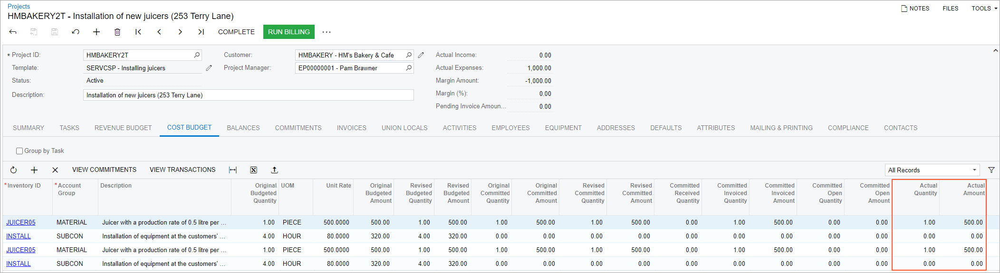

# Purchases to the Project Site: Process Activity {#_7698ac28-a6e2-4c20-8e90-e093aff32c6a .task}

This activity will walk you through the process of purchasing materials for the project site.

**Attention:** This activity is based on the *U100* dataset. If you are using another dataset or if any system settings have been changed in *U100*, these changes can affect the workflow of the activity and the results of the processing. To avoid issues, restore the *U100* dataset to its initial state.

## Story {#section_ajm_rn2_yrb .section}

Suppose that the HM's Bakery and Cafe customer has ordered two juicers, along with four hours of the installation service from the SweetLife Fruits &amp; Jams company. The project accountant has analyzed the requirements and decided to create a small cost-plus project with two tasks, each for the installation of a juicer, and specify the cost budget of a project.

Further suppose that SweetLife's project manager has noticed that the warehouse currently has no juicers of the requested type. The project manager has decided to purchase the juicers from the Squeezo Inc. vendor and request the vendor to ship the items directly to the project site. The project manager decided not to track the receipt of items to the project site as a separate document and to consider the provided installation services as the confirmation of the items being received.

Acting as SweetLife's project manager, you will configure a project to handle the tracking and billing of the provided services and stock items. Then you will create a drop-ship order for purchased items for the project and create an accounts payable bill for the vendor. Finally, you will review the commitment to the project budget.

## Configuration Overview {#section_rjp_wkc_vrb .section}

In the *U100* dataset, the following tasks have been performed to support this activity:

-   On the [Enable/Disable Features](CS_10_00_00.md) \(CS100000\) form, the following features have been enabled:
    -   *Projects*, which provides the project accounting functionality
    -   *Inventory and Order Management*, which provides the sales order and purchase order functionality
    -   *Inventory*, which provides the stock item functionality
-   On the [Project Templates](PM_20_80_00.md) \(PM208000\) form, the *SERVCSP* project template has been created.
-   On the [Vendors](AP_30_30_00.md) \(AP303000\) form, the *SQUEEZO* vendor has been created.
-   On the [Customers](AR_30_30_00.md) \(AP303000\) form, the *HMBAKERY* customer has been created.
-   On the [Stock Items](IN_20_25_00.md) \(IN202500\) form, the *JUICER05* stock item has been created.

## Process Overview {#section_k3j_j42_vrb .section}

You will create a project based on the project template on the [Projects](PM_30_10_00.md) \(PM301000\) form and configure settings for the drop-ship purchases for the project. Then you will create a drop-ship order for the project and prepare a bill for it. Finally, you will review the commitment to the project budget and the generated project transactions.

## System Preparation {#section_jqs_fp1_5rb .section}

Before you start creating a project and process a purchase, do the following:

1.  Launch the Acumatica ERP website, and sign in as a project manager. You should sign in by using the *brawner* username and the *123* password.
2.  In the info area, in the upper-right corner of the top pane of the Acumatica ERP screen, make sure that the business date in your system is set to 1/30/2026. If a different date is displayed, click the Business Date menu button, and select 1/30/2026 on the calendar. For simplicity, in this activity, you will create and process all documents in the system on this business date.
3.  On the **General** tab \(**General Settings** section\) of the [Projects Preferences](PM_10_10_00.md) \(PM101000\) form, make sure the **Internal Cost Commitment Tracking** check box is selected.

## Step 1: Creating a Project {#section_xjx_sq1_5rb .section}

To create a project, do the following:

1.  On the [Projects](PM_30_10_00.md) \(PM301000\) form, add a new record.
2.  In the Summary area, specify the following settings:
    -   **Project ID**: `HMBAKERY2T`
    -   **Customer**: *HMBAKERY*
    -   **Template**: *SERVCSP*
    -   **Description**: `Installation of new juicers (253 Terry Lane)`
3.  On the Summary tab, select the **Allow Adding New Items on the Fly** check box.
4.  On the **Addresses** tab, in the **Project Address** section, specify the following settings:
    -   **Address Line 1**: `253 Terry Lane`
    -   **City**: `New York`
    -   **Country**: *US*
    -   **State**: *NY*
    -   **Postal Code**: `10001`
5.  Save your changes to the project.
6.  On the **Tasks** tab, make sure that the *PHASE1* and *PHASE2* tasks have been added to the project.
7.  On the table toolbar, click **Activate Tasks** to change the status of the project tasks to *Active*.
8.  On the **Cost Budget** tab, make sure that two lines with the *JUICER05* item and two lines with the *INSTALL* item have been added.
9.  On the **Defaults** tab, make sure that the following settings have been specified:
    -   **Use Expense Account From**: *Posting Class or Item*
    -   **Drop-Ship Receipt Processing**: *Skip Receipt Generation*

        With this setting, items of any type added to a purchase order of the *Project Drop-Ship* type are processed without a purchase receipt.

10. On the form toolbar, click **Activate**. The system assigns the project the *Active* status.

## Step 2: Creating a Project Drop-Ship Order {#section_jy5_zv1_5rb .section}

Create and process a drop-ship order for the project as follows:

1.  Set the business date to 2/15/2026.
2.  While still reviewing the *HMBAKERY2T* project on the [Projects](PM_30_10_00.md) \(PM301000\) form, on the table toolbar of the **Commitments** tab, click **Create Drop-Ship**. The system opens the [Purchase Orders](PO_30_10_00.md) \(PO301000\) form, with the *Project Drop-Ship* selected in the **Type** box and *HMBAKERY2T* project specified in the **Project** box in the Summary area.
3.  In the Summary area, specify the following settings:
    -   **Vendor**: *SQUEEZO*
    -   **Date**: 2/15/2026 \(populated automatically\)
    -   **Description**: `Installation of juicers at the restaurant`
4.  On the **Details** tab, add a row with the following settings:
    -   **Inventory ID**: *JUICER05*
    -   **UOM**: *PIECE* \(specified automatically\)
    -   **Order Qty.**: `1`
    -   **Unit Cost**: `500`
    -   **Project Task**: *PHASE1*
    -   **Cost Code**: *00-000*
5.  Add another row with the following settings:
    -   **Inventory ID**: *JUICER05*
    -   **UOM**: *PIECE* \(specified automatically\)
    -   **Order Qty.**: `1`
    -   **Unit Cost**: `500`
    -   **Project Task**: *PHASE2*
    -   **Cost Code**: *00-000*
6.  Save the project drop-ship order. The system assigns the *On Hold* status to the purchase order. On the **Shipping** tab, review the shipping settings specified for the purchase order and notice that the **Shipping Destination Type** is set to *Project Site*.
7.  On the More menu \(under **Printing and Emailing**\), click **Print Purchase Order**. In the prepared printable document, review the **Ship To** section, and make sure that the shipping address has been copied from the project settings.
8.  Close the browser tab with the report and return to the project drop-ship order on the [Purchase Orders](PO_30_10_00.md) form.
9.  On the form toolbar, click **Remove Hold**. The system assigns the purchase order the *Open* status. When the *Open* status is assigned to the purchase order, the system creates the commitment for the project.
10. On the [Projects](PM_30_10_00.md) form, open the *HMBAKERY2T* project, and on the **Commitments** tab, make sure the drop-ship order for the project is shown.
11. On the **Cost Budget** tab, review the cost budget lines with the *JUICER05* inventory item that the system has updated based on the commitment.

    Notice that the original committed and revised committed amounts and quantities in the lines have been updated by the amounts from the drop-ship order lines for the project. The actual amount in both lines is still *0* because the expenses have not yet been recorded to the project.

12. On the **Commitments** tab, click the **Order Nbr.** link in the only line to open the project drop-ship order that you have created earlier in this activity on the [Purchase Orders](PO_30_10_00.md) form.
13. On the form toolbar, click **Enter AP Bill** to create a bill for the purchase order.

    The system creates an accounts payable bill and opens the bill on the [Bills and Adjustments](AP_30_10_00.md) \(AP301000\) form. Make sure that both purchase order lines have been added to the bill.

14. On the form toolbar, click **Remove Hold** to assign the AP bill the *Balanced* status, and then click **Release** to release the bill.
15. On the [Projects](PM_30_10_00.md) \(PM301000\) form, open the *HMBAKERY2T* project.

    On the **Cost Budget** tab, review the actual values of the cost budget. Notice that the **Actual Quantity** and **Actual Amount** of the lines with the *JUICER05* item have been updated and are now *1* and *500.00*, respectively \(see the following screenshot\). Also notice that the actual expenses of the project \(in the **Actual Expenses** box of the Summary area\) are *1,000.00*, which is the cost of the purchased juicers.

    

You have finished processing a drop-ship purchase order to the project site.

**Parent topic:**[Purchasing Materials to Project Site](../UserGuide/Projects_Purchase_to_Project_Site_Mapref.md)

