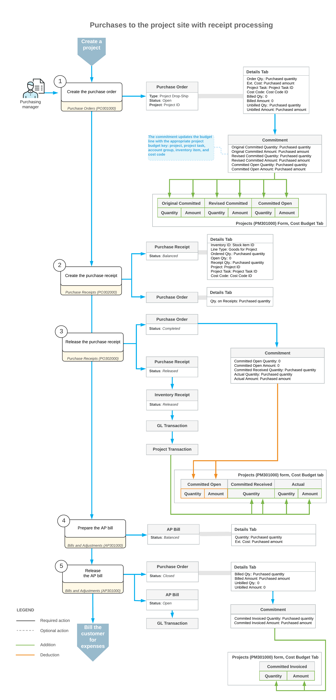

# Purchases to the Project Site with a Receipt: General Information {#_4dfec4b6-5f74-436e-932b-df5fcc3a0a68 .concept}

In some businesses, the project manager purchases items for a project from a vendor and requests that the ordered items be delivered directly to the site where the project-related work is performed. For example, you may need the construction materials to be delivered to the construction site. As another example, you may need the vendor to deliver directly to the customer site some materials that are needed to provide some service work related to the project. If you need to track which items have been received and verify the quantities received at the project site, you need to process a purchase in which the items are drop-shipped and a purchase receipt is processed.

In Acumatica ERP, you can define a project so that for purchase orders of the *Project Drop-Ship* type, the processing of purchase receipts is required. You can then use purchase orders of this type to process the purchases of materials for the project with drop-shipping of these items directly to the project site.

## Learning Objectives { .section}

In this chapter, you will learn how to do the following:

-   Define a project for which drop-ship purchases must be processed by using a purchase receipt
-   Create a drop-ship purchase order for the project
-   Prepare and process a purchase receipt for the purchase order to record the expenses to the project budget
-   Prepare an accounts payable bill for the purchase order
-   Review the generated inventory transactions, project transactions, and GL transactions

## Applicable Scenarios { .section}

You process a purchase with drop shipment for a project with a receipt when you need the purchased materials to be delivered directly to the project site and detailed information about the received items to be recorded.

## Project Configuration {#section_vsl_k1t_4qb .section}

In the settings of a project for which you want to process drop-ship purchases of items with purchase receipts used to record the receipt of these items, *Generate Receipt* must be specified in the **Drop-Ship Receipt Processing** box on the **Defaults** tab \(**Purchases** section\) of the [Projects](PM_30_10_00.md) \(PM301000\) form. In the same section of this tab, **Record Drop-Ship Expense** must be set to *On Receipt Release*, which will cause the system to capture this project's expenses on release of the purchase receipt. The remainder of this topic describes the resulting process of purchasing drop-shipped items when these settings are specified.

## A Drop-Ship Purchase for a Project with Receipt Processing {#section_hkz_nhg_5qb .section}

To process a purchase of items for a project with the items drop-shipped directly to the project site and with receipt processing, you create a purchase order of the *Project Drop-Ship* type on the [Purchase Orders](PO_30_10_00.md) \(PO301000\) form. In the purchase order, you first select the vendor and the project for which the purchase will be performed.

In this purchase order, because you have selected the *Project Drop-Ship* type, the system inserts *Project Site* in the **Shipping Destination Type** box on the **Shipping** tab. The system also copies the shipping contact and address from the selected project to the purchase order to indicate that all purchased items should be delivered to the project site.

On the **Details** tab, you list the stock items \(to which the system assigns the *Goods for Project* type\) and non-stock items \(to which the system assigns the *Non-Stock for Project* type\) to be purchased from the vendor. In each line, you specify the project task \(and cost code, if applicable\) with which the purchase is associated. When you save the purchase order with the *Open* status, the system creates a commitment for each purchase order line in the amount of the extended cost of the line; it then updates the original committed, revised committed, and committed open values of the corresponding budget line of the project on the **Cost Budget** tab of the [Projects](PM_30_10_00.md) form.

After you have confirmed that the materials have been received at the project site, you prepare the purchase receipt related to the drop-ship purchase order of the project by clicking **Enter PO Receipt** on the form toolbar of the [Purchase Orders](PO_30_10_00.md) form. The system automatically copies the applicable settings and the purchase order lines to the created purchase receipt and opens it on the [Purchase Receipts](PO_30_20_00.md) \(PO302000\) form.

**Tip:** In the lines of a project drop-ship order, a warehouse does not need to be specified; thus, the **Warehouse** column is hidden on the **Details** tab of the [Purchase Orders](PO_30_10_00.md) form for this type of purchase orders. In the purchase receipt that corresponds to the purchase order, you still need to enter a warehouse, but the release of the purchase receipt will not affect the quantities of the items in stock.

When you release this purchase receipt, the system creates an inventory receipt transaction; on release of this inventory transaction, the corresponding GL and project transactions are generated. The project transaction updates the cost budget lines of the project with the same project budget key \(that is, with the same project, project task, account group, inventory item, and cost code, if applicable\) on the **Cost Budget** tab of the [Projects](PM_30_10_00.md) form. The system updates the committed received quantity, committed open values, and actual values of these cost budget lines with the received quantity and amount. After all the lines in the purchase order have been received in full, the system assigns the purchase order the *Completed* status.

To finish the processing of the purchase and update the vendor balance in the system, you create an accounts payable bill for the purchase receipt by clicking **Enter AP Bill** on the form toolbar on the [Purchase Orders](PO_30_10_00.md) form. The system copies the applicable settings and lines from the purchase order to the bill and opens it on the [Bills and Adjustments](AP_30_10_00.md) \(AP301000\) form. Then you release the prepared bill; on release of the bill, the system generates the GL transaction. In the cost budget, the system updates the committed billed values with the quantity and amount that have been billed. After all the lines in the purchase order have been billed in full, the system assigns the purchase order the *Closed* status.

After the processing of the purchase is completed, you run project billing to prepare the invoice for the customer for the expenses related to the purchase.

## Avalara Tax Calculation for Project Drop-Ship Type Orders { .section}

If the *External Tax Calculation Integration* feature is enabled on the [Enable/Disable Features](CS_10_00_00.md) \(CS100000\) form and Avalara tax calculation is used in the system, the taxes in the *Project Drop-Ship* purchase orders are calculated based on the project's tax zone.

For such purchase orders, the address in Avalara is copied from the following settings: the **Ship-To Address** on the **Shipping** tab on the [Purchase Orders](PO_30_10_00.md) \(PO301000\) form is copied from the address of the related project, which is specified on the **Addresses** tab of the [Projects](PM_30_10_00.md) \(PM301000\) form.

-   **From**: **Vendor Address** section on the **Vendor Info** tab of the [Purchase Orders](PO_30_10_00.md) form
-   **To**: **Ship-To Address** section on the **Shipping** tab of the [Purchase Orders](PO_30_10_00.md) form

If an AP bill line is related to a *Project Drop-Ship* purchase order, for this line, the address in Avalara is copied from the same settings.

For more details, see [Calculating Use and Sales Taxes in Purchase Documents](PO__con_Use_Tax_PO_Avalara.md).

## Workflow of the Purchase to the Project Site with a Receipt {#section_vv2_1y4_y4b .section}

For project-related purchases with the items drop-shipped to the project site and with the processing of a purchase receipt, the typical process involves the actions and generated documents shown in the following diagram.

**Parent topic:**[Purchasing Materials to Project Site with Receipt](../UserGuide/Projects_Purchase_with_Receipt_Mapref.md)

