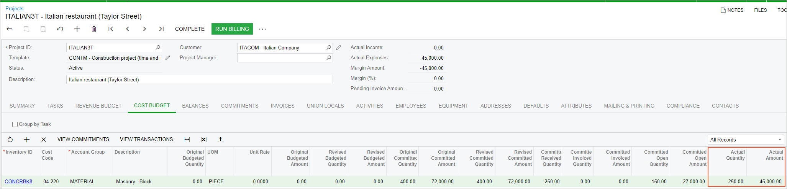

# Purchases to the Project Site with a Receipt: Process Activity {#_a8dc0c16-345e-4367-9069-8b6e238e1c46 .task}

This activity will walk you through the process of purchasing materials for the project site with a receipt being recorded.

**Attention:** This activity is based on the *U100* dataset. If you are using another dataset or if any system settings have been changed in *U100*, these changes can affect the workflow of the activity and the results of the processing. To avoid issues, restore the *U100* dataset to its initial state.

## Story {#section_msw_qn2_yrb .section}

Suppose that the ToadGreen Building Group company is building an Italian restaurant for the Italian Company, its customer. The construction project manager has analyzed the requirements and decided to create a project to track expenses and revenues for the performed work.

Further suppose that work on the project has started on February 15, 2026. The ToadGreen company purchases 400 pallets of 8-inch concrete blocks from the Concrete Supply Co. vendor. The construction project manager asks the vendor to deliver the purchased materials directly to the project site this week. On February 18, 2026, 250 pallets have been delivered to the project site. The vendor will deliver the rest of the purchased blocks at the beginning of March 2026.

Acting as ToadGreen's construction project manager, you will configure a project to handle the tracking and billing of the provided materials. Then you will process a purchase of materials with drop-shipping them directly to the project site.

## Configuration Overview {#section_rjp_wkc_vrb .section}

In the *U100* dataset, the following tasks have been performed to support this activity:

-   On the [Enable/Disable Features](CS_10_00_00.md) \(CS100000\) form, the following features have been enabled:
    -   *Projects* and *Construction*, which provides support for construction projects
    -   *Inventory and Order Management*, which provides the sales order and purchase order functionality
    -   *Inventory*, which provides the stock item functionality
-   On the [Customers](AR_30_30_00.md) \(AP303000\) form, the *ITACOM* customer has been created.
-   On the [Project Templates](PM_20_80_00.md) \(PM208000\) form, the *CONTM* project template has been created.
-   On the [Stock Items](IN_20_25_00.md) \(IN202500\) form, the *CONCRBK8* stock item has been defined.
-   On the [Vendors](AP_30_30_00.md) \(AP303000\) form, the *CONCRESUP* vendor has been created.

## Process Overview { .section}

You will create a project based on the project template on the [Projects](PM_30_10_00.md) \(PM301000\) form and configure settings for the drop-ship purchases for the project. Then you will create a drop-ship order for the project and process it. You will process a purchase receipt to record the partial receipt of the ordered items at the project site. Finally, you will review the commitment to the project budget.

## System Preparation {#section_jqs_fp1_5rb .section}

Before you start creating a project and process a purchase, do the following:

1.  Launch the Acumatica ERP website, and sign in as a construction project manager. You should sign in by using the *ewatson* username and the *123* password.
2.  In the info area, in the upper-right corner of the top pane of the Acumatica ERP screen, make sure that the business date in your system is set to 1/30/2026. If a different date is displayed, click the Business Date menu button, and select 1/30/2026 on the calendar. For simplicity, in this activity, you will create and process all documents in the system on this business date.
3.  On the **General** tab \(**General Settings** section\) of the [Projects Preferences](PM_10_10_00.md) \(PM101000\) form, select the **Internal Cost Commitment Tracking** check box to expose commitments and committed values in the project budget, and save your changes to the project accounting preferences.

## Step 1: Creating a Project Based on the Project Template {#section_xjx_sq1_5rb .section}

To create a project based on a template, do the following:

1.  On the [Projects](PM_30_10_00.md) \(PM301000\) form, add a new record.
2.  In the Summary area, specify the following settings:

    -   **Project ID**: `ITALIAN3T`
    -   **Customer**: *ITACOM*
    -   **Template**: *CONTM*
    When you select the project template, the system fills in the relevant elements of the project with the settings specified for the template, including tasks and revenue budget lines.

3.  In the **Description** box of the Summary area, enter `Italian restaurant (Taylor Street)`.
4.  In the **Project Properties** section on the **Summary** tab, specify the following settings:
    -   **Cost Budget Level**: *Task, Item, and Cost Code*
    -   **Allow Adding New Items on the Fly**: Selected
5.  On the **Addresses** tab, in the **Project Address** section, specify the following settings:
    -   **Address Line 1**: `3505 Taylor Street`
    -   **City**: `New York`
    -   **Country**: *US*
    -   **State**: *NY*
    -   **Postal Code**: `10011`
6.  Save your changes to the project.
7.  On the **Tasks** tab, make sure that 16 tasks have been added, and on the table toolbar, click **Activate Tasks** to change the status of the project tasks to *Active*.
8.  On the **Defaults** tab, specify the following settings:
    -   **Use Expense Account From**: *Posting Class or Item*
    -   **Drop-Ship Receipt Processing**: *Generate Receipt*

        With this setting, items of any type added to a purchase order of the *Project Drop-Ship* type are processed with a purchase receipt.

    -   **Record Drop-Ship Expenses**: *On Receipt Release*

        With this setting, the expenses are recorded to the project on release of the purchase receipt created for the drop-ship purchase order.

9.  On the form toolbar, click **Activate**. The system assigns the project the *Active* status.

## Step 2: Creating a Project Drop-Ship Order {#section_jy5_zv1_5rb .section}

Create and process a drop-ship order for the project as follows:

1.  Set the business date to 2/15/2026.
2.  While still reviewing the *ITALIAN3T* project on the [Projects](PM_30_10_00.md) \(PM301000\) form, on the table toolbar of the **Commitments** tab, click **Create Drop-Ship**. The system opens the [Purchase Orders](PO_30_10_00.md) \(PO301000\) form, with the *Project Drop-Ship* selected in the **Type** box and *ITALIAN3T* project specified in the **Project** box in the Summary area.
3.  In the Summary area, specify the following settings:
    -   **Vendor**: *CONCRESUP*
    -   **Date**: 2/15/2026 \(populated automatically\)
    -   **Description**: `Purchase of concrete blocks with delivery to project site`
4.  On the **Details** tab, add a row with the following settings:
    -   **Inventory ID**: *CONCRBK8*
    -   **UOM**: *PIECE* \(specified automatically\)
    -   **Order Qty.**: `400`
    -   **Unit Cost**: `180`
    -   **Project Task**: *04*
    -   **Cost Code**: *04-220*

        The system will warn you that the line with the specified project budget key does not exist in the project budget.

5.  Save the drop-ship order for the project. On the **Shipping** tab, review the shipping settings for the purchase order and notice that the **Shipping Destination Type** is set to *Project Site*.
6.  On the More menu \(under **Printing and Emailing**\), click **Print Purchase Order**. In the prepared printable document, review the **Ship To** section, and make sure that the shipping address has been copied from the project settings.
7.  Close the browser tab with the report and return to the drop-ship order for the project on the [Purchase Orders](PO_30_10_00.md) form.
8.  On the form toolbar, click **Remove Hold**. The system assigns the purchase order the *Open* status. When the *Open* status is assigned to the purchase order, the system creates the commitments for the project.
9.  On the [Projects](PM_30_10_00.md) form, open the *ITALIAN3T* project.
10. On the **Cost Budget** tab, review the cost budget line with the *04* project task, the *CONCRBK8* inventory item, and the *04-220* cost code. The system has created this cost budget line based on the commitment.

    Notice that the original committed and revised committed values of the cost budget line have been updated by the purchase order total \(*72,000.00*\). The actual quantity and actual amount in the line are zero because the expenses have not yet been recorded to the project.

## Step 3: Receiving the Items {#section_hct_sz1_5rb .section}

To record the receipt of the items at the project site, perform the following instructions:

1.  On the **Commitments** tab, click the **Order Nbr.** link of the only row to open the project drop-ship order that you have created earlier on the [Purchase Orders](PO_30_10_00.md) \(PO301000\) form.
2.  On the form toolbar, click **Enter PO Receipt**. The system creates a purchase receipt and opens it on the [Purchase Receipts](PO_30_20_00.md) \(PO302000\) form. Save the purchase receipt.
3.  In the **Date** box, specify 2/18/2026.
4.  In the only line on the **Details** tab, specify `250` as **Receipt Qty.**.
5.  Save the purchase receipt.
6.  On the form toolbar, click **Release**.
7.  On the [Projects](PM_30_10_00.md) form, open the *ITALIAN3T* project, and review the **Cost Budget** tab, as shown in the following screenshot. In the line with the *04* project task and the *04-220* cost code, the **Actual Amount** has been updated and is now 45,000. The **Actual Quantity** is 250.

    

You have finished processing a drop-ship purchase order for a project and recorded the receipt of items to the project site.

**Parent topic:**[Purchasing Materials to Project Site with Receipt](../UserGuide/Projects_Purchase_with_Receipt_Mapref.md)

