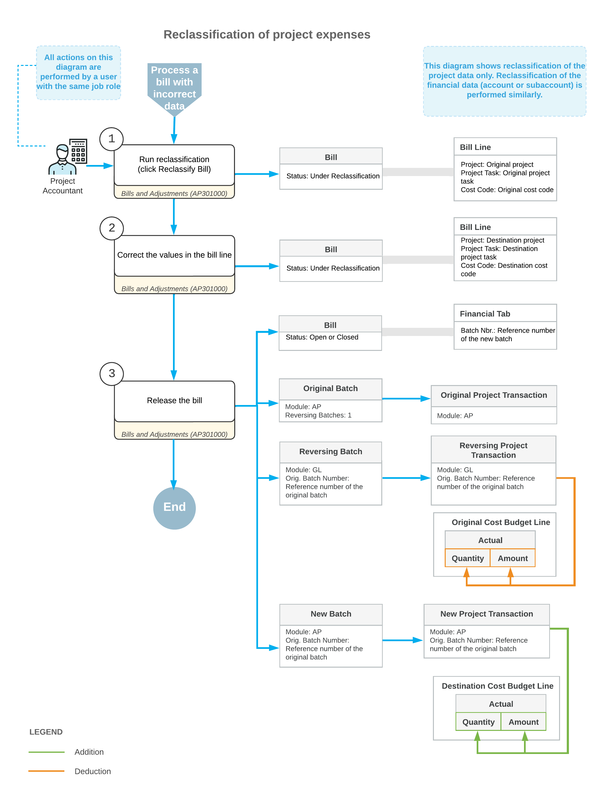

# Project Expense Reclassification: General Information {#_5121ebd7-2ad2-4a5c-94e4-525ce602a929 .concept}

If an accounts payable bill related to a project was released with any incorrect information, you can reclassify this bill to move the amount to another line of the project budget, or to correct the account or subaccount in a bill line.

## Learning Objectives {#section_ugm_tjr_2qb .section}

In this chapter, you will learn how to do the following:

-   Perform the reclassification of an AP bill related to a project
-   Perform the reclassification of a commitment-related line of an AP bill
-   Review the GL and project transactions that are generated on release of a reclassified bill
-   Review how the reclassified expense amounts are shown in the project budget

## Applicable Scenarios { .section}

You may need to reclassify an accounts payable bill related to a project in any of the following cases:

-   A project expense has been recorded to an incorrect project \(or to a non-project code\).
-   A project expense has been recorded to an incorrect project task or cost code.
-   A project expense has been recorded to an incorrect account or subaccount.
-   A project commitment has been recorded to an incorrect cost budget line.

## Bill Reclassification Process { .section}

You can reclassify bills that are assigned the *Open* or *Closed* status. To reclassify project expenses that have been recorded incorrectly, you open a bill on the [Bills and Adjustments](AP_30_10_00.md) \(AP301000\) form, and click **Reclassify Bill** on the More menu. The system assigns the bill the *Under Reclassification* status. In the bill lines on the **Details** tab, the columns whose values are available for reclassification are highlighted in green and can be edited.

The following values in bill lines can be reclassified, with the corresponding columns available on the **Details** tab if the corresponding features are enabled on the [Enable/Disable Features](CS_10_00_00.md) \(CS100000\) form:

-   Account
-   Subaccount \(if the *Subaccounts* feature is enabled\)
-   Project and project task
-   Cost code \(if the *Cost Codes* feature is enabled\)

You can change any of the listed values in the lines of the bill being reclassified. After you have made all needed corrections in the bill lines, you release the bill by clicking **Release** on the form toolbar. On release of the bill, the system reverses the original AP transaction linked to the bill and generates a reversing GL transaction and a new AP transaction based on the updated bill details. In the bill, the link to the original AP transaction is replaced with a link to the newly generated AP transaction.

On release of the generated GL transactions, the system reverses the original project transaction and generates a new project transaction with the updated information to update the values of the project cost budget.

## Reclassification of Commitment-Related Bill Lines {#section_ypf_b22_4qb .section}

In a bill on the [Bills and Adjustments](AP_30_10_00.md) \(AP301000\) form with the *Under Reclassification* status, if a bill line is linked to a commitment \(that is, a purchase order or subcontract\), you can link this line to another commitment line with the same **Inventory ID**.

If a bill line is linked to a commitment, after you click **Reclassify Bill** on the More menu, the only columns available for editing in this line are **PO Line** and **Subcontract Line**.

**Important:** These columns are hidden by default on the **Details** tab of the [Bills and Adjustments](AP_30_10_00.md) form. To be able to reclassify these expenses, you need to add these columns via the **Column Configuration** dialog box.

When you select a new commitment line to be linked to a bill line in the **PO Line** or **Subcontract Line** box, the system copies the following settings from the newly specified commitment line to the bill line: **Account**, **Subaccount**, **Project**, **Project Task**, and **Cost Code**. After you release the bill, the system generates GL transactions and project transactions that update the actual values in the cost budget of the corresponding project.

## Workflow of the Business Process {#section_vv2_1y4_y4b .section}

For the reclassification of project expenses, the typical process involves the actions and generated documents shown in the following diagram.

**Parent topic:**[Reclassifying Project Expenses](../UserGuide/Projects_Reclassifying_APBill_Mapref.md)

