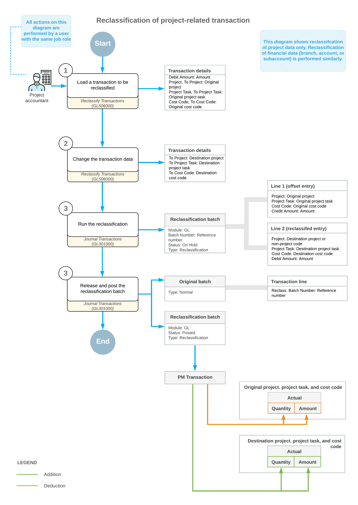

# Transaction Reclassification: General Information {#_8f173d82-9814-41ab-9261-c6f662faf59e .concept}

If a batch of project-related GL transactions was posted with any incorrect information, you can reclassify this batch to move the amount to the correct line of the project budget, or correct other financial data.

## Learning Objectives {#section_ugm_tjr_2qb .section}

You will learn how to perform the reclassification of GL transactions related to a project.

## Applicable Scenarios {#section_zwy_vjr_2qb .section}

You reclassify a project-related transaction in the following cases:

-   A transaction has been posted to the wrong account, subaccount, or branch.
-   A transaction has been posted to the wrong project, project task, or cost code.
-   A project-related transaction has been posted with the non-project code.
-   A part of transaction amount posted to a project should be moved to another project.

## Reclassification of Project-Related GL Transactions {#section_knc_vnr_2qb .section}

You initiate the reclassification process on the [Reclassify Transactions](GL_50_60_00.md) \(GL506000\) form. You open this form in one of the following ways:

-   Open the document for which the transaction has been generated on the [Invoices and Memos](AR_30_10_00.md) \(AR301000\) or [Bills and Adjustments](AP_30_10_00.md) \(AP301000\) form, and on the More menu, click **Reclassify GL Batch**
-   Open the transaction on the [Journal Transactions](GL_30_10_00.md) \(GL301000\) form and on the More menu, click **Reclassify**.

The [Reclassify Transactions](GL_50_60_00.md) form opens, displaying the transactions included in the selected GL batch. On this form, for each journal entry that you need to reclassify, you need to modify the transaction details. You can change the required settings in each needed row manually, or perform mass changing of settings in multiple rows. In each needed row, you modify any of the following values:

-   The branch \(**To Branch** column\). The transaction amount will be moved to the branch specified in this column from the originally specified branch \(**Branch** column.
-   The account \(**To Account** column\). The transaction amount will be moved to the account specified in this column from the originally specified GL account \(**Account** column\).

    **Attention:** The new account that you specify must have the same default currency as the default currency of the batch.

-   The subaccount \(**To Subaccount** column\). The transaction amount will be moved to the subaccount specified in this column from the originally specified subaccount \(**Subaccount** column\).
-   The project \(**To Project** column\). The transaction amount will be moved to the project or non-project code specified in this column from the originally specified project or non-project code \(**Project** column\).
-   The project task \(**To Project Task** column\). The transaction amount will be moved to the project task specified in this column from the originally specified project task \(**Project Task** column\).

    **Attention:** A user can select the project tasks with the *Completed*, *Canceled*, or *In Planning* status on data entry forms only if this user has the *Project Accountant* role assigned to their user account on the [User Roles](../Shared/../UserGuide/SM_20_10_05.md) \(SM201005\) form.

-   The cost code \(**To Cost Code** column\). The transaction amount will be moved to the cost code specified in this column from the originally specified cost code \(**Cost Code** column\).

Once you have changed any of the default values, the system selects the unlabeled check box in the row, indicating that the entry will be reclassified. In addition, in the transaction being reclassified, you can correct the transaction date \(**New Tran. Date** column\) and provide an updated transaction description \(**New Transaction Description** column\).

**Attention:** The new transaction date must be within the financial period of the original transaction.

After you have made all needed changes to the transaction details, you click **Process** on the form toolbar of the [Reclassify Transactions](GL_50_60_00.md) form. The system generates a new GL transaction of the *Reclassification* type that offsets the original transaction and posts the transaction amounts. Also, on release of the reclassification batch, the system generates a project transaction that updates the actual values in the project budget of the project for which the reclassification has been performed.

## Workflow of Reclassification Transactions { .section}

The following diagram shows the general process of reclassifying project-related transactions.

**Parent topic:**[Reclassifying Project-Related GL Transactions](../UserGuide/Projects_Reclassifying_GLTran_Mapref.md)

