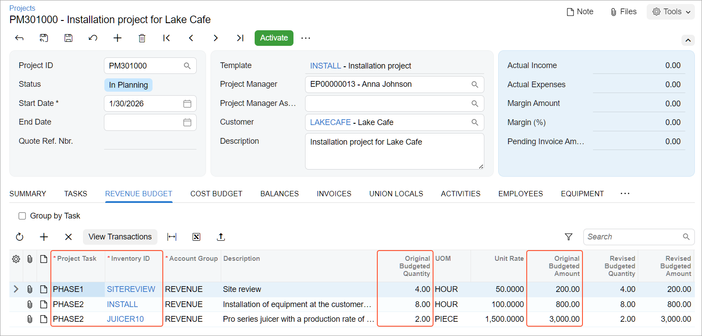

# Project Templates and Common Tasks: Process Activity {#_d14c0111-16c1-4385-a86e-d9cecd34d4c0 .task}

This activity will walk you through the process of configuring project templates. You will create a common task and add this task to a project. You will also learn how to create a new project based on a project template.

**Attention:** This activity is based on the *U100* dataset. If you are using another dataset or if any system settings have been changed in *U100*, these changes can affect the workflow of the activity and the results of the processing. To avoid issues, restore the *U100* dataset to its initial state.

## Story { .section}

Suppose that the Lake Cafe customer has ordered a juicer, along with the following services from the SweetLife Fruits &amp; Jams company: site review, installation, and training of employees on operating the juicer. SweetLife's project accountant has analyzed the past projects and realized that customers are usually doing typical fixed-price projects that involve the sale of a juicer, along with the services of installation and site review. Sometimes customers' projects also involve training on operating the juicer.

The project accountant decides to create a new project template for such a project, and to create a common task for training on operating juicers \(so the task can be quickly added to projects as needed\). Then the project accountant creates a project for the customer based on the created project template and common task.

You will perform the needed actions in the system, acting as the project accountant.

## Configuration Overview { .section}

In the *U100* dataset, the following tasks have been performed to support this activity:

-   On the [Enable/Disable Features](CS_10_00_00.md) \(CS100000\) form, the *Projects* feature has been enabled to provide support for the project management functionality.
-   On the [Billing Rules](PM_20_70_00.md) \(PM207000\) form, the *COMBINED* billing rule has been configured.

## Process Overview { .section}

You create a project template on the [Project Templates](PM_20_80_00.md) \(PM208000\) form. You create a common task on the [Common Tasks](PM_20_80_30.md) \(PM208030\) form. Then you use the [Projects](PM_30_10_00.md) \(PM301000\) form to create a project based on the created project template and add the common task to the project.

## System Preparation { .section}

To sign in to the system and prepare to perform the instructions of the activity, do the following:

1.  Launch the Acumatica ERP website, and sign in to a company with the *U100* dataset preloaded; you should sign in as project accountant by using the *brawner* username and the *123* password.
2.  In the info area at the upper-right corner of the top pane of the Acumatica ERP screen, make sure that the business date is set to *1/30/2026*. If a different date is displayed, click the Business Date menu button and select *1/30/2026* from the calendar. For simplicity, you'll create and process all documents in this activity using this business date.

## Step 1: Creating a Project Template { .section}

To create a new project template, do the following:

1.  On the [Project Templates](PM_20_80_00.md) \(PM208000\) form, add a new record.
2.  In the Summary area, specify the following settings:
    -   **Template ID**: `INSTALL`
    -   **Description**: `Installation project`
    -   **Project Manager**: *EP00000001*
3.  On the **Summary** tab, specify the following settings:
    -   **Project Properties** section:
        -   **Revenue Budget Level**: *Task and Item*
        -   **Cost Budget Level**: *Task*
    -   **Billing and Allocation Settings** section:
        -   **Billing Period**: *On Demand*
        -   **Billing Rule**: *COMBINED*
4.  On the **Tasks** tab, add a new row, and specify the following settings in the row:
    -   **Task ID**: *PHASE1*
    -   **Type**: *Cost and Revenue Task*
    -   **Description**: `Site review`
5.  Add one more row, and specify the following settings:

    -   **Task ID**: *PHASE2*
    -   **Type**: *Cost and Revenue Task*
    -   **Description**: `Installation`
    By default, the system inserts *By Billing Period* as the **Billing Option** of each project task and the *COMBINED* billing rule as the **Billing Rule**.

6.  On the **Revenue Budget** tab, add each line of the project revenue that is listed in the following table by clicking **Add Row** and specifying the listed settings in the row.

    |**Project Task**|**Inventory ID**|**Original Budgeted Quantity**|**Unit Rate**|
    |----------------|----------------|------------------------------|-------------|
    |*PHASE1*|*SITEREVIEW*|`2`|`50`|
    |*PHASE2*|*JUICER10*|`1`|`1500`|
    |*PHASE2*|*INSTALL*|`4`|`100`|

    For each line, the system inserts *REVENUE* as the **Account Group** because the sales account specified in the settings of the stock and non-stock items is mapped to this account group, which has the *Income* type.

7.  Save your changes to the project template.

    When you save the project template, the system automatically creates project template tasks corresponding to the tasks you have added to the project template.

8.  On the form toolbar, click **Activate** to assign the project template the *Active* status, which makes it possible to use the project template for creating projects.
9.  On the **Tasks** tab, in the **Task ID** column, click the *PHASE1* link to open the task on the [Project Template Tasks](PM_20_80_10.md) \(PM208010\) form.

    On the **Summary** tab of this form, notice that the **Automatically Include in Project** check box is selected by default. With this setting, the project template task will be automatically included in any project created based on the associated project template.

You have created a project template and project template tasks. In the next step, you will create a common task.

## Step 2: Creating a Common Task { .section}

A common task is a task that can be added to any new or existing project \(unlike a project template task, which is associated with just one project template\). To create a common task, perform the following instructions:

1.  On the [Common Tasks](PM_20_80_30.md) \(PM208030\) form, add a new record.
2.  In the Summary area, specify the following settings:
    -   **Task ID**: `TRAINING`
    -   **Description**: `Training on juicer usage`
3.  On the **Budget** tab, add a budget line with the following settings:
    -   **Account Group** *LABOR*

        The system automatically inserts *Expense* in the **Type** column when you select the account group.

    -   **Inventory ID**: *TRAINING*
    -   **Cost Code**: `00-000`
    -   **Description**: `Training on juicer usage`
    -   **UOM**: *HOUR*
    -   **Unit Rate**: `50`
4.  Save your changes to the common task.

You have created a common task. In the next step, you will create a project based on the project template you have created.

## Step 3: Creating a Project Based on the Project Template { .section}

To create a project based on template, do the following:

1.  On the [Projects](PM_30_10_00.md) \(PM301000\) form, create a new project, and specify the following settings:

    -   **Project ID**: `INSTLAKE`
    -   **Customer**: *LAKECAFE*
    -   **Template**: *INSTALL*
    When you select the project template, the system fills in the relevant elements of the project with the settings specified for the template, including tasks and revenue budget lines.

2.  In the Summary area, enter `Installation project for Lake Cafe` as the **Description** of the project.
3.  On the **Summary** tab, clear the **Change Order Workflow** check box.
4.  Save your changes to the project.
5.  On the **Tasks** tab, make sure that the *PHASE1* and *PHASE2* tasks have been copied to the project from the selected project template.
6.  On the table toolbar of the tab, click **Activate Tasks** to change the status of the added tasks to *Active*.
7.  On the **Revenue Budget** tab, make sure that three revenue budget lines have been copied to the project from the selected project template.
8.  In the line with the *PHASE1* task and the *SITEREVIEW* item, specify `4` as the **Original Budgeted Quantity**.

    When you enter the **Original Budgeted Quantity** in each line, the system automatically calculates the **Original Budgeted Amount** as the **Original Budgeted Quantity** multiplied by the **Unit Rate** \(see below\).

9.  In the line with the *PHASE2* task and the *INSTALL* item, specify `8` as the **Original Budgeted Quantity**.
10. In the line with the *PHASE2* task and the *JUICER10* item, specify `2` as the **Original Budgeted Quantity**.

    

11. Save the project.
12. On the form toolbar, click **Activate**. The system assigns the project the *Active* status.

You have created the project based on the project template. In the next step, you will add the common task to the project.

## Step 4: Adding the Common Task to the Project { .section}

To add the common task to the *INSTLAKE* project, perform the following instructions:

1.  While you are still reviewing the *INSTLAKE* project on the [Projects](PM_30_10_00.md) \(PM301000\) form, on the table toolbar of the **Tasks** tab, click **Add Common Tasks**.
2.  In the **Add Tasks** dialog box, which opens, select the check box in the unlabeled column for the line with the *TRAINING* common task, and click **Add Tasks &amp; Close**.

    The system adds the common task to the project and closes the dialog box.

3.  On the **Tasks** tab, select *Active* as the **Status** in the line with the *TRAINING* task, which you just added.
4.  On the **Cost Budget** tab, make sure that the line with the *TRAINING* common task has been added to the cost budget of the project. Specify `1` as the **Original Budgeted Quantity** in this line.
5.  Save your changes to the project.

You have finished configuring the project based on a project template and have added the common task to the project.

**Parent topic:**[Creating Project Templates and Common Tasks](../UserGuide/Projects_Templates_Mapref.md)

