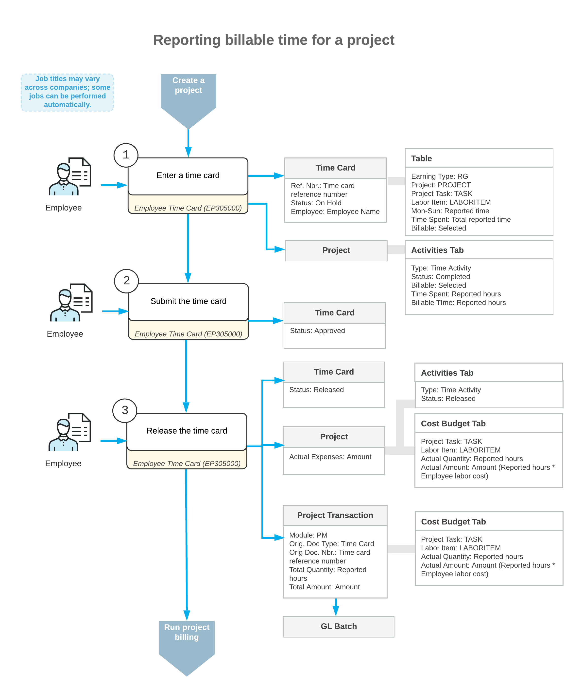

# Employee Time Billing: General Information {#_c17cd444-2ac9-4e6e-a687-fa3ccdaa1214 .concept}

In Acumatica ERP, you can use the time reporting functionality to give employees the ability to report the time that they spend for the project. During project billing, you can bill customers for this time.

## Learning Objectives { .section}

In this chapter, you will learn how to do the following:

-   Enter a billable time activity related to a project, and log the time spent for the project
-   Enter a billable time card related to a project, and log the time spent for the project
-   Bill a project for employees’ time spent working on it

## Applicable Scenarios { .section}

You may want to learn more about employee time billing if you are an employee who needs to log work time spent on particular project.

This information is also useful if you are a project accountant, and you need to bill the customer for employee time that was spent for a particular project and logged by using time cards.

## Entry of Time Tracking Documents {#section_n4l_212_fmb .section}

In Acumatica ERP, employees can report their work time by creating time cards that include separate detail records associated with different projects or project tasks.

A time card, which an employee enters on the [Employee Time Cards](EP_30_50_00.md) \(EP305000\) form, is a weekly report on the time an employee has spent on each activity. In each line of a time card, the following information is specified:

-   The earning type, which defines whether the reported work should be billed
-   The project and project task related to the reported hours
-   The labor item assigned to the employee who performed the work
-   The time spent on each day of the week for which the time card is prepared

For each time duration reported in the time card, the system creates a time activity linked to the project; the activity is assigned the *Completed* status. You can review the list of time activities related to a project on the **Activities** tab of the [Projects](PM_30_10_00.md) \(PM301000\) form.

**Tip:** If time tracking with time activities is configured, on the **Activities** tab, you can add an individual project-related activity to the selected project by clicking **Create Activity** on the table toolbar and selecting the type of activity to be created. Then you enter the details of the time activity on the [Activity](CR_30_60_10.md) \(CR306010\) form, which opens. To indicate that the time activity is related to a project, you select the **Track Time and Costs** check box and specify the project-related information in the Summary area of the form. Finally, you complete the activity to submit it. The reported data from the time activity becomes available in the employee time card; the time activity can be released within this time card or individually.

When the time card is released, the related project transaction is created and released, so that the logged employee time is tracked in the related project and can then be billed. Also, on release of the time card, for each day of the week with reported time, a separate time activity is released.

## Workflow of the Submission of a Time Card {#section_v1m_bjk_fmb .section}

For a project-related time card, the processing involves the actions and generated documents shown in the following diagram.

## Billing Employee Time in Projects {#section_qld_spy_2mb .section}

Once time tracking is configured for projects and the system is configured to generate transactions from time activities, the working time reported by employees is tracked in the related projects and can be billed automatically during the project billing procedure.

**Attention:** The system processes time cards reported by payroll employees by using a separate set of rules. For more information, see [Employee Payroll Settings: General Information](Payroll_Employee_Settings_GeneralInfo.md) and [Time Tracking: General Information](config_Payroll_Time_Tracking_GeneralInfo.md).

Each line of a time card is a time activity. On release of a time card with project-related lines, the system processes these lines as follows:

-   Generates project transactions for each time activity within a time card that is associated with a project.

    This extra step between the release of the time-tracking document and the updating of balances of general ledger accounts makes it possible to define labor costs and bill customers based on these costs and the quantity of working hours reported by employees for the project. The system further processes the project transactions originating from a time card based on the allocation or billing rules assigned to the project tasks of the project to which these transactions relate.

-   Generates general ledger transactions \(and doesn’t generate project transactions\) for each time activity within a time card that is associated with a non-project code.

**Parent topic:**[Billing Employee Time](../UserGuide/Projects_Tracking_Time_Mapref.md)

