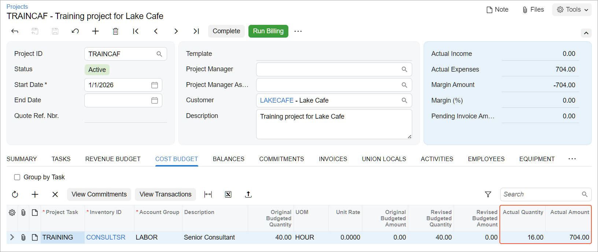

# Employee Time Billing: Process Activity {#_c53c0444-16c1-4385-a86e-d9cecd34d214 .task}

This activity will walk you through the process of billing employee time spent on a particular project.

**Attention:** This activity is based on the *U100* dataset. If you are using another dataset or if any system settings have been changed in *U100*, these changes can affect the workflow of the activity and the results of the processing. To avoid issues, restore the *U100* dataset to its initial state.

## Story { .section}

Suppose that Lake Cafe has requested 40 hours of training on operating juicers that were previously purchased from and installed by the SweetLife Fruits &amp; Jams company. Jon Waite, SweetLife's senior consultant, has provided 16 hours of training \(three hours on Monday, January 27, 2026; five hours on Tuesday, January 28; and eight hours on Thursday, January 30\).

Acting as SweetLife's project accountant, Pam Brawner, you need to create a project to account for the provided services. Then acting as Jon Waite, you need to enter a time card to log the work related to the project. Finally, again acting as Pam Brawner, you need to bill the project and review the invoice prepared for the customer.

## Configuration Overview { .section}

In the *U100* dataset, the following tasks have been performed to support this activity:

-   The *Projects* feature has been enabled on the [Enable/Disable Features](CS_10_00_00.md) \(CS100000\) form.
-   The *54100 \(Project Labor Expense\)* account is mapped to the *LABOR* expense account group, which has been defined on the [Account Groups](PM_20_10_00.md) \(PM201000\) form.
-   On the [Billing Rules](PM_20_70_00.md) \(PM207000\) form, the *TM* billing rule has been created, and a step for billing project transactions associated with the *LABOR* account group has been added to the rule.
-   On the [Customers](AR_30_30_00.md) \(AR303000\) form, the *LAKECAFE \(Lake Cafe\)* customer has been created.
-   On the [Projects](PM_30_10_00.md) \(PM301000\) form, the *TRAINCAF* project has been configured.

## Process Overview { .section}

You will create and release a time card on the [Employee Time Cards](EP_40_60_00.md) \(EP406000\) form. You will review the project transaction generated based on the time card on the [Project Transactions](PM_30_40_00.md) \(PM304000\) form. Next, you will bill the project on the [Projects](PM_30_10_00.md) \(PM301000\) form, and release both the prepared pro forma invoice on the [Pro Forma Invoices](PM_30_70_00.md) \(PM307000\) form and the AR invoice on the [Invoices and Memos](AR_30_10_00.md) \(AR301000\) form. Finally, on the [Projects](PM_30_10_00.md) form, you will make sure that the project cost and revenue budget have been updated with the billed employee time.

## System Preparation { .section}

To sign in to the system and prepare to perform the instructions of the activity, do the following:

1.  As a prerequisite activity, configure the labor cost rates as described in [Labor Items: To Define Labor Cost Rates](Non_Stock_Item_Projects_Implem_Activity_LaborCostRates.md).
2.  Sign in to a company with the *U100* dataset preloaded. You should sign in as Jon Waite by using the *waite* username and the *123* password.
3.  In the info area at the upper-right corner of the top pane of the Acumatica ERP screen, make sure that the business date is set to *2/5/2026*. If a different date is displayed, click the Business Date menu button and select *2/5/2026* from the calendar. For simplicity, you'll create and process all documents in this activity using this business date.

## Step 1: Entering an Employee Time Card { .section}

In this step, you will enter Jon Waite's working hours for the project by creating an employee time card as follows:

1.  On the form toolbar of the [Employee Time Cards](EP_40_60_00.md) \(EP406000\) form, click **Add New Timecard** to create a new time card. The system opens the [Employee Time Cards](EP_30_50_00.md) \(EP305000\) form with the new time card created for the employee who is currently signed in \(Jon Waite\).
2.  In the Summary area, make sure that *2026-05 \(02/01 - 02/07\)* is specified in the **Week** box. This is the work week during which the work for the project has been performed.
3.  On the **Summary** tab, add a row, and specify the following settings:
    -   **Earning Type**: *RG* \(inserted automatically\)
    -   **Project**: *TRAINCAF*
    -   **Project Task**: *TRAINING* \(inserted automatically\)
    -   **Cost Code**: *00-000*
    -   **Labor Item**: *CONSULTSR* \(inserted automatically\)
    -   **Mon**: `03:00`
    -   **Tue**: `05:00`
    -   **Thu**: `08:00`
    -   **Time Spent**: *16:00* \(calculated and inserted automatically\)

        When you enter hours in the columns representing the days of the week for any row, the system calculates the **Time Spent** in the Summary area as the sum of all these columns.

    -   **Billable**: Selected \(selected automatically based on the settings of the selected earning type\)
    -   **Description**: `Training provided by senior consultant`
    -   **Approval Status**: *Not Required* \(inserted automatically\)
4.  Save the time card.
5.  On the form toolbar, click **Submit** to submit the time card. The status of the time card is changed to *Approved*.
6.  On the form toolbar, click **Release** to release the time card; its status is changed to *Released*.
7.  On the form toolbar, click **View Transactions**. On the [Project Transactions](PM_30_40_00.md) \(PM304000\) form, the system opens the project transaction that has been generated based on the released time card. Notice that the system has created a separate project transaction line for each time activity within the time card. The total billable quantity of the transaction is 16, which is the quantity of reported hours, and the total amount is calculated based on the billable quantity and employee labor cost as follows:

    `16.00 * 44.00 = 704.00`

8.  Sign out of the system.

## Step 2: Billing the Project { .section}

To review the cost budget of the project and bill the project on behalf of the project accountant, do the following:

1.  Sign in to the system as Pam Brawner by using the *brawner* username and the *123* password.
2.  In the info area, in the upper-right corner of the top pane of the Acumatica ERP screen, click the Business Date menu button, and select *2/5/2026* on the calendar.
3.  On the [Projects](PM_30_10_00.md) \(PM301000\) form, open the *TRAINCAF* project.

    On the **Cost Budget** tab, notice that the system has updated the actual quantity and amount with the data of the project transaction that was generated on release of the time card, as shown below.

    

4.  On the form toolbar, click **Run Billing**. The system creates a pro forma invoice and opens it on the [Pro Forma Invoices](PM_30_70_00.md) \(PM307000\) form.

    On the **Time and Material** tab of this form, notice that based on the settings of the step of the *TM* billing rule that processes the project transactions associated with the *LABOR* account group, the invoiced amount for each line has been calculated as the amount of the related project transaction line \(that is, the cost of the provided employee labor\) multiplied by 1.25. The total invoiced amount is $880 \($704.00 \* 1.25\).

5.  On the form toolbar, click **Remove Hold** to assign the pro forma invoice the *Open* status, and then click **Release** to release the pro forma invoice.
6.  On the **Financial** tab, click the **AR Ref. Nbr.** link to open the accounts receivable invoice that has been created.
7.  On the form toolbar of the [Invoices and Memos](AR_30_10_00.md) \(AR301000\) form, which opens, click **Remove Hold** to assign the invoice the *Balanced* status, and then click **Release** to release the accounts receivable invoice.
8.  On the [Projects](PM_30_10_00.md) form, open the *TRAINCAF* project, and in the only line on the **Revenue Budget** tab, make sure that the **Actual Amount** is now $880.

You have billed the project for the employee labor.

**Parent topic:**[Billing Employee Time](../UserGuide/Projects_Tracking_Time_Mapref.md)

