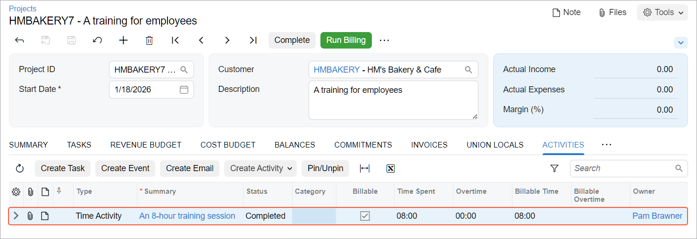

# Employee Time Billing: To Enter a Project-Related Time Card {#_0178cf68-3cba-46dd-86fe-08f5b5c6c613 .task}

In this activity, you will enter a time card for work related to a project.

**Attention:** This activity is based on the *U100* dataset. If you are using another dataset or if any system settings have been changed in *U100*, these changes can affect the workflow of the activity and the results of the processing. To avoid issues, restore the *U100* dataset to its initial state.

## Story { .section}

Suppose that the HM's Bakery and Cafe customer has contacted the SweetLife Fruits &amp; Jams company and ordered training on operating juicers for the company's new employees. The project accountant has created a project to account for the provided services.

Further suppose that project accountant \(who also provides employee training services\) has spent eight hours training the customer's employees on February 3, 2026. Acting as Pam Brawner, you need to enter a time card to log the time spent working on the project.

## Configuration Overview { .section}

In the *U100* dataset, the following tasks have been performed to support this activity:

-   The following features have been enabled on the [Enable/Disable Features](CS_10_00_00.md) \(CS100000\) form:
    -   *Projects*, which provides support for the project management functionality
    -   *Advanced Financials*, which provides the functionality of time cards
-   On the [Projects](PM_30_10_00.md) \(PM301000\) form, the *HMBAKERY7* project has been created, and the *TRAINING* project task has been added to the project.
-   On the [Non-Stock Items](IN_20_20_00.md) \(IN202000\) form, the *CONSULTPM* labor item has been created; on the [Employees](EP_20_30_00.md) \(EP203000\) form, this item is assigned to the *EP00000001 – Pam Brawner* employee. For an example of configuring a labor item and assigning it to an employee, refer to [Labor Items: To Configure a Labor Item](Non_Stock_Item_Projects_Implem_Activity.md).
-   On the [Labor Rates](PM_20_99_00.md) \(PM209900\) form, a labor cost rate has been configured for the *EP00000001 – Pam Brawner* employee.

## Process Overview { .section}

On the [Employee Time Cards](EP_30_50_00.md) \(EP305000\) form, you will enter a time card for an employee related to the particular project on which the employee has worked. Then you will submit the time card and release it. Finally, on the [Projects](PM_30_10_00.md) \(PM301000\) form, you will make sure that the time card has appeared in the project details.

## System Preparation {#section_wwl_nsk_v5b .section}

1.  Launch the Acumatica ERP website, and sign in to a company with the *U100* dataset preloaded. You should sign in as project accountant by using the *brawner* username and the *123* password.
2.  In the info area at the upper-right corner of the top pane of the Acumatica ERP screen, make sure that the business date is set to *2/3/2026*. If a different date is displayed, click the Business Date menu button and select *2/3/2026* from the calendar. For simplicity, you'll create and process all documents in this activity using this business date.
3.  On the [Time and Expenses Preferences](EP_10_10_00.md) \(EP101000\) form \(**Approvals** tab\), clear the **Time Card Approval Map** box and save the changes.

## Step: Entering a Time Card for the Project { .section}

To log the eight hours that Pam Brawner has spent training the customer's employees as part of the project, enter a time card as follows:

1.  On the form toolbar of the [Employee Time Cards](EP_40_60_00.md) \(EP406000\) form, add a new record. The system opens the [Employee Time Cards](EP_30_50_00.md) \(EP305000\) form with the new time card.

    In the Summary area, *2026-05 \(02/01 - 02/07\)* is specified in the **Week** box. This is the work week to which the current business date belongs. Also, notice that the system has automatically selected the employee who is currently signed in \(*Pam Brawner*\) as the **Employee**.

2.  On the **Summary** tab, add a row, and specify the following settings:

    -   **Earning Type**: *RG*
    -   **Project**: *HMBAKERY7*
    -   **Project Task**: *TRAINING* \(inserted automatically\)
    -   **Cost Code**: *00-000*
    -   **Labor Item**: *CONSULTPM* \(inserted automatically\)
    -   **Tue**: *08:00*
    -   **Billable**: Selected \(selected automatically based on the settings of the selected earning type\)
    -   **Description**: `An 8-hour training session`
    -   **Approval Status**: *Not Required* \(selected automatically\)
    When you enter hours in the columns representing the days of the week for any row, the system calculates the **Time Spent** in the Summary area as the sum of all these columns.

3.  Save the time card.
4.  On the form toolbar, click **Submit** to submit the time card. The status of the time card is changed to *Approved*.
5.  On the form toolbar, click **Release** to release the time card. The time card is assigned the *Released* status.
6.  On the [Projects](PM_30_10_00.md) \(PM301000\) form, open the *HMBAKERY7* project, and on the **Activities** tab, notice that the time activity you have entered by using the time card is shown on the tab, as shown below.

    

    You have submitted and released the time card related to the project.

7.  Open the [Time and Expenses Preferences](EP_10_10_00.md) \(EP101000\) form, in the **Time Card Approval Map** box, select *Employee Time Cards*, and save the changes.

**Parent topic:**[Billing Employee Time](../UserGuide/Projects_Tracking_Time_Mapref.md)

