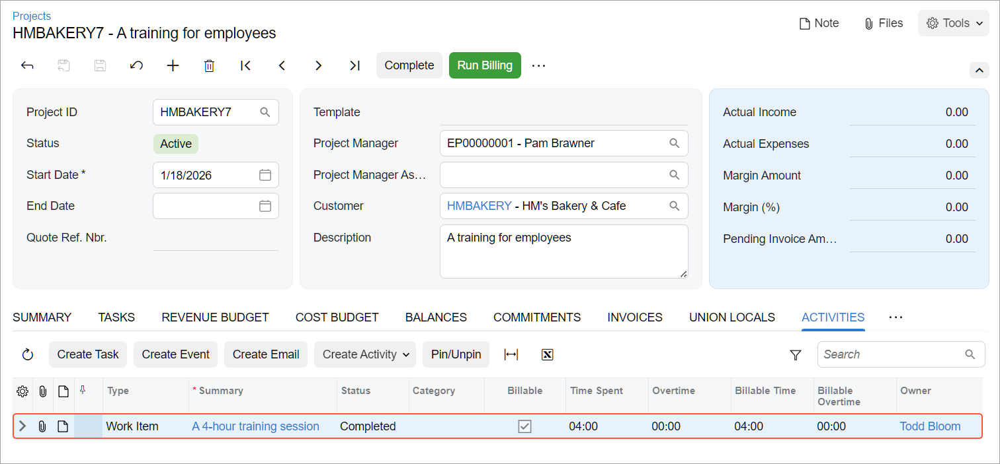

# Employee Time Billing: To Enter a Project-Related Time Activity {#_b7780e6e-0253-4477-9489-8ba40dc6ad67 .task}

In this activity, you will enter a time activity for work related to a project.

**Attention:** This activity is based on the *U100* dataset. If you are using another dataset or if any system settings have been changed in *U100*, these changes can affect the workflow of the activity and the results of the processing. To avoid issues, restore the *U100* dataset to its initial state.

## Story { .section}

Suppose that the HM's Bakery and Cafe customer has contacted the SweetLife Fruits &amp; Jams company to order training on operating juicers for the company's new employees. The project accountant has created a project to account for the provided services.

Further suppose that Todd Bloom has spent four hours training the customer's employees on Monday. Acting as Todd Bloom, you need to enter a time activity to log the time spent working on the project.

## Configuration Overview { .section}

In the *U100* dataset, the following tasks have been performed to support this activity:

-   The following features have been enabled on the [Enable/Disable Features](CS_10_00_00.md) \(CS100000\) form:
    -   *Projects*, which provides support for the project management functionality
    -   *Time Management*, which provides support for tracking the time that employees spend on activities
-   On the [Projects](PM_30_10_00.md) \(PM301000\) form, the *HMBAKERY7* project has been created and the *TRAINING* project task has been added to the project.
-   On the [Activity Types](CR_10_20_00.md) \(CR102000\) form, the **Track Time** check box is selected for the *Work Item* activity type.
-   On the [Non-Stock Items](IN_20_20_00.md) \(IN202000\) form, the *CONSULTSR* labor item has been created; on the [Employees](EP_20_30_00.md) \(EP203000\) form, this item is assigned to the *EP00000002 – Todd Bloom* employee.

## Process Overview { .section}

On the [Activity](CR_30_60_10.md) \(CR306010\) form, you will enter and complete a time activity for the project on which the employee has worked. Then on the [Projects](PM_30_10_00.md) \(PM301000\) form, you will make sure that the time activity has appeared in the project details.

## System Preparation {#section_obx_2pk_v5b .section}

Launch the Acumatica ERP website, and sign in to a company with the *U100* dataset preloaded. You should sign in as an employee by using the *bloom* username and the *123* password.

## Step: Entering a Time Activity for the Project { .section}

To log the four hours that Todd Bloom has spent training the customer's employees as part of the project, enter a time activity as follows:

1.  On the [Projects](PM_30_10_00.md) \(PM301000\) form, open the *HMBAKERY7* project.
2.  On the table toolbar of the **Activities** tab, click **Create Activity** &gt; **Create Work Item** to add an activity to the project. The system opens the [Activity](CR_30_60_10.md) \(CR306010\) form with the new activity created.
3.  On this form, specify the following settings:
    -   **Summary**: `A 4-hour training session`
    -   **Track Time and Costs**: Selected
    -   **Started On**: Current business date
    -   **Project**: *HMBAKERY7* \(selected automatically\)
    -   **Project Task**: *TRAINING* \(selected automatically\)
    -   **Cost Code**: *00-000* \(selected automatically\)
    -   **Labor Item**: *CONSULTSR* \(selected automatically\)
    -   **Earning Type**: *RG* \(selected automatically\)
    -   **Time Spent**: *04:00*
    -   **Billable**: Selected
    -   **Billable Time**: *04:00*
4.  On the form toolbar, click **Complete** to complete the activity.

    The system creates and saves the activity with the *Work Item* type, closes the [Activity](CR_30_60_10.md) form, and returns to the project on the [Projects](PM_30_10_00.md) form.

5.  On the **Activities** tab, make sure that the time activity you created has appeared, as shown below.

    

You have entered the time activity for the work performed by the employee for a project.

**Parent topic:**[Billing Employee Time](../UserGuide/Projects_Tracking_Time_Mapref.md)

