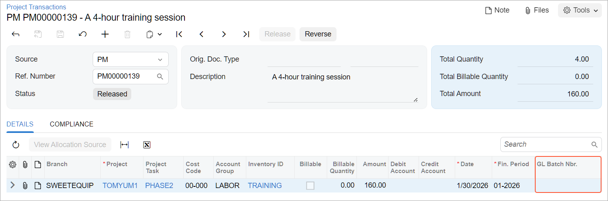

# Project Transactions: Process Activity {#_c53c0111-16c1-4385-a86e-d9cecd34d4c0 .task}

This activity will walk you through the process of creating project transactions from general ledger transactions and from scratch.

**Attention:** This activity is based on the *U100* dataset. If you are using another dataset or if any system settings have been changed in *U100*, these changes can affect the workflow of the activity and the results of the processing. To avoid issues, restore the *U100* dataset to its initial state.

## Story { .section}

Suppose that the Thai Food Restaurant customer has ordered training from the SweetLife Fruits &amp; Jams company on how to use a juicer the company previously bought. Based on the agreement with the customer, SweetLife’s project accountant has created a project and has created the following tasks corresponding to the phases of training:

-   *PHASE1*: Training is going to be provided within this task and is subject to billing. Any additional expenses incurred during the completion of this task will not be billed.
-   *PHASE2*: If additional training is required after the initial training in the first task, it will be provided within this task and will not be billed.

In the first phase, a consultant has provided eight hours of training and spent $50 on a taxi. Then the customer requested additional training, and the consultant has provided four extra hours of training in the second phase.

Acting as the project accountant, you need to enter the general ledger transactions to directly capture the costs involved with delivering the first phase of training. The Thai Food Restaurant company covers travel expenses, so they should not affect the project budget. Then you need to enter the project transaction to capture the costs involved with delivering the second phase of training, but the costs should not affect the general ledger.

## Configuration Overview { .section}

In the *U100* dataset, the following tasks have been performed to support this activity:

-   On the [Enable/Disable Features](CS_10_00_00.md) \(CS100000\) form, the *Projects* feature has been enabled to provide support for the project management functionality.
-   On the [Projects](PM_30_10_00.md) \(PM301000\) form, the *TOMYUM1* project for the *TOMYUM \(Thai Food Restaurant\)* customer has been created, and the *PHASE1* and *PHASE2* project tasks have been created for the project.
-   On the [Account Groups](PM_20_10_00.md) \(PM201000\) form, the *LABOR* account group has been created. The *54100 \(Project Labor Expense\)* account has been mapped to the account group.
-   On the [Non-Stock Items](IN_20_20_00.md) \(IN202000\) form, the *TRAINING* non-stock item has been configured. The *54100 \(Project Labor Expense\)* account has been specified as the expense account of the item.

## Process Overview { .section}

On the [Journal Transactions](GL_30_10_00.md) \(GL301000\) form, you will create a batch of general ledger transactions with the project and project task specified to record the work related to the first phase of the training. You will release the batch, which will generate the corresponding project transaction. Then you will review this transaction on the [Project Transaction Details](PM_40_10_00.md) \(PM401000\) form. Finally, on the [Project Transactions](PM_30_40_00.md) \(PM304000\) form, you will create and release a batch of project transactions that represents the second phase of the training and does not affect the general ledger.

## System Preparation { .section}

To sign in to the system and prepare to perform the instructions of the activity, do the following:

1.  Launch the Acumatica ERP website, and sign in to a company with the *U100* dataset preloaded. You should sign in as Pam Brawner by using the *brawner* username and the *123* password.
2.  In the info area at the upper-right corner of the top pane of the Acumatica ERP screen, make sure that the business date is set to *1/30/2026*. If a different date is displayed, click the Business Date menu button and select *1/30/2026* from the calendar. For simplicity, you'll create and process all documents in this activity using this business date.

## Step 1: Creating General Ledger Transactions { .section}

To create a batch of general ledger transactions to represent the first phase of the training \(the *PHASE1* task\), do the following:

1.  On the [Journal Transactions](GL_30_10_00.md) \(GL301000\) form, add a new record.
2.  In the Summary area, make sure *GL* is selected as the **Module**.
3.  In the **Description** box, type `A training session for the TOMYUM1 project`.
4.  On the table toolbar, click **Add Row** to add the first row, which represents your training expenses within the first phase of the project, and specify the following settings in the row:
    -   **Account**: *54100 \(Project Labor Expense\)*
    -   **Project/Contract**: *TOMYUM1*
    -   **Project Task**: *PHASE1*
    -   **Cost Code**: *00-000* \(inserted automatically\)
    -   **Debit Amount**: `320`
    -   **Transaction Description**: `8 hours of training for the customer's employee`
5.  Add the second row, which represents the non-project \(travel\) expenses, and specify the following settings in the row:
    -   **Account**: *81000 \(Other Expenses\)*
    -   **Project**: *X* \(inserted automatically\)

        This transaction will not affect the project budget of the *TOMYUM1* project.

    -   **Cost Code**: *00-000*
    -   **Debit Amount**: `50`
    -   **Credit Amount**: `0`
    -   **Transaction Description**: `Travel expenses`
6.  Add the third row, which balances the batch of transactions, and specify the following settings in the row:
    -   **Account**: *23015 \(Accrued Expenses\)*
    -   **Project**: *X* \(inserted automatically\)
    -   **Cost Code**: *00-000*
    -   **Credit Amount**: `370` \(inserted automatically\)
    -   **Transaction Description**: `Project and travel expenses`
7.  On the form toolbar, click **Remove Hold** to assign the general ledger transaction the *Balanced* status, and then click **Release**.

    When you release the general ledger transaction, for the row with the specified project and project task, the system creates the corresponding project transaction. In the created project transaction, the system specifies the account group to which the account in the transaction row is mapped.

8.  On the [Project Transaction Details](PM_40_10_00.md) \(PM401000\) form, in the Selection area, select *TOMYUM1* as the **Project**. Make sure that the **Account Group** and **Project Task** boxes are cleared. In the table, review the project transaction that has been created based on the GL transaction that you have processed earlier. Notice the following:
    -   The system has created only one project transaction because only one row of the general ledger transaction has the specified project and project task.
    -   The reference number of the corresponding batch of general ledger transactions is shown in the **GL Batch Nbr.** column.
    -   The **Debit Account** is *54100 \(Project Labor Expense\)*.
    -   The **Debit Account Group** of the project transaction is *LABOR*.

        The system selected the *LABOR* account group as the debit account group of the transaction because the *54100 \(Project Labor Expense\)* account is mapped to this account group.

    -   The **Credit Account** and **Credit Account Group** columns are empty in the row.

## Step 2: Creating a Project Transaction Without Posting to the General Ledger { .section}

To create a project transaction that does not affect the general ledger and represents the training expenses within the second phase of the training \(the *PHASE2* task\), do the following:

1.  On the [Project Transactions](PM_30_40_00.md) \(PM304000\) form, create a new record.
2.  In the Summary area, make sure *PM* is selected as the **Source**.
3.  Enter `A 4-hour training session` as the **Description**.
4.  In the table on the **Details** tab, add a new row, and specify the following settings:

    -   **Project**: *TOMYUM1*
    -   **Project Task**: *PHASE2*
    -   **Cost Code**: *00-000*
    -   **Account Group**: *LABOR*
    -   **Inventory ID**: *TRAINING*
    -   **Quantity**: `4`
    -   **Billable**: Cleared
    -   **Amount**: `160`
    You leave the **Debit Account** and **Credit Account** columns empty, so that the corresponding general ledger transaction will not be created. The system also will not use this transaction for billing because you cleared the **Billable** check box in the line.

5.  On the form toolbar, click **Save** and then **Release** to save your changes to the project transaction and release it.

    Notice that the **GL Batch Nbr.** column is empty \(see below\) indicating that no corresponding general ledger transaction has been created.

    

6.  On the [Projects](PM_30_10_00.md) \(PM301000\) form, open the *TOMYUM1* project, and on the **Cost Budget** tab, notice that the cost budget now includes two budget lines:

    -   The line with the *PHASE1* project task and the *&lt;N/A&gt;* inventory item that has been added to the budget based on the project transaction created on release of the general ledger transaction. This line will be included in the next billing.
    -   The line with the *PHASE2* project task and the *TRAINING* inventory item that has been added to the budget based on the project transaction that you created and released. This line will not be billed.
    The actual values in both lines have been updated based on the project transactions that you have processed.

You have captured the costs for the project.

**Parent topic:**[Processing Project Transactions](../UserGuide/Projects_Transactions_Mapref.md)

