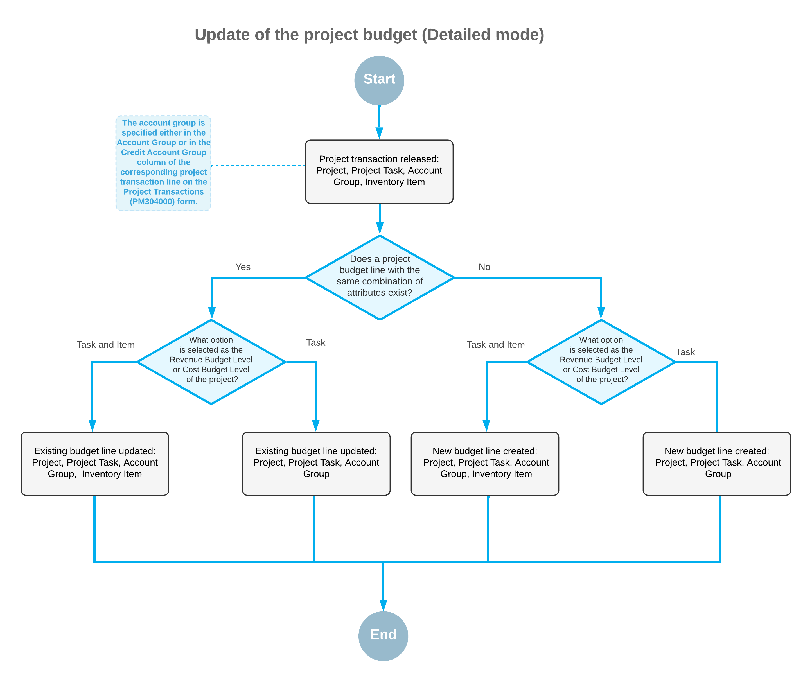
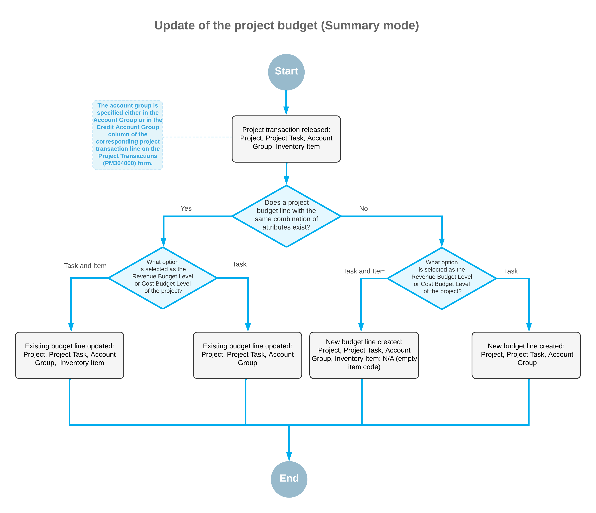

# Project Transactions: Update of the Project Budget Structure {#_b310ad0d-8feb-4720-aecf-8597c500cad1 .concept}

When you process project-related documents, the system reflects the changes in the budget of the corresponding project accordingly. The way the system updates the revenue budget and cost budget lines depends on the settings of the budget level and the project transaction details. The following sections describe which settings affect the budget update and how the system updates revenue budget lines and cost budget lines.

## Documents That Affect the Project Budget { .section}

The system updates the cost budget and revenue budget of a project when any of the documents associated with the project are processed as follows:

-   A project transaction is released on the [Project Transactions](PM_30_40_00.md) \(PM304000\) form.
-   A change order is released on the [Change Orders](PM_30_80_00.md) \(PM308000\) form.
-   A commitment line is added or changed on the [Purchase Orders](PO_30_10_00.md) \(PO301000\) form or on the [Subcontracts](SC_30_10_00.md) \(SC301000\) form, and the document is saved.
-   A pro forma invoice line is added or changed on the [Pro Forma Invoices](PM_30_70_00.md) \(PM304000\) form, and the document is saved.
-   An accounts receivable invoice line is added or changed on the [Invoices and Memos](AR_30_10_00.md) \(AR301000\) form, and the document is saved.
-   A new change request line is added or linked to a change order on the [Change Requests](PM_30_85_00.md) \(PM308500\) form, and the document is saved.

Also, the cost budget and revenue budget of the project are updated if you run the recalculation process for the project on the [Projects](PM_30_10_00.md) \(PM301000\) or [Recalculate Project Balances](PM_50_40_00.md) \(PM504000\) form. For more information about budget recalculation, see [Project Budget: Recalculation of the Project Balances](Projects_Budget_Recalculating_Balances.md).

## Update of the Project Budget Structure { .section}

When a project-related document is processed, in the corresponding project, the system either updates the existing budget line or creates a new budget line, depending on the following combination of settings:

-   The **Cost Budget Update** and **Revenue Budget Update** system-wide settings on the [Projects Preferences](PM_10_10_00.md) \(PM101000\) form, which can be *Detailed* or *Summary*.
-   The **Cost Budget Level** and **Revenue Budget Level** settings, which are specified for the particular project on the **Summary** tab of the [Projects](PM_30_10_00.md) \(PM301000\) form. These settings determine the detail level of the cost and revenue budget for the project, which can be *Task*, *Task and Cost Code*, *Task and Item*, or *Task, Item, and Cost Code*.

The following diagrams illustrate how the system updates the project budget on the release of a project transaction depending on the budget update preferences, the settings of the budget level in a project, and the project transaction details.

## Update of Quantities { .section}

The quantities \(actual, committed, budgeted change order, committed change order, and potential\) in budget lines are updated in a project budget record if all of the following conditions are met:

-   The project transaction has a unit of measure \(UOM\) specified.
-   In the project budget record that matches the project transaction, a UOM is specified.
-   The conversion rule from the project transaction's UOM to the budget record's UOM is specified in the system.

The system proceeds as follows to determine the rules it used for conversion from the project transaction's UOM to the budget record's UOM:

-   If a stock item is specified in the project budget line, the system uses the conversion rules in the Unit of Measure table on the **General** tab of the [Stock Items](IN_20_25_00.md) \(IN202500\) form.
-   If a non-stock item is specified in the project budget line, the system uses the conversion rules in the Unit of Measure table on the **General** tab of the [Non-Stock Items](IN_20_20_00.md) \(IN202000\) form.
-   If no item is specified in the project budget line, the system uses the conversion rules on the [Units of Measure](CS_20_35_00.md) \(CS203500\) form.

**Parent topic:**[Processing Project Transactions](../UserGuide/Projects_Transactions_Mapref.md)

