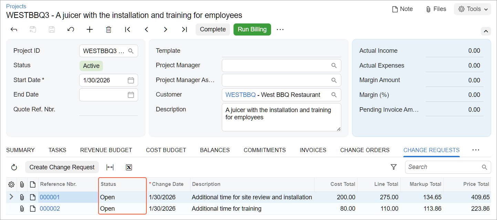
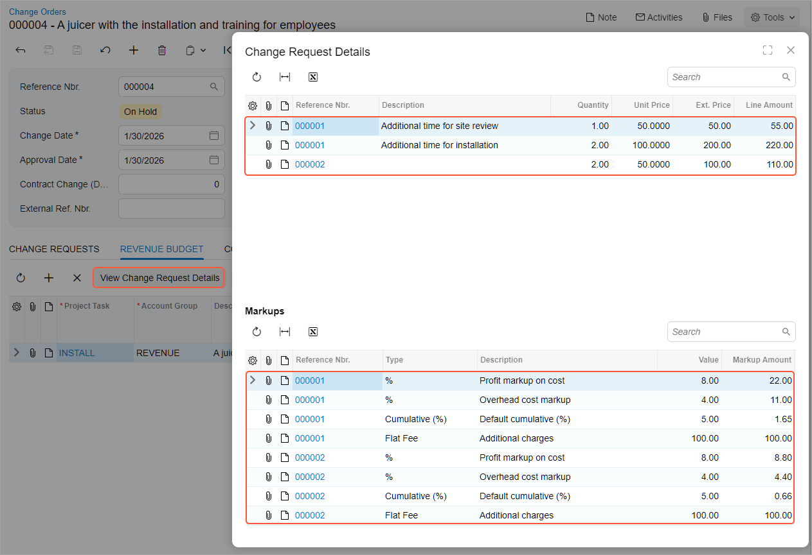

# Change Requests: Process Activity {#_c42c0444-1421-4225-a42e-d9ce4224d4c0 .task}

In this activity, you will learn how you can turn on the change order workflow for a project and manage changes to the project’s budgeted values by creating change requests and including these change requests to change orders.

## Story { .section}

Suppose that the West BBQ Restaurant customer has ordered a juicer, along with the following services from the SweetLife Fruits &amp; Jams company: two hours of site review, four hours of installation, and eight hours of employee training on operating the juicers. The SweetLife company has contracted the Squeezo Inc. vendor to provide the juicer and perform the installation, while SweetLife will perform the services of site review and training.

Acting as SweetLife's project accountant, you will create a project. SweetLife's consultant will provide the service of site review, and you will then realize that adjustments to the project should be agreed upon with the customer: The site review, which has taken an additional hour beyond what was planned, has shown that the installation of the juicer will take two hours beyond the planned time frame. The customer will then ask you for an additional staff person to be trained, and the training will take two additional hours. For all these adjustments, you have decided to include an additional 10% markup amount in addition to charging for the services.

You will make the needed corrections to the project budget by using change requests.

## Configuration Overview { .section}

In the *U100* dataset, the following tasks have been performed to support this activity:

-   On the [Enable/Disable Features](CS_10_00_00.md) \(CS100000\) form, the following features have been enabled:
    -   *Projects*, which provides support for the project management functionality
    -   *Change Orders*, which gives you the ability to manage changes to the project’s budgeted and committed values
-   On the [Non-Stock Items](IN_20_20_00.md) \(IN202000\) form, the *SITEREVIEW*, *INSTALL*, and *TRAINING* non-stock items have been defined.
-   On the [Stock Items](IN_20_25_00.md) \(IN202500\) form, the *JUICER15* stock item has been defined.
-   On the [Vendors](AP_30_30_00.md) \(AP303000\) form, the *SQUEEZO* vendor has been created.

## Process Overview { .section}

In this activity, you will create the project on the [Projects](PM_30_10_00.md) \(PM301000\) form and configure the document-level markups for it. To make changes to the project budget, you will create change requests on the [Change Requests](PM_30_85_00.md) \(PM308500\) form. When an agreement with the customer about the changes is reached, you will add open change requests to two change orders on the [Change Orders](PM_30_80_00.md) \(PM308000\) form; you will then release the change orders.

## System Preparation { .section}

To sign in to the system and prepare to perform the instructions of the activity, do the following:

1.  Implement the two-tier change management and configure change order classes as described in [Change Requests: Implementation Activity](Projects_Two_Tier_Change_Management_Implem_Activity.md).
2.  Sign in to the system as Pam Brawner by using the *brawner* username and the *123* password.
3.  In the info area at the upper-right corner of the top pane of the Acumatica ERP screen, make sure that the business date is set to *1/30/2026*. If a different date is displayed, click the Business Date menu button and select *1/30/2026* from the calendar. For simplicity, you'll create and process all documents in this activity using this business date.

## Step 1: Creating a Project { .section}

To create a project and define the project-specific document markups, do the following:

1.  On the [Projects](PM_30_10_00.md) \(PM301000\) form, add a new record.
2.  In the Summary area, specify the following settings:
    -   **Project ID**: `WESTBBQ3`
    -   **Customer**: *WESTBBQ*
    -   **Description**: `A juicer with the installation and training for employees`
3.  On the **Summary** tab \(**Project Properties** section\), make sure that the **Change Order Workflow** check box is selected, which means you can make changes to the project budget with change orders, including the creation of change requests.
4.  In the **Cost Budget Level** box, select *Task and Item*.
5.  On the **Tasks** tab, click **Add Row** on the table toolbar and specify the following settings in the row:
    -   **Task ID**: `INSTALL`
    -   **Type**: *Cost and Revenue Task*
    -   **Description**: `A juicer with the installation and training`
    -   **Status**: *Active*
    -   **Default**: Selected
6.  On the **Revenue Budget** tab, click **Add Row** on the table toolbar.

    Notice that the system has automatically inserted the *INSTALL* project task in the row because it’s the default project task.

7.  In the added row, specify the following settings:
    -   **Account Group**: *REVENUE*
    -   **Original Budgeted Amount**: `3,400`
8.  On the **Cost Budget** tab, add four budget lines \(by clicking **Add Row** on the table toolbar\) with the settings shown in the following table.

    |Project Task|Inventory ID|Original Budgeted Quantity|Unit Rate|
    |------------|------------|--------------------------|---------|
    |*INSTALL*|*SITEREVIEW*|`2.00`|`40.00`|
    |*INSTALL*|*TRAINING*|`8.00`|`40.00`|
    |*INSTALL*|*JUICER15*|`1.00`|`2,000.00`|
    |*INSTALL*|*INSTALL*|`4.00`|`80.00`|

9.  On the **Defaults** tab, in the **Document Markups** table, configure the default document markups that the system has populated from the project accounting preferences as follows: For each markup in the table, select *INSTALL* in the **Project Task** column and *REVENUE* in the **Account Group** column.
10. Save the project.
11. On the form toolbar, click **Activate**. The system assigns the project the *Active* status.

## Step 2: Creating a Change Request { .section}

To make changes to the project budget with a change request, do the following:

1.  While remaining on the [Projects](PM_30_10_00.md) \(PM301000\) form with the *WESTBBQ3* project opened, on the More menu, click **Create Change Request**.

    The system creates a change request for the project and opens it on the [Change Requests](PM_30_85_00.md) \(PM308500\) form.

2.  In the **Description** box in the Summary area, type `Additional time for site review and installation`.

    On the **Markups** tab, notice that the system has copied the document markups from the project to the change request with all the settings you have specified at the project level.

3.  On the **Estimation** tab, to represent an additional hour of site review, click **Add Row** on the table toolbar, and specify the following settings in the row:
    -   **Project Task**: *INSTALL* \(specified by default\)
    -   **Account Group**: *LABOR*
    -   **Cost Code**: *00-000*
    -   **Inventory ID**: *SITEREVIEW*
    -   **Description**: `Additional time for site review`
    -   **Quantity**: `1.00`
    -   **Unit Cost**: *40* \(inserted automatically\)
    -   **Price Markup \(%\)**: *25.00* \(inserted automatically\)

        The system has copied this value from the **Default Price Markup \(%\)** box on the **General** tab of the [Projects Preferences](PM_10_10_00.md) \(PM101000\) form.

    -   **Unit Price**: *50* \(inserted automatically\)

        The system calculates this value based on the **Unit Cost** value and the **Price Markup \(%\)** by using the following formula: `Unit Price = Unit Cost + Unit Cost * Price Markup (%) / 100`

    -   **Line Markup \(%\)**: `10.00` \(inserted automatically\)

        The system has copied this value from the settings of the *LABOR* account group—that is, from the **Default Line Markup \(%\)** box on the **Change Request Settings** tab of the [Account Groups](PM_20_10_00.md) \(PM201000\) form.

    -   **Line Amount**: *55* \(inserted automatically\)

        The system calculates this value based on the **Ext. Price** value and the **Line Markup \(%\)** by using the following formula: `Line Amount = Ext. Price + Ext. Price * Line Markup (%) / 100`

4.  Add one more line to represent the two additional hours needed for the installation by clicking **Add Row** on the table toolbar and specifying the following settings in the row:

    -   **Project Task**: *INSTALL* \(specified by default\)
    -   **Account Group**: *SUBCON*
    -   **Cost Code**: *00-000*
    -   **Inventory ID**: *INSTALL*
    -   **Description**: `Additional time for installation`
    -   **Quantity**: `2.00`
    -   **Price Markup \(%\)**: *25.00* \(inserted automatically\)
    -   **Line Markup \(%\)**: `10.00`

        You enter this markup manually because it is not defined in the settings of the *SUBCON* account group.

    -   **Vendor**: *SQUEEZO*
    -   **Create Commitment**: Selected

        You are selecting this check box because you have contracted Squeezo Inc. to perform the installation, so you need to create a purchase order for this change.

    The calculated line amount of the added row should be $220.

5.  On the **Markups** tab, review the markup amounts that the system has calculated based on the document totals.

    The system calculated the *Profit markup on cost* and *Overhead cost* markups \($22 and $11, respectively\) based on the line total of the change request, which is shown in the **Amount Subject to Markup** column and is $275.

    The *Default cumulative \(%\)* markup is calculated based on the markups of the *%* type calculated above the markup line \($22 + $11\) and is equal to $1.65. The *Additional charges* markup amount is a flat fee in the amount of $100, which does not depend on any document amounts.

6.  Make sure that **Price Total** in the Summary area is *409.65* and save the change request.
7.  On the form toolbar, click **Remove Hold** to assign the change request the *Open* status.

## Step 3: Creating the Second Change Request { .section}

To create one more change request for additional two hours of training, do the following:

1.  While you are still viewing the [Change Requests](PM_30_85_00.md) \(PM308500\) form, click **Add New Record** on the form toolbar, and specify the following settings in the Summary area of the form:
    -   **Project**: *WESTBBQ3*
    -   **Description**: `Additional time for training`
2.  On the **Estimation** tab, to represent two additional hours of training, click **Add Row** on the table toolbar, and specify the following settings in the row:

    -   **Project Task**: *INSTALL* \(specified by default\)
    -   **Account Group**: *LABOR*
    -   **Cost Code**: *00-000*
    -   **Inventory ID**: *TRAINING*
    -   **Description**: `Additional time for training`
    -   **Quantity**: `2.00`
    -   **Price Markup \(%\)**: *25.00* \(inserted automatically\)
    -   **Line Markup \(%\)**: *10.00* \(inserted automatically\)
    The line amount of the added row should be equal to $110.

3.  Make sure that **Price Total** in the Summary area is *223.86* and save the change request.
4.  On the form toolbar, click **Remove Hold** to assign the change request the *Open* status.
5.  On the [Projects](PM_30_10_00.md) \(PM301000\) form, open the *WESTBBQ3* project, and review the updated amounts in the project budget as follows:

    -   On the **Change Requests** tab, make sure that both of the related change requests have the *Open* status \(see below\).
    -   On the **Cost Budget** tab, review the values in the **Potential CO Quantity** and **Potential CO Amount** columns, which the system has filled in based on the estimation lines of the open change requests for the rows with the *SITEREVIEW*, *TRAINING*, and *INSTALL* inventory items.
    -   On the **Revenue Budget** tab, review the values in the **Potential CO Amount** column, which is $633.51. This amount equals the total price of both change requests \($409.65 + $223.86\) and includes markup totals calculated at the document level.
    

## Step 4: Processing the Cost Part of the Change Request { .section}

To create a cost change order based on the first change request you created, do the following:

1.  On the [Change Orders](PM_30_80_00.md) \(PM308000\) form, add a new record. By default, in a newly created change order, the system inserts the *EXTERNAL* class, which is specified as the default change order class on the [Projects Preferences](PM_10_10_00.md) \(PM101000\) form.
2.  In the **Class** box, select *INTERNAL*. Notice that the **Revenue Budget** tab has been hidden because the specified class is defined to make it impossible to add or modify revenue budget lines for change orders of this class.
3.  Specify the following settings in the Summary area:
    -   **Project**: *WESTBBQ3*
    -   **Description**: `An adjustment to the WESTBBQ3 project`
4.  On the table toolbar of the **Change Requests** tab, click **Add Change Requests** to add a change request to the change order.
5.  In the **Add Change Requests** dialog box, which opens, select the change request with the *Additional time for site review and installation* description by selecting the check box in the unlabeled column, and click **Add &amp; Close**.
6.  Review the details of the change order, and make sure that the change order has been modified as follows:
    -   On the **Cost Budget** tab, the system has added two lines based on the estimation lines of the change request.
    -   On the **Commitments** tab, the system has added a line with the *New Document* status for the installation service based on the estimation line of the change request with the **Create Commitment** check box selected.
    -   In the Summary area, the **Cost Budget Change Total** is *200* and the **Commitment Change Total** is *160*.
    -   In the Summary area, the **Revenue Budget Change Total** is *0* because the change order makes no changes to the revenue budget of the project.
    -   In the only line on the **Change Requests** tab, the change request still has the *Open* status because the revenue part of the change request has not been processed yet.
7.  Save the change order.
8.  On the form toolbar, click **Remove Hold** to assign the change order the *Open* status.

## Step 5: Processing the Revenue Part of the Change Requests { .section}

Suppose that the agreement with the customer has been reached. To create a revenue change order based on both change requests, do the following:

1.  While you are still viewing the [Change Orders](PM_30_80_00.md) \(PM308000\) form, click **Add New Record** on the form toolbar, and specify the following settings in the Summary area:
    -   **Class**: *EXTERNAL* \(inserted by default\)
    -   **Project**: *WESTBBQ3*
    -   **Description**: `The second adjustment to the WESTBBQ3 project`
2.  On the table toolbar of the **Change Requests** tab, click **Add Change Requests** to add change requests to the change order.
3.  In the **Add Change Requests** dialog box, which opens, select both change requests you have created by selecting the check boxes in the unlabeled column; click **Add &amp; Close**.

    In the added lines, notice that both change requests have been assigned the *Closed* status because the change requests have been fully processed with this change order. On the **Cost Budget** tab, notice that the system has added a line with 2 hours of training based on the estimation line of the second change request.

4.  In the Summary area, make sure that the system has assigned a **Revenue Change Nbr.** to the change order because the change order makes changes to the revenue budget of the project.
5.  Save the change order.
6.  On the **Revenue Budget** tab, make sure that the only line has a **Change Request Total Amount** of *633.51*.
7.  On the table toolbar, click **View Change Request Details**.
8.  In the **Change Request Details** dialog box, which opens, review the change request lines and the markups that correspond to the selected change order line \(see below\). There are three estimation lines and eight markup lines that affect the same revenue budget line.

    

9.  Close the dialog box.
10. On the form toolbar, click **Remove Hold** to assign the change order the *Open* status.

## Step 6: Reviewing the Project Budget { .section}

To review the project and the related change requests you have processed, do the following:

1.  On the [Projects](PM_30_10_00.md) \(PM301000\) form, open the *WESTBBQ3* project.

    On the **Cost Budget** and **Revenue Budget** tabs, notice that the potential change order quantities and amounts remain the same after you have created open change orders based on the change requests because you have not released the change orders yet.

2.  On the **Change Requests** tab, make sure that both change requests have been assigned the *Closed* status. In the line with the *Additional time for site review and installation* description, click the link in the **Reference Nbr.** column to open the first change request.

    On the [Change Requests](PM_30_85_00.md) \(PM308500\) form, which opens, review the details of the change request. In the Summary area, make sure that change request has both the **Change Order Nbr.** box and the **Cost Change Order Nbr.** box filled in because the revenue part of the change request has been processed with a separate change order, whose reference number is shown in the **Change Order Nbr.** box.

3.  Return to the [Projects](PM_30_10_00.md) form with the *WESTBBQ3* project opened.
4.  On the **Change Requests** tab, click the link in the **Reference Nbr.** column in the row with the *Additional time for training* description to open the second change request. On the [Change Requests](PM_30_85_00.md) form, which opens, review the change request. In the Summary area, notice that change request has only the **Change Order Nbr.** box filled in \(the **Cost Change Order Nbr.** box is hidden\) because both the revenue part and the cost part of the change request have been processed with a single change order.
5.  Return to the *WESTBBQ3* project on the [Projects](PM_30_10_00.md) form.

## Step 7: Releasing the Change Orders { .section}

To release the change orders, do the following:

1.  While still reviewing the project on the [Projects](PM_30_10_00.md) \(PM301000\) form, on the **Change Orders** tab, open and release each created order by doing the following:
    1.  Click the link in the **Reference Nbr.** column to open the change order.
    2.  On the form toolbar of the [Change Orders](PM_30_80_00.md) \(PM308000\) form, which opens, click **Release**.
    3.  Close the form.
2.  On the [Projects](PM_30_10_00.md) form \(to which you return\), press Esc to refresh the form.

    On the **Change Orders** tab, notice that both change orders have been assigned the *Closed* status.

    On the **Cost Budget** and **Revenue Budget** tabs, notice that potential change order quantities and amounts now 0. These quantities and amounts have been moved to the budgeted CO quantities and amounts, which also have resulted in an increase of the revised budgeted quantities and amounts.

3.  On the [Projects Preferences](PM_10_10_00.md) \(PM101000\) form, on the **General** tab \(**General Settings** section\), clear the **Internal Cost Commitment Tracking** check box, and save your changes to the project accounting preferences.

**Parent topic:**[Processing Change Requests](../UserGuide/Projects_Two_Tier_Change_Management_Mapref.md)

