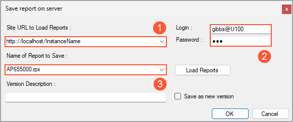

# Report Creation: Modification of an Existing Report {#_1c6f5184-dbe2-4e2f-9716-0a26ff637265 .concept}

In the Acumatica Report Designer, you can create a report by copying an existing report and modifying this copy. You can also create versions of an existing report and customize the versions.

## Predefined, Custom, and Customized Reports in Acumatica ERP { .section}

Acumatica ERP provides a number of predefined reports for each area of the system's functionality. By using the Acumatica Report Designer, you can expand the set of reports that meet your company's needs by creating custom \(new\) reports and by customizing copies of existing ones.

**Tip:** We recommend that you leave predefined reports intact; if you want a report that is similar to an existing one, make a copy of the existing report, and customize \(modify\) this copy.

In the Acumatica ERP interface, you can view reports published in the system. In most workspaces, predefined reports are listed in the **Reports** category. You can add reports that you develop with the Report Designer to this category of any workspace.

## Storing of Reports { .section}

Reports in the Acumatica Report Designer are XML files with the `.rpx` extension.

Predefined reports are stored on the Acumatica ERP server. You can store reports that you develop by using the Report Designer either locally or on the Acumatica ERP server.

We recommend that you save your reports in one of the following locations:

1.  The server
2.  The `/Site/ReportsDefault/` folder

When you open a report in the Report Designer, the application searches for the report in these locations in the listed order.

**Tip:** The system uses the `/Site/ReportsCustomized/` folder for backward compatibility. You can use this folder to store modified reports whose names are the same as the names of predefined reports.

The Report Designer saves all reports in the *UserReports* table of the Acumatica ERP database.

## Copy of a Report { .section}

To copy a report, you open this report in the Report Designer by using the sign-in credentials of a user who has the *Report Designer* role, and you save a copy of the report with the name different from the name of the original report.

To save a new report, you can use the following commands on the Report Designer menu bar:

-   **File** &gt; **Save to Server**: You use this command if you want to save your report to the Acumatica ERP server.

    In the **Save Report on Server** dialog box, which opens, you specify the following:

    -   The connection settings to the server—that is, the connection string and the sign-in credentials.

        You specify the connection string \(see Item 1 in the screenshot below\) in the following format: *http://&lt;URL&gt;*, where *&lt;URL&gt;* is the URL of your Acumatica ERP server. You can use the *http* or *https* protocol, depending the settings of your website.

        When you enter your credentials, if your application contains more than one tenant, you type the tenant name with the username \(Item 2 in the screenshot below\) in the following format: *&lt;username&gt;@&lt;tenant name&gt;*. The tenant name matches the name you use when you sign in to Acumatica ERP. If your application contains only one tenant, you specify only the username.

    -   The name of the report \(Item 3 in the screenshot below\)—which is an identifier with the *&lt;AANNNNNN&gt;* format, where *A* is a letter and *N* is a digit. For information on the identifier conventions of Acumatica ERP reports, see [Form and Report Numbering](../StudioDeveloperGuide/DA__con_Form_Numbering.md).

        **Tip:** To avoid conflicts with new reports that the Acumatica ERP engineering team could produce in the future, we recommend that you use different report identifiers than those described in [Form and Report Numbering](../StudioDeveloperGuide/DA__con_Form_Numbering.md).

    

-   **File** &gt; **Save as**: You use this command if you want to save your report locally.

    **Tip:** You can also save the report locally by clicking the **Save Report As** button on the Report Designer window toolbar.

After you have used any of these commands, the next time you want to save the report \(to the same location\), you can use the **File** &gt; **Save** command. For example, if you have saved a report to the server by using the **File** &gt; **Save to Server** command and then modified this report, you can use **File** &gt; **Save** to save this report to the server again.

After you have saved your report locally or to the server of an instance, you can use this report for any tenant of this instance.

## Report Versions { .section}

You can save your report to an Acumatica ERP server as a new version by selecting the **Save as New Version** check box in the **Save Report on Server** dialog box; the version you are saving is activated automatically. When a user runs this report, the active version of the report is executed.

You can manage the active version of a report only in the Acumatica ERP interface. When a report form is opened, you activate the necessary version on the **Report Versions** tab by selecting the **Active** check box in the row with this version. Alternatively, you can activate the selected version by clicking **Activate** on the table toolbar.

If you want to modify a specific report version, you need to open the report form in Acumatica ERP and select the row with the necessary version on the **Report Versions** tab. Then you start the Report Designer by clicking the **Edit Report** button on the report form toolbar.

**Parent topic:**[Creating a Report](../UserGuide/RD_Creating_Report_Mapref.md)

