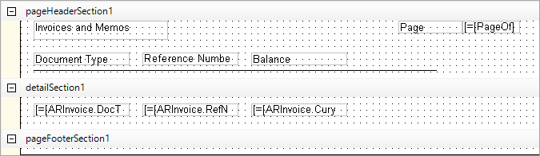
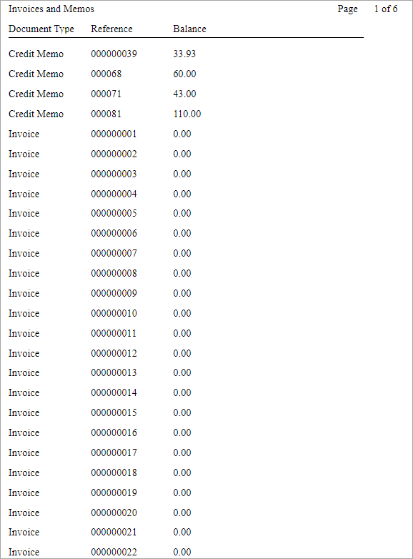

# Report Creation: To Create a Report Based on One DAC {#_911ae3dc-0331-457c-8708-fb570c19a84b .task}

In the following activity, you will create a report based on one DAC.

**Attention:** This activity is based on the *U100* dataset. If you are using another dataset or if any system settings have been changed in *U100*, these changes can affect the workflow of the activity and the results of the processing. To avoid issues, restore the *U100* dataset to its initial state.

## Story { .section}

Suppose that you are a technical specialist in your company who is working on simple customizations. An accountant of your company has requested a report that collects data about invoices and memos. The accountant wants a simple report that displays columns with the document type, the invoice reference number, and the balance of the invoice with that number.

## Process Overview { .section}

You will first inspect the [Invoices and Memos](AR_30_10_00.md) \(AR301000\) form to explore which data access classes you can use to access the needed data: the document type, reference number, and balance.

With the knowledge you have obtained, you will create the report and add the columns to be displayed.

When the report is created and all the necessary settings are specified, you will preview and then publish the report.

## System Preparation { .section}

Before you perform the steps of this activity, make sure that the following tasks have been performed:

1.  You have installed the Acumatica Report Designer, as described in [Report Designer: To Install the Acumatica Report Designer](../Shared/../UserGuide/RD_Getting_Started_Installing_RD_Activity.md).
2.  You have installed an Acumatica ERP instance with the *U100* dataset, or a system administrator has performed this task for you.
3.  You have signed in to Acumatica ERP as the system administrator by using the *gibbs* username and the *123* password.

    **Tip:** The *gibbs* user is assigned the *Administrator* role and the *Report Designer* role. Thus, this user has sufficient access rights to manage system configuration and to preview, save, and publish reports.

## Step 1: Discovering DACs and Data Fields { .section}

To inspect the user interface elements whose data you will use for your report, do the following:

1.  In Acumatica ERP, open the [Invoices and Memos](AR_30_10_00.md) \(AR301000\) form.
2.  Point to the **Reference Nbr.** element, press Ctrl+Alt, and then click.

    The **Element Properties** dialog box opens. You are interested in the **Data Class** and **Data Field** values, which correspond to the class and field you need. Notice that these values are *ARInvoice* and *RefNbr*, respectively. Close the dialog box.

3.  On the form, point at the **Balance** element, press Ctrl+Alt, and click to again open the **Element Properties** dialog box.

    Notice that the **Data Class** value is again *ARInvoice*, while the **Data Field** value is *CuryDocBal*. Close the dialog box.

4.  On the form, inspect the **Type** element as you inspected elements in the previous instructions to find its data class and data field.

    Notice that its **Data Class** value is again *ARInvoice* and its **Data Field** value is *DocType*.

You have discovered that the data access class you need is *ARInvoice* and the data fields are *DocType*, *RefNbr*, and *CuryDocBal*.

## Step 2: Loading the Database Schema { .section}

To load the database schema, do the following:

1.  On the Report Designer menu bar, click **File** &gt; **New** to create a report.

    An empty report with the default sections opens.

2.  On the Report Designer menu bar, click **File** &gt; **Build Schema**.

    The Schema Builder opens with the **Tables** tab selected.

3.  In the **Site URL to Load Database Tables** box, enter the URL of your Acumatica ERP website, which can be your local website or an external URL of Acumatica ERP.

    **Tip:** The history of successful connections is automatically saved in the drop-down list of the URL box. For example, if you have already opened a report from the server, you can select the URL from the drop-down list.

4.  Type `gibbs` as the username and `123` as the password.
5.  Click **Load Schema**.
6.  In the **Search** box, type `ARInvoice`.
7.  In the **Report Tables** list, click *ARInvoice \(PX.Objects.AR.ARInvoice\)*, and click **&gt;**.

    The *ARInvoice* data access class is placed in the right pane of the Schema Builder.

8.  In the Schema Builder, click **OK**.

    The Schema Builder is closed.

## Step 3: Adding Data to the Report { .section}

To add data to the report, while you are still working with the report in the Report Designer, do the following:

1.  In the Properties pane, open the **Fields** tab.
2.  In the list of the fields of the *ARInvoice* data access class, drag the *DocType* field to the `detailSection1` section.

    Notice that in `detailSection1`, you have a box with the following content: `[=[ARInvoice.DocType]]`.

3.  Repeat the actions of the previous instruction with the *RefNbr* and *CuryDocBal* fields. Place *RefNbr* to the right of *DocType*, and *CuryDocBal* next to *RefNbr*.
4.  In the Tools pane, drag the *TextBox* element to the `pageHeaderSection1` section. This element will be a column header. Place the element above the element with the `[=[ARInvoice.DocType]]` content.
5.  While the text box is selected, go to the **Properties** tab of the Properties pane. For the **Appearance** &gt; **Value** property, enter `Document Type`.

    **Tip:** Alternatively, you could double-click the added text box, enter `Document Type`, and press the Enter key.

6.  Add two more *TextBox* elements to the `pageHeaderSection1` section with the following values: `Reference Number` and `Balance`. These elements will be the headers of two other columns. Place these elements above the element with the `[=[ARInvoice.RefNbr]]` and `[=[ARInvoice.CuryDocBal]]` content.
7.  In the Tools pane, drag the *Line* element to `pageHeaderSection1`. Extend the line. Place the line below the added text boxes. This line will divide the heading of the table in the report.
8.  Add two more *TextBox* elements to the `pageHeaderSection1` section with the following values: `Page` and `=[PageOf]`. These elements will display the current page number and the total number of pages in the report.
9.  Add one more text box to the `pageHeaderSection1` section with the `Invoices and Memos` value to display the report name.
10. Adjust the height of the `pageHeaderSection1` and `detailSection1` sections by dragging the section borders to be the same as the height of the added elements in the sections. Set the height of `pageFooterSection1` to the minimum.

The following screenshot shows the report you have designed.

Before saving the report, preview it. In the Design pane of the Report Designer, go to the **Preview** tab. If you are not satisfied with the design of the report, move the text boxes to align them.

## Step 4: Saving the Report { .section}

To save the report on your Acumatica ERP website, do the following:

1.  On the Report Designer menu bar, click **File** &gt; **Save to Server**.

    The **Save Report on Server** dialog box opens.

2.  In the dialog box, in the **Site URL to Load Database Tables** box, type the URL of your Acumatica ERP website.
3.  In the **Login** box, type `gibbs`, and in the **Password** box, type `123`.
4.  In the **Name of Report to Save** box, enter the report name: `AR308000`.
5.  Click **OK**.

## Step 5: Publishing the Report { .section}

To publish the report, do the following:

1.  In Acumatica ERP, open the [Site Map](SM_20_05_20.md) \(SM200520\) form.
2.  Add a new row with the following settings:
    -   **Screen ID**: `AR.30.80.00`
    -   **Title**: `All Invoices and Memos`
    -   **URL**: `~/Frames/ReportLauncher.aspx?ID=AR308000.rpx`
    -   **Workspaces**: *Receivables*
    -   **Category**: *Reports*
3.  On the page toolbar, click **Save**.
4.  On the [Access Rights by Screen](SM_20_10_20.md) \(SM201020\) form, specify the access rights for the added report as follows:
    1.  In the **Receivables** node, click **All Invoices and Memos**.
    2.  In the right pane, select *Granted* in the **Access Rights** column for the *ReportDesigner*, *AR Admin*, and *Accountant* roles.
    3.  On the form toolbar, click **Save**.

## Step 6: Viewing the Report { .section}

To view and run the report you have created, do the following:

1.  In the main menu of Acumatica ERP, click the **Receivables** menu item.
2.  In the **Reports** category of the **Receivables** workspace, click *All Invoices and Memos*.
3.  On the report form toolbar, click **Run Report**.

The created report with the information about invoices and memos is displayed. The following screenshot shows the resulting report.

**Parent topic:**[Creating a Report](../UserGuide/RD_Creating_Report_Mapref.md)

