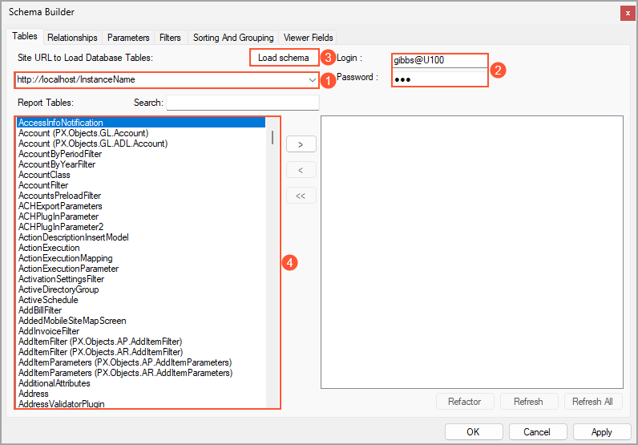

# Report Creation: General Information {#_b78decec-1048-4c7c-8526-5640275383b9 .concept}

By using the Acumatica Report Designer, you design a report to collect particular data from the Acumatica ERP database, using any report parameters that the user has specified. The report groups, sorts, filters, and displays the data based on the settings you have specified when designing the report, so that a user running the report does not have to perform all these steps manually. The Report Designer gives you the flexibility to gear the report design process and the resulting report to your users' needs for information.

## Learning Objectives { .section}

In this chapter, you will learn how to do the following in the Report Designer:

-   Open and view an existing report
-   Copy an existing report
-   Create a report from scratch
-   Update the database schema for reports
-   Publish and view a report

## Applicable Scenarios { .section}

You may want to create reports by using the Acumatica Report Designer in the following circumstances:

-   You are responsible for the customization of Acumatica ERP in your company, including developing and modifying reports to give users the information they need to do their jobs.
-   You need to deliver different reports that your colleagues may need to perform their job duties.

## Report Development Stages { .section}

The process of developing a report in the Report Designer consists of the following stages:

1.  *Preparation*: You determine which data you need for the report, and you find the underlying data access classes \(DACs\) and the corresponding data fields. For more information about DACs, see [DAC Discovery: General Information](GI_Discovering_DACs_General_Info.md).
2.  *Data loading*: You load the database schema, select the DACs that you have determined during the previous stage, and specify the relationships between DACs. For more information about relationships between DACs, see [Data from Multiple Data Sources: General Information](GI_Getting_Data_from_Multiple_Tables_GeneralInfo.md).
3.  *Layout definition*: You add sections to the report layout \(or delete unneeded sections from it\), add any of the visual elements available in the Tools pane of the Report Designer main window, specify the visibility of the report sections and elements, and define the style and colors of the report. This stage can follow the *Data modification* stage instead of preceding it.

    For more information about adding elements to the report layout, see [Report Content: General Information](RD_Filling_with_Content_GeneralInfo.md). For more information about the report style, see [Report Style: General Information](RD_Report_Style_GeneralInfo.md).

4.  *Data modification* \(optional\): You define parameters, filters, and sorting and grouping for the data in the report.

    For more information about sorting and grouping, see [Data Sorting and Grouping: General Information](RD_Sorting_and_Grouping_GeneralInfo.md). For details about parameters and filters, see [Parameters and Filters: General Information](RD_Parameters_and_Filters_GeneralInfo.md).

5.  *Saving*: You save the report on the server or locally. For more information about saving of a report, see [Report Creation: Modification of an Existing Report](RD_Creating_Report_Copying_Existing_Concept.md).
6.  *Publishing*: You preview the report and make sure that it satisfies all the requirements. If it does not, you modify the report. When it is ready, you publish the report, which entails adding it to the site map to make it listed in a workspace, and assigning the *Granted* access rights to the roles whose users need to work with the report.
7.  *Running and viewing*: You run the report in Acumatica ERP to be sure that you have published it correctly.

**Attention:** Only users with the *Report Designer* role are allowed to preview, save, and publish reports.

## Data for a Report {#section_h2p_5dk_p1b .section}

You can load the database schema of all available data access classes from the application server that you use to work with Acumatica ERP. To load the database schema, you use the Schema Builder, which you invoke by clicking **File** &gt; **Build Schema** on the Report Designer menu bar. On the **Tables** tab, you specify the following settings:

1.  The connection string \(see Item 1 in the screenshot below\) in the following format: *http://&lt;URL of your Acumatica ERP server&gt;/&lt;InstanceName&gt;/*, where you replace *&lt;URL of your Acumatica ERP server&gt;* with the actual URL of your Acumatica ERP server, and *&lt;InstanceName&gt;* with the name of your Acumatica ERP instance.
2.  Your username and password in the Acumatica ERP instance \(Item 2\). If your application contains more than one tenant, you type the appropriate tenant name with the username in the following format: `<username>@<tenant name>`. The tenant name is the name you select when you sign in to Acumatica ERP.

When you click the **Load Schema** button \(Item 3\), the Report Designer connects to the application server and loads the schema. When the schema is retrieved, the list of all data access classes defined in Acumatica ERP is displayed \(Item 4\).

When you have loaded the database schema, you can select the data access classes you found for the report. If your report is to be based on multiple data access classes, you should specify the relationships between them. On the **Relationships** tab of the Schema Builder wizard, you specify the relationships between a pair of DACs in the upper table and the links between the DACs in the lower table.

## Report Publication { .section}

When a report is ready, you can publish it so that users of the system can run it. Publishing a report entails adding the URL of the report to the site map in Acumatica ERP—that is, adding information about the report to the [Site Map](SM_20_05_20.md) \(SM200520\) form and saving your changes. Also, you need to specify access rights to the report on the [Access Rights by Screen](SM_20_10_20.md) \(SM201020\) form.

On the [Site Map](SM_20_05_20.md) form, you add a new row with the following settings:

-   **Screen ID**: The identifier of the form that is used to access the report in Acumatica ERP. You assigned this identifier when you saved your report in the Report Designer.
-   **Title**: The name of the report. This name is displayed in the **Reports** category of the workspace that you specify for the report.
-   **URL**: `~/Frames/ReportLauncher.aspx?ID=<ScreenID>.rpx`.
-   **Workspaces**: The name of the workspace or workspaces where you want to place the report; you can add the report to multiple workspaces by selecting the check box next to each needed workspace in the drop-down list.
-   **Category**: *Reports*.

By default, the system sets the report's access rights to *Revoked* for all user roles. To make the report visible to users of any specific user role, you need to set the role’s access rights to it to *Granted* on the [Access Rights by Screen](SM_20_10_20.md) \(SM201020\) form.

## Report Viewing and Execution in Acumatica ERP { .section}

To preview a report that has not been published yet, you use the **Preview** tab in the Report Designer. If your report requires parameters, they are ignored, and the report is displayed with random data.

To view a report in Acumatica ERP, you open the workspace where the report is placed, and under the **Reports** category, you click the link with the report name. You can also open the report form by searching for its identifier. If needed, on the **Report Parameters** tab, you specify the report parameters. Then you click **Run Report** on the report toolbar.

**Tip:** To return to the report form—for example, to change report parameters—you can click the **Parameters** button \(\) on the report toolbar.

**Parent topic:**[Creating a Report](../UserGuide/RD_Creating_Report_Mapref.md)

