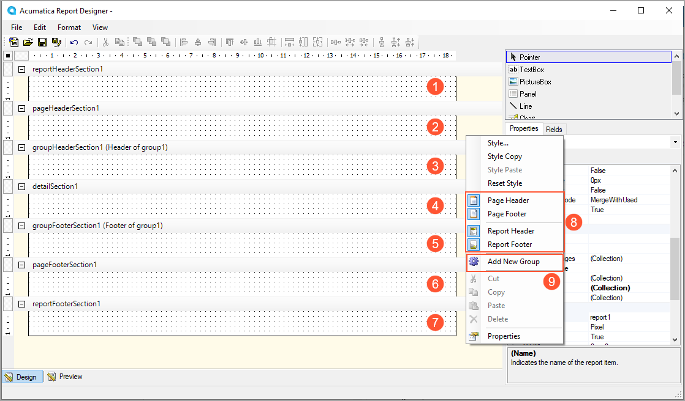
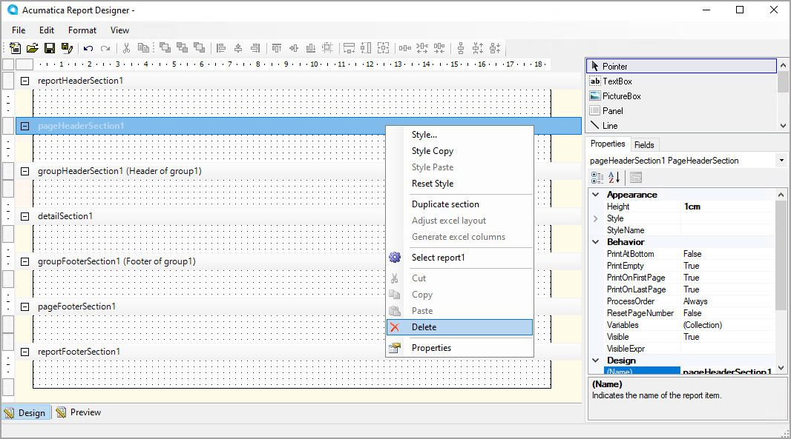

# Report Creation: Report Sections {#_4c43f727-df45-449c-a576-9f5c5a45be93 .concept}

By default, a newly created report includes the main sections, which are described in this topic. You can add new sections, as well as delete, hide, and duplicate sections.

## Sections in the Report Layout { .section}

The layout of any newly created report always consists of the following main sections:

-   The page header section \(see Item 2 in the screenshot below\)
-   The page footer section \(Item 6\)
-   The detail section \(Item 4\)

Within the report, you can add group sections, which can be nested. Each group includes the group header \(Item 3\) and group footer \(Item 5\) sections, with the same detail section always nested between the group header and group footer. You can also add the report header \(Item 1\) and report footer \(Item 7\) sections.

All these sections are briefly described below:

-   The detail section is the central part of the report that contains its main data. \(If the detail section has been duplicated, both detail sections are in the middle of the report.\) For example, if your report outlines sales orders, you would put a list of orders in the detail section. Unlike other sections, it cannot be deleted.
-   The group header and group footer sections are shown at the beginning and end, respectively, of each group of the report data. These sections are a good place for information that applies to all data in the detail section of the report. For example, if you are grouping sales orders by customer, you can place detailed information about the customer in the group header section and use the group footer section to calculate subtotals for the customer.
-   The page header and page footer sections, located at the top and bottom of every page of the report, are the best place for information that the reader may need when reading every page. For example, you can use the page header to display the column headers of a table that is continued from the previous page. You can use the page footer to display the number of the current page.
-   The report header and report footer sections are the only types of report sections that are printed once per report. The report header is the second section of the report on the first page; when the report is printed, the report header is placed right after the page header. The report header is the best place to display the report name, the company logo, the date range of the report, and similar information. The report footer, which finalizes the informative part of the report, is placed before the page footer on the last page of the report. It is a good place for totals or conclusions.

You can do the following with a report section:

-   Add it: You can add the report header, the report footer, the page header, and the page footer sections to the report layout. To add these sections, you right-click any empty space of the report layout \(on the left side or the right side\), and select the appropriate command \(Item 8 in the screenshot above\).

    When you add a new group, its group header and group footer sections are added automatically. To do this, you right-click any empty space in the report layout, and then select **Add New Group** \(Item 9 in the screenshot above\). You can also add a new group in the Group Collection Editor. For more information, see [Data Sorting and Grouping: General Information](RD_Sorting_and_Grouping_GeneralInfo.md).

-   Delete it: You can delete the report header, the report footer, the page header, and the page footer sections from the report layout; you cannot delete the detail section. You may need to delete a section if it does not contain any elements or the information in this section is not relevant to this report. To delete a section, you right-click the section header and then select **Delete**, as shown in the screenshot below.
-   Duplicate it: You may need to duplicate a section if, for example, you want to display content in the section conditionally. To duplicate any section, you right-click the section header and then select **Duplicate Section**.
-   Hide it: You may need to hide a section if data from the section is used in calculations but you do not need to display the content of the section. To hide any section, you set the **Visible** property of the section to *False*. You also can hide a section if a condition is met; in this case, you specify an expression for the **VisibleExpr** property.

**Parent topic:**[Creating a Report](../UserGuide/RD_Creating_Report_Mapref.md)

