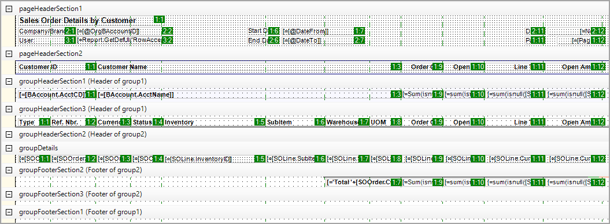
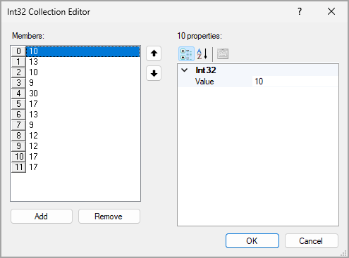

# Report Export: General Information {#_41bda201-c3ac-450f-8b38-337e719ed830 .concept}

Acumatica ERP reports can be exported as XLS and PDF files. In the Acumatica Report Designer, you can specify the settings to export a report as an XLS file.

## Learning Objectives { .section}

In this chapter, you will learn how to export report results by using the Report Designer.

## Applicable Scenarios { .section}

You may need to learn about the exporting of report results in the following circumstances:

-   You are responsible for the customization of Acumatica ERP in your company, including developing and modifying reports to give users the information they need to do their jobs.
-   You need to export reports from Acumatica ERP to send them by email or to use them for further processing in Excel.

## Export of Reports in Acumatica ERP { .section}

In Acumatica ERP, you can export any report, predefined or custom, that has been generated. The system has two options of export: as an XLS file, or as a PDF file.

To export a report in Acumatica ERP, you run the report, and on the report toolbar, you select one of the following menu commands, based on the format you need:

-   **Export** &gt; **Excel**: If you plan to export a predefined or custom report as an XLS file, then in the Report Designer, you can configure the report's settings in advance.
-   **Export** &gt; **PDF**: The system exports the report to a PDF file as is; you cannot configure any settings of this report.

## Excel Mode for Export { .section}

In the Report Designer, you manage the export settings of a report to XLS file by using the **Layout** &gt; **Excel Mode** property. By default, for any newly created report, this property is set to *Auto*. With *Auto*, some reports are exported readably. Other reports exported to an XLS file can have displaced cells with data in the grid. These reports are difficult or even impossible to read. For these reports, before report generation and export, you need to mark up cells and columns in the Report Designer.

To do this, you set the **Layout** &gt; **Excel Mode** property to *Manual* and then specify the needed settings. To prepare a report for export, you can perform the following actions \(which are further described in the remaining sections of this topic\) in the Report Designer:

1.  Display the Excel column grid.
2.  Adjust or define the list of Excel columns.
3.  Define the row and column position of all report elements.
4.  Adjust the position of each element.
5.  Specify additional settings for the margins between sections and the export status of elements.

After you specify all necessary settings, you save the report. It can be run and exported to Excel.

**Important:** For tabular reports, setting the **Layout** &gt; **Excel Mode** property to *Manual* is not supported. The system generates columns automatically for such a report and cannot adjust them according to the settings that you specify manually in the Report Designer.

## Display of the Excel Column Grid { .section}

To display the Excel column grid, on the menu bar of the Report Designer, you click **View** &gt; **Excel Grid** &gt; **Show Columns**. In this display, each element on the report layout is marked with two numbers divided by a colon \(see the following screenshot\).

These numbers mean the following:

-   The first number is the row in Excel worksheet to which the element content will be exported. This number is specified by the value of the **Layout** &gt; **Excel Cell** &gt; **Row** property.
-   The second number is the column to which the element content will be exported. This number is specified by the value of the **Layout** &gt; **Excel Cell** &gt; **Column** property.

In each section, the numbering of rows starts from 1. You can change the numbers of rows and columns to define the order of elements within each exported section. You cannot change the order of the sections in the exported report, however. You can generate the list of columns automatically according to the number and width of elements of any section. For this purpose, you can use the section with the maximum number of elements. You right-click the header of this section, and then select **Generate Excel Columns**.

**Tip:** If you need to refresh the Excel column grid, on the menu bar, you can click **View** &gt; **Excel Grid** &gt; **Hide Columns**, and then click **View** &gt; **Excel Grid** &gt; **Show Columns**.

## Adjustment or Defining of the Excel Columns { .section}

To adjust the number, order, and width of columns to be exported to Excel, you select the report; then in the **Layout** &gt; **Excel Columns** property, you click the More button to open the Int32 Collection Editor \(that is, the **Int32 Collection Editor** dialog box\), as shown in the following screenshot.

In the **Members** pane of the Int32 Collection Editor, the first number corresponds to the order of the column in the Excel grid. **0** is the first column \(**A**\) of the Excel grid, **1** is the second \(**B**\), and so on. To specify the width of each column, you click the column in the **Members** pane; then you specify the **Value** property of the right pane of the Int32 Collection Editor. The column width corresponds to the element width in pixels in an approximate 1:6 ratio. For example, the width of a column with a **Value** of *10* is approximately equal to the width of a text box with a **Size** &gt; **Width** of *60px*.

Based on the settings in the screenshot above, the report will be exported to Excel with the following settings:

-   The report will have columns from **A** \(which corresponds to **0**\) to **L** \(which corresponds to **11**\).
-   The **A** column will have a width of *10*.

## Row and Column Positions of Report Elements { .section}

To define the row and column position of all the report elements, on the Report Designer menu bar, you click **Edit** &gt; **Adjust Excel Layout**. The Report Designer automatically changes the row and column position of all the report elements depending on how they fit the Excel columns.

This functionality exports the report as expected for simple report layouts but may cause unexpected results for some complicated layouts. We recommend that you assign the row and column position for report elements automatically. You can adjust the positions manually later in Excel, if needed.

**Tip:** Similarly, you can define the row and column position of the elements of any particular section. You right-click the section header and then select **Adjust Excel Layout**.

## The Position of Each Element { .section}

In the Report Designer, you can adjust the position of each element in a report. To do this, you use the **Layout** &gt; **Excel Cell** &gt; **Row** and **Layout** &gt; **Excel Cell** &gt; **Column** properties.

## Additional Settings { .section}

In the Report Designer, you can specify the following additional settings for a report:

-   Margins between sections: You specify this setting \(in number of rows\) in the **Layout** &gt; **Excel Margin** &gt; **Top** and **Layout** &gt; **Excel Margin** &gt; **Bottom** properties.
-   Export status of an element: If you do not want to export a particular element of the report to Excel, you select the element; then in the **Layout** &gt; **Excel Visible** property, select *False*. By default, the property is set to *True*.

    **Tip:** The export of *SubReport*, *Chart*, *Line*, and *ImageBox* elements to Excel is not supported. Also, if you want to export the contents of a *Panel* element to Excel, you should specify the position—a row and a column—of each element inside the panel.

**Parent topic:**[Exporting Reports](../UserGuide/RD_Exporting_Reports_Mapref.md)

