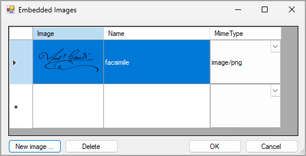

# Report Content: To Embed an Image in a Report {#_4b658e14-3d47-470b-9d46-3229efb076eb .task}

In the following activity, you will learn how to embed an image in a report.

**Attention:** This activity is based on the *U100* dataset. If you are using another dataset or if any system settings have been changed in *U100*, these changes can affect the workflow of the activity and the results of the processing. To avoid issues, restore the *U100* dataset to its initial state.

## Story { .section}

Suppose that you are a technical specialist in your company who is working on simple customizations. A sales manager has requested that you add an image of his signature to a report that displays the details of an invoice or memo. You have decided to use the predefined [Invoice/Memo](AR_64_10_00.md) \(AR641000\) report as a base and modify it by adding the image of the signature, which the sales manager has sent to you as a PNG file.

## Process Overview { .section}

In the Report Designer, you will open the `AR6410C3.RPX` report, which is a copy of the [Invoice/Memo](AR_64_10_00.md) \(AR641000\) report, and add the *PictureBox* element to the report layout. You will specify the properties of this element to display the `facsimile.png` image.

## System Preparation { .section}

Before you perform the steps of this activity, make sure that the following tasks have been performed:

1.  You have installed the Acumatica Report Designer, as described in [Report Designer: To Install the Acumatica Report Designer](../Shared/../UserGuide/RD_Getting_Started_Installing_RD_Activity.md).
2.  You have installed an Acumatica ERP instance with the *U100* dataset, or a system administrator has performed this task for you.
3.  You have signed in to Acumatica ERP as the system administrator by using the *gibbs* username and the *123* password.

    **Tip:** The *gibbs* user is assigned the *Administrator* role and the *Report Designer* role. Thus, this user has sufficient access rights to manage system configuration and to preview, save, and publish reports.

Also, to prepare for use the file that you will need for this activity, do the following:

1.  Download the `AR6410C3.rpx` file.
2.  Open the downloaded file in the Report Designer.
3.  On the Report Designer menu bar, select **File** &gt; **Save To Server**, which opens the **Save Report on Server** dialog box.
4.  In the dialog box, specify the connection string and sign-in credentials of your Acumatica ERP instance, type `AR6410C3` as the report name, and click **OK**.

    The report is saved on the server.

Finally, you should download the `facsimile.png` file and save it to any folder on your computer.

## Step 1: Embedding the Image in the Report { .section}

To embed the image in the *AR6410C3* report, do the following:

1.  In the Report Designer, make sure that the *AR6410C3* report \(which you have saved to the server\) is open.
2.  On the **Properties** tab of the Properties pane, select the `report1 Report` object from the drop-down list to select the report form, and do the following:
    1.  In the **Data** &gt; **EmbeddedImages** property, click the More button to open the **Embedded Images** dialog box.
    2.  In the dialog box, click the **New image ...** button, which is shown in the following screenshot, and select the `facsimile.png` file, which contains the needed image. \(The **Name** and **Mime Type** of the selected file are filled in automatically.\)

        

3.  Click **OK** to add the image that you have selected to the embedded images collection of the report and to close the **Embedded Images** dialog box. Now you can use this image in the report.
4.  Select the `groupFooterSection2 (Footer of groupInvoice)` section and specify the `2.5cm` value for the **Appearance** &gt; **Height** property to increase the height of the section.
5.  In the Tools pane, drag the *PictureBox* element to the left side of the `groupFooterSection2 (Footer of groupInvoice)` section.
6.  While the element is selected, specify the following properties for the embedded image:

    -   **Data** &gt; **Source**: *Embedded*
    -   **Data** &gt; **Value**: *facsimile*
    -   **Layout** &gt; **Size**: `2cm; 2cm`
    -   **Layout** &gt; **Sizing**: *Scale*
    By specifying the *Scale* value for the **Layout** &gt; **Sizing** property, you adjust the sizing of the image so that the image keeps its proportions.

7.  On the Report Designer window toolbar, click **Save**.

## Step 2: Viewing the Report { .section}

To view the report, do the following:

1.  In Acumatica ERP, open the S150 Invoice/Memo \(AR6410C3\) report form by searching for its identifier.

    **Tip:** This report, which you have modified in this activity, has been published in the *U100* dataset. That is, it has been added to the [Site Map](SM_20_05_20.md) \(SM200520\) form, and you can access it in Acumatica ERP.

2.  On the **Report Parameters** tab, in the **Document Type** box, make sure *Invoice* \(the default value\) is selected.
3.  In the **Reference Number** box, select any number, for example, *000058*.
4.  On the report form toolbar, click **Run Report**.

Make sure that the image you have added is displayed below the list of items in the invoice. The following screenshot displays the report.

 report with the image added")

**Parent topic:**[Filling a Report with Content](../UserGuide/RD_Filling_with_Content_Mapref.md)

