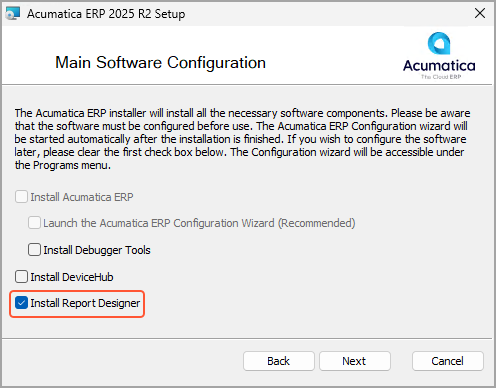
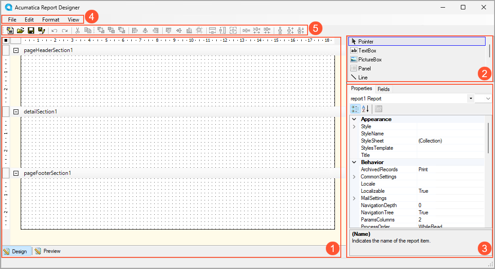

# Report Designer: General Information {#_d5931465-a209-4d4e-b3bf-eab46fbb5952 .concept}

The Acumatica Report Designer is a Windows application that provides visual tools to design custom reports. With the Report Designer, you can select data for a report, calculate the required values based on the selected data, and customize the layout of the report.

## Learning Objectives { .section}

In this chapter, you will learn how to do the following:

-   Install the Acumatica Report Designer
-   Start the Acumatica Report Designer and explore its interface

## Applicable Scenarios { .section}

You may want to use the Acumatica Report Designer in the following circumstances:

-   You are responsible for the customization of Acumatica ERP in your company, including developing and modifying reports to give users the information they need to do their jobs.
-   You need to deliver different reports that your colleagues may need for getting their jobs done. By using the Acumatica Report Designer, you can develop reports based on the Acumatica ERP data.

## Advantages of the Report Designer { .section}

The Report Designer is a reporting tool that uses SQL queries to retrieve data from the Acumatica ERP database. The Report Designer gives you the following advantages for representing data in reports:

-   Use of formatting options, for example, font style, size, color, and background color
-   Ability to use predefined and custom style templates
-   Management of the report layout based on your needs
-   Use of pictures, barcodes, and charts

## Installation of the Report Designer { .section}

You install the Acumatica Report Designer by using the Acumatica ERP Installer wizard. In the wizard, the **Install Report Designer** check box is cleared by default; you need to select this check box and make sure that the other check boxes are cleared, as shown in the following screenshot.

The Report Designer receives from the Acumatica ERP application server all the information you need to design any report. You do not need to install Acumatica ERP locally to change or develop the report; you can just connect to a remote server by using the appropriate URL.

## The User Interface of the Report Designer { .section}

To open the Report Designer, you use the following path: **Start** &gt; **All Programs** &gt; **Acumatica** &gt; **Report Designer**. This opens the main window, as shown in the following screenshot.

The main window of the Acumatica Report Designer includes the following panes:

-   The Design pane on the left part of the window \(Item 1 in the screenshot above\), which includes the following tabs:
    -   **Design**: Displays the report layout.
    -   **Preview**: Gives you the ability to preview the report you are designing, so you can control the intermediate results. If your report requires parameters, they are ignored, and the report is displayed with random data.
-   The Tools pane in the top right of the window \(Item 2\), which provides access to the elements and tools that you can use to design the layout of the report and add its content.
-   The Properties pane in the bottom right of the window \(Item 3\), which includes the following tabs:
    -   **Properties**: Displays the properties of the report element selected in the Design pane. When you select a report element in the drop-down list, the set of properties in the properties list corresponds to the selected element. By using the buttons above the properties list, you can change the order of the properties to be listed under the categories of the properties or in alphabetical order of the names of properties.
    -   **Fields**: Lists all the fields of the data access classes selected as the source of data for the report.

The Report Designer window toolbar \(Item 5\) is located above the Design pane and provides single-click access to common actions. You can also access these actions on the Report Designer menu bar \(Item 4\).

**Parent topic:**[Getting Started with the Report Designer](../UserGuide/RD_Getting_Started_Mapref.md)

