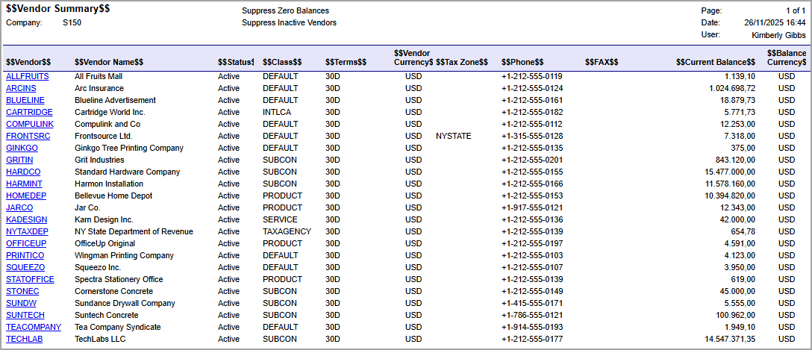

# Report Localization: To Localize a Report {#_7b47372d-f42e-4e52-ac04-5540e3ee3d32 .task}

In the following activity, you will learn how to localize a report.

**Attention:** This activity is based on the *U100* dataset. If you are using another dataset or if any system settings have been changed in *U100*, these changes can affect the workflow of the activity and the results of the processing. To avoid issues, restore the *U100* dataset to its initial state.

## Story { .section}

Suppose that you are a technical specialist in your company who is working on simple customizations. A sales manager of your company has requested that you localize the predefined [Vendor Summary](AP_65_50_00.md) \(AP655000\) report to the Italian language. You will localize a copy of the predefined report, starting with a test of the capability in which you localize the report header and table header.

## Process Overview { .section}

In the Report Designer, you will open the `AP6550C5.RPX` report, which is a copy of the [Vendor Summary](AP_65_50_00.md) \(AP655000\) report, and make sure that it can be localized. On the [System Locales](SM_20_05_50.md) \(SM200550\) form, you will add the Italian language. On the [Translation Dictionaries](SM_20_05_40.md) \(SM200540\) form, you will collect strings, select the language, and type a translation for the strings related to the needed report. To experiment with the capability, as a translation, you will use the same strings as the original ones with *$$* as a prefix and suffix. You will localize the report header and the table header in the report.

## System Preparation { .section}

Before you perform the steps of this activity, make sure that the following tasks have been performed:

1.  You have installed the Acumatica Report Designer, as described in [Report Designer: To Install the Acumatica Report Designer](../Shared/../UserGuide/RD_Getting_Started_Installing_RD_Activity.md).
2.  You have installed an Acumatica ERP instance with the *U100* dataset, or a system administrator has performed this task for you.
3.  You have signed in to Acumatica ERP as the system administrator by using the *gibbs* username and the *123* password.

    **Tip:** The *gibbs* user is assigned the *Administrator* role and the *Report Designer* role. Thus, this user has sufficient access rights to manage system configuration and to preview, save, and publish reports.

Also, to prepare for use the file that is intended for this activity, do the following:

1.  Download the `AP6550C5.rpx` file.
2.  Open the downloaded file in the Report Designer.
3.  On the Report Designer menu bar, select **File** &gt; **Save To Server**, which opens the **Save Report on Server** dialog box.
4.  In the dialog box, specify the connection string and sign-in credentials of your Acumatica ERP instance, type `AP6550C5` as the report name, and click **OK**.

    The report is saved on the server.

## Step 1: Localizing the Report { .section}

To localize the report, do the following:

1.  In the Report Designer, make sure that the *AP6550C5* report \(which you have saved to the server\) is open.
2.  In the top left corner of the Design pane, click the  icon to select the report, and make sure that the **Behavior** &gt; **Localizable** property of the **Properties** tab is set to *True* \(which is the default value\).
3.  In Acumatica ERP, open the [System Locales](SM_20_05_50.md) \(SM200550\) form.
4.  Add a new row, and specify the following settings in the added row:
    1.  **Locale Name**: *it-IT*
    2.  **Locale Name in Locale Language**: `Italiano`
    3.  **Description**: `Italian`
    4.  **Sequence**: `2`
    5.  **Active**: Selected
5.  On the form toolbar, click **Save**.
6.  In Acumatica ERP, open the [Translation Dictionaries](SM_20_05_40.md) \(SM200540\) form, and on the form toolbar, click **Collect Strings**.

    The process can be time-consuming. In the upper-right corner of the form, a notification should appear indicating successful processing.

7.  In the **Language** box, select *Italiano*.

    **Tip:** You can select two or more languages if you want to translate the report into multiple languages simultaneously.

8.  Select the **Show Only Unbound** check box.

    Based on this selection, all unbound strings, including report strings, will be shown on the **Collected** tab of the form.

    **Tip:** Because you decided to translate only the report heading and column headers that are *TextBox* elements, in the **Unbound Resources To Display** box, you can select *Text Box Value*.

9.  On the **Collected** tab, in the Search box of the **Default Values** table, type the string you are looking for to find the particular string of your report \(which is initially *Vendor Summary*\).

    **Tip:** To view already localized strings, select the **Show Localized** check box.

10. In the **Source Value** column of the **Default Values** table, click the string that exactly matches the string in the *AP6550C5* report. To look for a string in a long list, use the arrow buttons below **Default Values**.

    In the **Key** column of the **Key-Specific Values** table, all elements that use the string are listed.

    **Tip:** When you look for the string in the **Default Values** table, make sure that in the **Key-Specific Values** table, the **Key** value is *AP6550C5.rpx textBox11.Value*. You need to look for this value because in the Report Designer, the *Vendor Summary* string is the value of the **Appearance** &gt; **Value** property of the text box element with the *textBox11* value of the **Design** &gt; **\(Name\)** property.

11. In the **Italiano** column of the **Default Values** table, type your translation—that is, *$$Vendor Summary$$*.
12. On the form toolbar, click **Save**.
13. Repeat the four previous instructions to find and translate the strings from the first column of the following table.

    For each of the strings in the first column, in the **Key-Specific Values** table, the **Key** value is a concatenation of the *AP6550C5.rpx* prefix and the corresponding string from the second column of the following table.

    |The **Appearance** &gt; **Value** property of the text box|The **Design** &gt; **\(Name\)** property of the text box|
    |----------------------------------------------------------|---------------------------------------------------------|
    |*Vendor*|*textBox35*|
    |*Vendor Name*|*textBox39*|
    |*Status*|*textBox30*|
    |*Class*|*textBox37*|
    |*Terms*|*textBox34*|
    |*Vendor Currency*|*textBox32*|
    |*Tax Zone*|*textBox33*|
    |*Phone*|*textBox38*|
    |*FAX*|*textBox36*|
    |*Current Balance*|*textBox27*|
    |*Balance Currency*|*textBox4*|

## Step 2: Viewing the Report { .section}

To view the report, do the following:

1.  In Acumatica ERP, open the S150 Vendor Summary \(AP6550C5\) report form by searching for its identifier.

    **Tip:** This report, which you have modified in this activity, has been published in the *U100* dataset. That is, it has been added to the [Site Map](SM_20_05_20.md) \(SM200520\) form, and you can access it in Acumatica ERP.

2.  In the **Locale** box of the Selection area, select *Italian*.
3.  On the report form toolbar, click **Run Report**.

The following screenshot displays the localized report. Make sure that the report heading and each column header has *$$* as a prefix and a suffix.

**Parent topic:**[Localizing Reports](../UserGuide/RD_Localization_of_Reports_Mapref.md)

