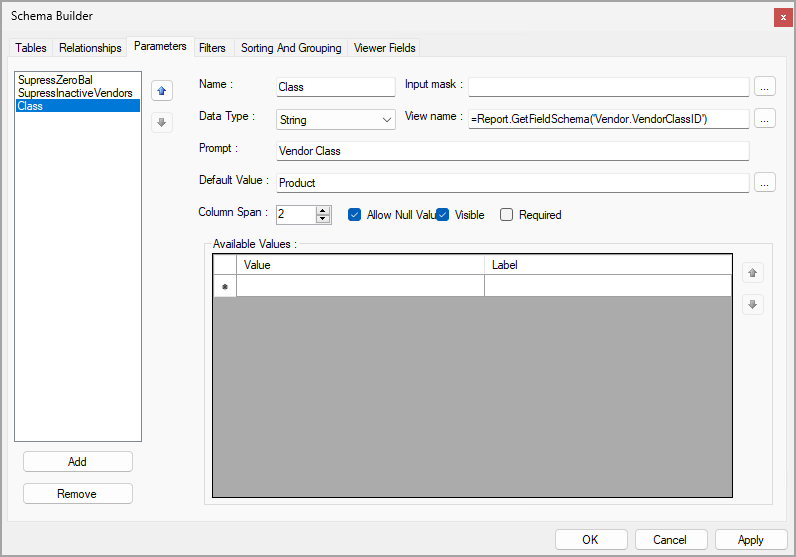
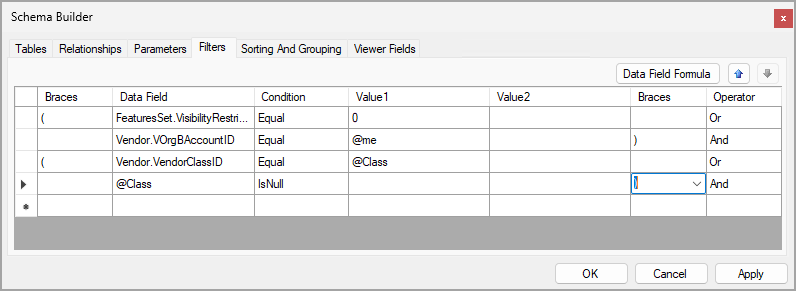

# Parameters and Filters: To Define a Parameter and a Filter {#_43976a2c-a9d7-4717-92e3-7d2f3e93a40f .task}

In the following activity, you will learn how to define parameters for a report and set a filter using the parameters.

**Attention:** This activity is based on the *U100* dataset. If you are using another dataset or if any system settings have been changed in *U100*, these changes can affect the workflow of the activity and the results of the processing. To avoid issues, restore the *U100* dataset to its initial state.

## Story { .section}

Suppose that you are a technical specialist in your company who is working on simple customizations. A sales manager of your company has requested a report that displays data about vendors. You have offered the predefined [Vendor Summary](AP_65_50_00.md) \(AP655000\) report, but the sales manager has asked you to give users the ability to select a particular vendor class to view data about only the vendors of this class. If no vendor class is specified, the report should display the full list of vendors.

## Process Overview { .section}

In the Report Designer, you will open the `AP6550C2.RPX` report, which is a copy of the [Vendor Summary](AP_65_50_00.md) \(AP655000\) report. In the Schema Builder, on the **Tables** tab, you will look for the field that contains the vendor class; you will need this field to specify the parameter. You will add a new parameter to the **Parameters** tab. Then, on the **Filters** tab, you will add clauses to limit the data in the report. With this filter, the report will display only documents that relate to the specified vendor class.

## System Preparation { .section}

Before you perform the steps of this activity, make sure that the following tasks have been performed:

1.  You have installed the Acumatica Report Designer, as described in [Report Designer: To Install the Acumatica Report Designer](../Shared/../UserGuide/RD_Getting_Started_Installing_RD_Activity.md).
2.  You have installed an Acumatica ERP instance with the *U100* dataset, or a system administrator has performed this task for you.
3.  You have signed in to Acumatica ERP as the system administrator by using the *gibbs* username and the *123* password.

    **Tip:** The *gibbs* user is assigned the *Administrator* role and the *Report Designer* role. Thus, this user has sufficient access rights to manage system configuration and to preview, save, and publish reports.

Also, to prepare for use the file that is intended for this activity, do the following:

1.  Download the `AP6550C2.rpx` file.
2.  Open the downloaded file in the Report Designer.
3.  On the Report Designer menu bar, select **File** &gt; **Save To Server**, which opens the **Save Report on Server** dialog box.
4.  In the dialog box, specify the connection string and sign-in credentials of your Acumatica ERP instance, type `AP6550C2` as the report name, and click **OK**.

    The report is saved on the server.

## Step 1: Defining the Parameter for the Report { .section}

To define the parameter for the vendor class in the *AP6550C2* report, do the following:

1.  In the Report Designer, make sure that the *AP6550C2* report \(which you have saved to the server\) is open.
2.  On the Report Designer menu bar, click **File** &gt; **Build Schema** to open the Schema Builder.
3.  On the **Parameters** tab, click the **Add** button.

    A new parameter is added to the list of parameters.

4.  In the **Name** box, enter `Class` as the parameter name.
5.  In the **Data Type** box, make sure that *String* is selected.
6.  In the **Prompt** box, enter `Vendor Class` as the prompt for the parameter.
7.  In the **Default Value** box, enter `Product` as the default value for the parameter.
8.  In the **Column Span** box, set the value to *2*.
9.  Select the **Allow Null Values** and **Visible** check boxes.
10. Make sure that the **Required** check box is cleared.
11. In the **View Name** box, click the More button. In the Expression Editor, which opens, enter the formula used to retrieve data for the parameter from the `Vendor` data access class and the VendorClassID data field as follows: `=Report.GetFieldSchema('Vendor.VendorClassID')`.
12. Click **Validate** to validate the added formula.
13. Click **OK** to close the Expression Editor.
14. In the Schema Builder, click the **Apply** button.

    The **Class** parameter on the **Parameters** tab of the Schema Builder is shown in the following screenshot.

    

15. Click **OK** to save the parameters defined for the report and close the Schema Builder.
16. On the Report Designer window toolbar, click **Save**.

## Step 2: Defining the Filter {#section_gch_skb_pvb .section}

To define the filter for the vendor class, while you are still working with the *AP6550C2* report in the Report Designer, do the following:

1.  On the Report Designer menu bar, click **File** &gt; **Build Schema** to open the Schema Builder.
2.  On the **Filters** tab, in the table, add single braces to bracket the existing expression.
3.  Add two filter clauses. The first clause uses the *@Class* parameter specified in this report \(which you can find listed on the **Parameters** tab\). The clause compares the value in the *Vendor.VendorClassID* field with the value of the vendor class that a user will specify before running the report. Specify the following settings in the first row of the table:

    -   **Braces**: *\(*
    -   **Data Field**: *Vendor.VendorClassID*
    -   **Condition**: *Equal*
    -   **Value 1**: `@Class`
    -   **Operator**: *Or*
    The second clause covers the case when a user will not specify a vendor class before running the report. Specify the following settings in the second row of the table as follows:

    -   **Data Field**: *@Class*
    -   **Condition**: *IsNull*
    -   **Braces**: *\)*
    These two clauses are grouped into one expression by the *Or* operator \(see the following screenshot\).

    

4.  Click the **Apply** button.
5.  Click **OK** to save the filter defined for the report and close the Schema Builder.
6.  On the Report Designer window toolbar, click **Save**.

## Step 3: Viewing the Report { .section}

To view the report, do the following:

1.  In Acumatica ERP, open the S150 Vendor Summary \(AP6550C2\) report form by searching for its identifier.

    On the **Report Parameters** tab, notice that the **Vendor Class** label is displayed to the left of the box with the defined parameter.

    **Tip:** This report, which you have modified in this activity, has been published in the *U100* dataset. That is, it has been added to the [Site Map](SM_20_05_20.md) \(SM200520\) form, and you can access it in Acumatica ERP.

2.  In the **Vendor Class** box, select any value, for example, *Product*.
3.  On the report form toolbar, click **Run Report**.

Make sure that the report contains only vendors of the class you have specified. The following screenshot displays the report generated for the *Product* vendor class.

 report for the Product vendor class")

**Parent topic:**[Using Parameters and Filters](../UserGuide/RD_Parameters_and_Filters_Mapref.md)

