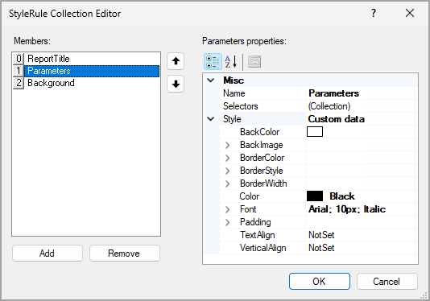

# Report Style: To Create and Apply a Style Template {#_887866d3-9518-42ca-aabf-88a761ec122c .task}

In the following activity, you will learn how to create a style template and apply it to a report.

**Attention:** This activity is based on the *U100* dataset. If you are using another dataset or if any system settings have been changed in *U100*, these changes can affect the workflow of the activity and the results of the processing. To avoid issues, restore the *U100* dataset to its initial state.

## Story { .section}

Suppose that you are a technical specialist in your company who is working on simple customizations. An accountant has asked you to implement the following new company standards for the reports in the **Payables** workspace:

-   Reports must have a light-blue background.
-   For report titles, the following font must be used:
    -   Type: Bold
    -   Style: Times New Roman
    -   Size: 12 px
    -   Color: Blue
-   For report parameters, the following font must be used:
    -   Type: Italic
    -   Style: Arial
    -   Size: 10 px
    -   Color: Black

You have decided to create a style template based on the new standards. Then you can apply this style template to the reports in the **Payables** workspace.

## Process Overview { .section}

In the Report Designer, you will create a style template. In a new report, in the **Appearance** &gt; **StyleSheet** property, you will create a collection of styles in line with the accountant's requirements. You will save the new report as `TemplateForPayables.rpx`. Then you will apply this style template to the `AP6325C1.RPX` report, which is a copy of the [AP Balance by Vendor](AP_63_25_00.md) \(AP632500\) report.

## System Preparation { .section}

Before you perform the steps of this activity, make sure that the following tasks have been performed:

1.  You have installed the Acumatica Report Designer, as described in [Report Designer: To Install the Acumatica Report Designer](../Shared/../UserGuide/RD_Getting_Started_Installing_RD_Activity.md).
2.  You have installed an Acumatica ERP instance with the *U100* dataset, or a system administrator has performed this task for you.
3.  You have signed in to Acumatica ERP as the system administrator by using the *gibbs* username and the *123* password.

    **Tip:** The *gibbs* user is assigned the *Administrator* role and the *Report Designer* role. Thus, this user has sufficient access rights to manage system configuration and to preview, save, and publish reports.

Also, to prepare the file that is intended for this activity, do the following:

1.  Download the `AP6325C1.rpx` file.
2.  Open the downloaded file in the Report Designer.
3.  On the Report Designer menu bar, select **File** &gt; **Save To Server**, which opens the **Save Report on Server** dialog box.
4.  In the dialog box, specify the connection string and sign-in credentials of your Acumatica ERP instance, type `AP6325C1` as the report name, and click **OK**.

    The report is saved on the server.

## Step 1: Creating a Style Template { .section}

To create a style template, do the following:

1.  In the Report Designer, click **File** &gt; **New** to create a file.
2.  In the Properties pane, to the right of the **Appearance** &gt; **StyleSheet** property, click the More button.
3.  In the StyleRule Collection Editor, which opens, click **Add**.

    A new member, `PX.Reports.Drawing.StyleRule`, is added to the **Members** pane.

4.  In the right pane, specify the properties of the new added member as follows:
    -   **Name**: Type `ReportTitle`.
    -   **Style**: Click the More button to open the Style Builder, click **Text** on the left, and specify the following settings:

        -   **Name**: *Times New Roman*
        -   **Size**: `12` *px*
        -   **Color**: *Blue*
        -   **Bold**: Selected
        Click **OK** to close the Style Builder.

5.  By repeating the actions of Instructions 3 and 4, add two more members in the StyleRule Collection Editor \(see the screenshot below\).

    For the member named `Parameters`, in the Style Builder, click **Text** on the left, and specify the following style settings:

    -   **Name**: *Arial*
    -   **Size**: `10` *px*
    -   **Color**: *Black*
    -   **Italic**: Selected
    For the member named `Background`, in the Style Builder, click **Background** on the left, and type `#EAF4F4` in the **Color** box.

    

6.  Click **OK** to close the StyleRule Collection Editor.
7.  Click **File** &gt; **Save To Server** to save the new style template on the server.
8.  In the **Save Report on Server** dialog box, which opens, specify the connection string and sign-in credentials of your Acumatica ERP instance, enter `TemplateForPayables.rpx` name as the report name, and click **OK**.

    The report is saved on the server.

## Step 2: Applying the Style Template to the Report { .section}

To apply the customized template to the *AP6325C1* report, do the following:

1.  In the Report Designer, open the *AP6325C1* report. \(You have saved this report to the server earlier.\)
2.  In the top left corner of the Design pane, click the  icon to select the report.
3.  On the **Properties** tab of the Properties pane, in the **Appearance** &gt; **StylesTemplate** property, type `TemplateForPayables.rpx`.
4.  Click the text box with the report title \(in the upper left of the report\), and in the **Appearance** &gt; **StyleName** property of the **Properties** pane, select *ReportTitle*, which is the name of the style that you have defined in the *TemplateForPayables* template.
5.  Select two text boxes below the box with the report title \(*Company/Branch:* and *=\[@OrgBAccountID\]*\) and three text boxes to the right of the report title \(*=Report.ExtToUI\('Batch.FinPeriodID', @PeriodID\)*, *=\[@VendorID\]*, *Include Applications*\), and in the **Appearance** &gt; **StyleName** property of the **Properties** tab, select *Parameters*. This is the name of the style that you have defined in the *TemplateForPayables* template.

    **Tip:** To select multiple text boxes, you first click one text box; you then press and hold the Ctrl key and click the rest of the text boxes.

6.  In the top left corner of the Design pane of Report Designer, click the  icon to select the report. On the **Properties** tab of the Properties pane, in the **Appearance** &gt; **StyleName** property, select *Background*, the name of the style that you have defined in the *TemplateForPayables* style template.
7.  On the Report Designer window toolbar, click **Save**.

## Step 3: Viewing the Report { .section}

To view the report, do the following:

1.  In Acumatica ERP, open the S150 Balance by Vendor \(AP6325C1\) report form by searching for its identifier.

    **Tip:** This report, which you have modified in this activity, has been published in the *U100* dataset. That is, it has been added to the [Site Map](SM_20_05_20.md) \(SM200520\) form, and you can access it in Acumatica ERP.

2.  In the **Financial Period** box of the **Report Parameters** tab, leave the default value or select *12-2025*.
3.  Click **Run Report**.

Make sure that the report has a light-blue background, the title has the Times New Roman blue bold font \(with a size of 12 pixels\), and the report parameters have the Arial black italic font \(with a size of 10 pixels\). Notice that elements in the report may overlap because you have not selected styles from the applied style template for all elements of the report. The following screenshot shows the report with the applied *TemplateForPayables* style template.

 report with the new style template applied")

**Parent topic:**[Modifying the Report Style](../UserGuide/RD_Report_Style_Mapref.md)

