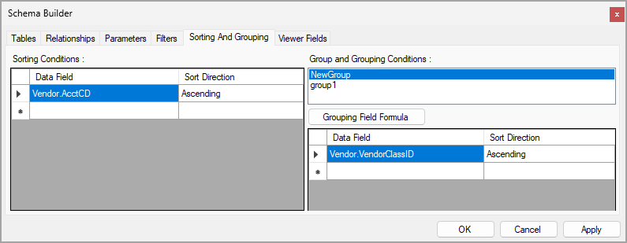

# Data Sorting and Grouping: To Specify a Data Group in a Report {#_845deb53-2186-4539-9e74-9d0918a73f71 .task}

In the following activity, you will specify a data group in a report.

**Attention:** This activity is based on the *U100* dataset. If you are using another dataset or if any system settings have been changed in *U100*, these changes can affect the workflow of the activity and the results of the processing. To avoid issues, restore the *U100* dataset to its initial state.

## Story { .section}

Suppose that you are a technical specialist in your company who is working on customizations. A sales manager of your company has requested a report that displays data about vendors. You have offered the predefined [Vendor Summary](AP_65_50_00.md) \(AP655000\) report, but the sales manager wants the data to be grouped by vendor class. The sales manager has also asked you to display the total balance for each group. You will create the requested report by using a copy of the [Vendor Summary](AP_65_50_00.md) report.

## Process Overview { .section}

In the Report Designer, you will open the `AP6550C1.RPX` report, which is a copy of the [Vendor Summary](AP_65_50_00.md) \(AP655000\) report, and add a new group. You will specify a grouping condition and other properties for the new group. You will then modify the report layout and place necessary elements in the new group. Then in the Schema Builder, on the **Sorting and Grouping** tab, you will review the changes that you have made on the **Properties** tab of the Properties pane.

## System Preparation { .section}

Before you perform the steps of this activity, make sure that the following tasks have been performed:

1.  You have installed the Acumatica Report Designer, as described in [Report Designer: To Install the Acumatica Report Designer](../Shared/../UserGuide/RD_Getting_Started_Installing_RD_Activity.md).
2.  You have installed an Acumatica ERP instance with the *U100* dataset, or a system administrator has performed this task for you.
3.  You have signed in to Acumatica ERP as the system administrator by using the *gibbs* username and the *123* password.

    **Tip:** The *gibbs* user is assigned the *Administrator* role and the *Report Designer* role. Thus, this user has sufficient access rights to manage system configuration and to preview, save, and publish reports.

Also, to prepare for use the file that is intended for this activity, do the following:

1.  Download the `AP6550C1.rpx` file.
2.  Open the downloaded file in the Report Designer.
3.  On the Report Designer menu bar, select **File** &gt; **Save To Server**, which opens the **Save Report on Server** dialog box.
4.  In the dialog box, specify the connection string and sign-in credentials of your Acumatica ERP instance, type `AP6550C1` as the report name, and click **OK**.

    The report is saved on the server.

## Step 1: Creating a Group in the Report { .section}

To create the group in the *AP6550C1* report, perform the following steps:

1.  In the Report Designer, make sure that the *AP6550C1* report \(which you have saved to the server\) is open.
2.  In the top left corner of the Design pane, click the  icon to select the whole report as an object.
3.  On the **Properties** tab of the Properties pane, in the **Data** &gt; **Groups** property, click the More button.
4.  In the Group Collection Editor, which opens, in the **Members** pane on the left, click **Add**.

    A new group with the default `group2` name is added and displayed in the **Members** pane.

5.  Click **OK** to save the new group and close the Group Collection Editor.

On the report layout, notice that the new group is placed inside the existing `group1`.

## Step 2: Specifying the Properties of the Group { .section}

To specify the group properties, while you are still working with the *AP6550C1* report in the Report Designer, do the following:

1.  In the top left corner of the Report Designer screen, click the  icon to select the whole report as an object.
2.  On the **Properties** tab of the Properties pane, in the **Data** &gt; **Groups** property, click the More button.
3.  In the Group Collection Editor, which opens, in the **Members** pane, select `group2`.
4.  To the right of the **Members** pane, click the button with the arrow pointing upward to place `group2` at the top of the list.

    The order of the groups in the Group Collection Editor defines the order of groups in the report.

5.  In the **group2 properties** pane on the right side of the Group Collection Editor, in the **Design** &gt; **\(Name\)** property, type `NewGroup`.
6.  Select the **Behavior** &gt; **Grouping** property, and click the More button.
7.  In the GroupExp Collection Editor, which opens, in the **Members** pane, click **Add**.
8.  In the **PX.Reports.GroupExp** properties pane, in the **Misc** &gt; **DataField** property, type `Vendor.VendorClassID` to specify the grouping condition based on the class of a vendor.

    **Tip:** By clicking the More button to the right of the **Misc** &gt; **DataField** collection, you can invoke the Expression Editor. In the left pane, you can select the necessary field from the list.

    Notice that the **Misc** &gt; **SortOrder** property has the *Ascending* value, which means that by default, the data in the group is sorted in ascending order.

9.  Click **OK** to save your changes and close the GroupExp Collection Editor.
10. Click **OK** to close the Group Collection Editor.

## Step 3: Placing Elements in the New Group { .section}

To place elements in the new group, while you are still working with the *AP6550C1* report in the Report Designer, do the following:

1.  In the Design pane of Report Designer, in the `pageHeaderSection2` section, select the text box with the `Class` value and move it to the `groupHeaderSection2 (Header of NewGroup)` section \(to the left\).
2.  In the `groupHeaderSection1 (Header of group1)` section, select the text box with the `=[Vendor.VendorClassID]` value, and move it to the `groupHeaderSection2 (Header of NewGroup)` section, to the right of the text box with the `Class` value.

    **Tip:** If values are not displayed in the text boxes, you can enlarge the height of the text boxes. Alternatively, you can view values in the **Appearance** &gt; **Value** property of the text boxes.

3.  Adjust the height of the `groupHeaderSection2 (Header of NewGroup)` section to be the same as the height of the text boxes in the section.

    **Tip:** You can also adjust the height of the `groupHeaderSection2 (Header of NewGroup)` section on the **Properties** tab of the Properties pane. Select *groupHeaderSection2 \(Header of NewGroup\)*, and for the **Appearance** &gt; **Height** property, type the value as follows: `20px`.

4.  In the `groupHeaderSection1 (Header of group1)` section, copy the text box with the following value: `=sum([APHistory.FinYtdBalance])` \(this is the second element from the right\). Paste the text box in the `groupFooterSection2 (Footer of NewGroup)` section, in the column with the `Current Balance` title \(see `pageHeaderSection2`\). This element will display the total balance for the members of the `NewGroup` group.
5.  In the `groupHeaderSection1 (Header of group1)` section, copy the text box with the following value: `=[BAccount.BaseCuryID]` \(this is the rightmost element\). Paste the text box in the `groupFooterSection2 (Footer of NewGroup)` section, in the column with the `Balance Currency` title \(see `pageHeaderSection2`\). This element will display the currency name of the total balance for the members of the `NewGroup` group.
6.  Adjust the height of the `groupFooterSection2 (Footer of NewGroup)` section to be the same as the height of the text boxes in the section.
7.  On the Report Designer window toolbar, click **Save**.
8.  Click the **Preview** tab to preview the report.

    Make sure that the data of one group is displayed.

## Step 4: Reviewing the Sorting and Grouping Settings in the Schema Builder { .section}

While you are still working with the *AP6550C1* report in the Report Designer, in the Report Designer, click **File** &gt; **Build Schema**. In the Schema Builder, which opens, go to the **Sorting and Grouping** tab. Make sure that the settings on this tab are the same as those that you have specified in the Properties pane of the Report Designer. The settings are shown in the following screenshot.

## Step 5: Viewing the Report { .section}

In Acumatica ERP, open the S150 Vendor Summary \(AP6550C1\) report form by searching for its identifier.

**Tip:** This report, which you have modified in this activity, has been published in the *U100* dataset. That is, it has been added to the [Site Map](SM_20_05_20.md) \(SM200520\) form, and you can access it in Acumatica ERP.

On the report form toolbar, click **Run Report**. Notice that the data in the report is grouped by vendor class and that a total balance is displayed for each class. The following screenshot shows the report.

 report, with data grouped by vendor class")

**Parent topic:**[Sorting and Grouping Data](../UserGuide/RD_Sorting_and_Grouping_Mapref.md)

