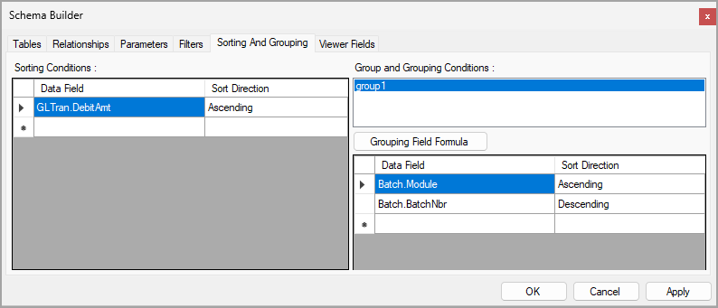

# Data Sorting and Grouping: To Specify Sorting Conditions {#_e47458b2-5469-40f9-982c-f632f01956c6 .task}

In the following activity, you will specify the sort order for the data in a report.

**Attention:** This activity is based on the *U100* dataset. If you are using another dataset or if any system settings have been changed in *U100*, these changes can affect the workflow of the activity and the results of the processing. To avoid issues, restore the *U100* dataset to its initial state.

## Story {#section_krh_4db_2fc .section}

Suppose that you are a technical specialist in your company who is working on customizations. An accountant of your company has requested a report that displays the AP batch register. You have offered the predefined [AP Batch Register Detailed](AP_62_10_00.md) \(AP621000\) report, but the sales manager has requested that the data be sorted by batch number in descending order and by debit amount in ascending order.

## Process Overview {#section_lrh_4db_2fc .section}

In the Report Designer, you will open the `AP6210C1.RPX` report, which is a copy of the [AR Batch Register Detailed](AR_62_10_00.md) \(AP621000\) report. Then you will find the sections of the data for sorting. You will add the sorting condition for the data in the `detailSection1` section and change the sort order in the existing `group1` group. In the Schema Builder, on the **Sorting and Grouping** tab, you will review the changes that you have made on the **Properties** tab of the Properties pane.

## System Preparation {#section_mrh_4db_2fc .section}

Before you perform the steps of this activity, make sure that the following tasks have been performed:

1.  You have installed the Acumatica Report Designer, as described in [Report Designer: To Install the Acumatica Report Designer](../Shared/../UserGuide/RD_Getting_Started_Installing_RD_Activity.md).
2.  You have installed an Acumatica ERP instance with the *U100* dataset, or a system administrator has performed this task for you.
3.  You have signed in to Acumatica ERP as the system administrator by using the *gibbs* username and the *123* password.

    **Tip:** The *gibbs* user is assigned the *Administrator* role and the *Report Designer* role. Thus, this user has sufficient access rights to manage system configuration and to preview, save, and publish reports.

Also, to prepare for use the file that is intended for this activity, do the following:

1.  Download the `AP6210C1.rpx` file.
2.  Open the downloaded file in the Report Designer.
3.  On the Report Designer menu bar, select **File** &gt; **Save To Server**, which opens the **Save Report on Server** dialog box.
4.  In the dialog box, specify the connection string and sign-in credentials of your Acumatica ERP instance, type `AP6210C1` as the report name, and click **OK**.

    The report is saved on the server.

## Step 1 \(Optional\): Looking for the Report Sections of the Data for Sorting {#section_orh_4db_2fc .section}

This step is not required if you understand in which sections the data for sorting is located.

To find the sections in which the needed data—that is, the batch number and stock item description—is placed, do the following:

1.  In the Report Designer, make sure that the *AP6210C1* report \(which you have saved to the server\) is open.
2.  Select `groupHeaderSection1 (Header of group1)`, and in the **Appearance** &gt; **Style** &gt; **BackColor** property, select the light green color.
3.  Repeat the action described in the previous instruction and select the light yellow color for `detailSection1`.

    **Tip:** For each section, you can use any color that you prefer. The only requirement is that the color for each section must be different.

4.  In the Report Designer window toolbar, select **Save**.

    The report is saved on the server.

5.  In Acumatica ERP, open the S150 AP Batch Register Detailed \(AP6210C1\) report form by searching for its identifier.

    **Tip:** This report, which you have modified in this activity, has been published in the *U100* dataset. That is, it has been added to the [Site Map](SM_20_05_20.md) \(SM200520\) form, and you can access it in Acumatica ERP.

6.  On the **Report Parameters** tab, in the **From Period** box, select *01-2025*, and in the **To Period** box, select *12-2025*. In other boxes, leave the default values.
7.  On the report form toolbar, click **Run Report**.

    Notice that different sections of the report have different colors. The stock item description has a yellow background because it is located in `detailSection1`. The batch number has a green background because it is located in `group1`. Based on this information, you can make a conclusion about the sections in which you need to sort data. You will need to sort data in the `group1` group by batch number \(the *Batch.BatchNbr* field\) and in the `detailSection1` section by debit amount \(*GLTran.DebitAmt* field\).

## Step 2: Specifying the Sort Order for the Data Group {#section_rrh_4db_2fc .section}

To specify the sort order for the `group1` data group, do the following:

1.  While you are viewing the *AP6210C1* report in the Report Designer, in the top left corner of the Design pane, click the  icon.
2.  In the Properties pane, to the right of the **Data** &gt; **Groups** property, click the More button.
3.  In the Group Collection Editor, which opens with the only `group1` group selected in the **Members** pane, in the right pane \(**group1 properties**\), to the right of the **Behavior** &gt; **Grouping** property, click the More button.
4.  In the GroupExp Collection Editor, which opens, in the **Members** pane, select the second member \(its **Misc** &gt; **DataField** property is *Batch.BatchNbr*\). In the **Misc** &gt; **SortOrder** property, select *Descending*.
5.  Click **OK** to save your changes and close the GroupExp Collection Editor.
6.  Click **OK** to close the Group Collection Editor.

## Step 3: Specifying the Sort Order for the Report Data {#section_srh_4db_2fc .section}

To specify the sort order for the data in the report, while you are still working with the *AP6210C1* report in the Report Designer, do the following:

1.  In the top left corner of the Design pane, click the  icon to select the report.
2.  In the Properties pane, to the right of the **Data** &gt; **Sorting** property, click the More button.
3.  In the SortExp Collection Editor, which opens, click the **Add** button to add the new criteria for sorting.
4.  In the right pane of the SortExp Collection Editor, in the **Misc** &gt; **DataField** property, select *GLTran.DebitAmt*. This field will be used to sort the data in the report.
5.  In the **Misc** &gt; **SortOrder** property, make sure that the *Ascending* option is selected \(this is the default value\).
6.  Click **OK** to save your changes and close the SortExp Collection Editor.
7.  In the Report Designer window toolbar, click **Save**.

## Step 4: Reviewing the Sorting and Grouping Settings in the Schema Builder {#section_trh_4db_2fc .section}

While you are still working with the *AP6210C1* report in the Report Designer, click **File** &gt; **Build Schema**. In the Schema Builder, which opens, open the **Sorting And Grouping** tab. Make sure that the settings on this tab are the same as those that you have specified in the Properties pane of Report Designer. The settings in the Schema Builder are shown in the following screenshot.

## Step 5: Viewing the Report {#section_urh_4db_2fc .section}

To view the report, do the following:

1.  In Acumatica ERP, open the S150 AP Batch Register Detailed \(AP6210C1\) report form by searching for its identifier.

    **Tip:** The report that you have modified in this activity has been published in the *U100* dataset. That is, it has been added to the [Site Map](SM_20_05_20.md) \(SM200520\) form, and you can access it in Acumatica ERP.

2.  On the **Report Parameters** tab, in the **From Period** box, select *01-2026*, and in the **To Period** box, select *12-2026*. In other boxes, leave the default values.
3.  On the report form toolbar, click **Run Report**.

Make sure that the report is sorted by batch number in descending order \(see Item 1 in the following screenshot\), and by debit amount in each batch in ascending order \(Item 2\). The following screenshot displays one of the report pages.

 report")

**Parent topic:**[Sorting and Grouping Data](../UserGuide/RD_Sorting_and_Grouping_Mapref.md)

