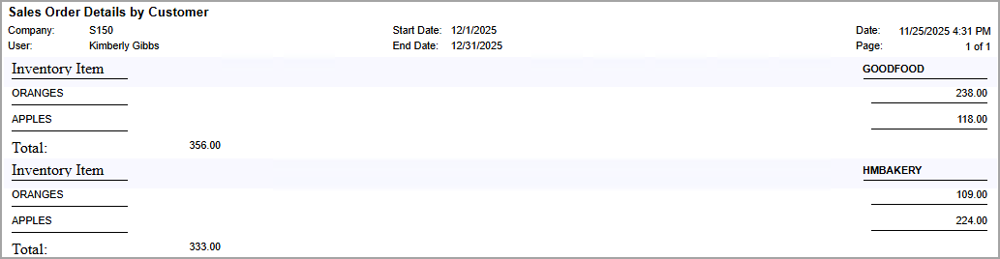
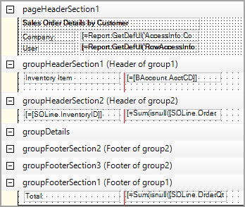

# Tabular Reports: To Create a Tabular Report {#_6f8991a4-fa7e-4c69-8e58-ca8cb8d95fb2 .task}

In the following activity, you will learn how to create a tabular report.

**Attention:** This activity is based on the *U100* dataset. If you are using another dataset or if any system settings have been changed in *U100*, these changes can affect the workflow of the activity and the results of the processing. To avoid issues, restore the *U100* dataset to its initial state.

## Story { .section}

Suppose that you are a technical specialist in your company who is working on simple customizations. A sales manager has requested a report that shows the quantity of inventory items ordered by customers. You have looked through the reports in the **Sales Orders** workspace and suggested that the manager use the [Sales Order Details by Customer](SO_61_10_00.md) \(SO611000\) report. The sales manager said that the requested report should give salespeople the ability to compare the quantities of inventory items for different customers—that is, to display the quantities of an inventory item for different customers in the same row, with a separate row for each inventory item.

## Process Overview { .section}

In the Report Designer, you will open the `SO6110C1.RPX` report, which is a copy of the [Sales Order Details by Customer](SO_61_10_00.md) \(SO611000\) report, and modify the copy to make the report a tabular one. You will change the grouping conditions for the data in the report, and delete the groups and text boxes that you do not need from the report layout. \(You will not make any modifications in the Schema Builder.\)

## System Preparation { .section}

Before you perform the steps of this activity, make sure that the following tasks have been performed:

1.  You have installed the Acumatica Report Designer, as described in [Report Designer: To Install the Acumatica Report Designer](../Shared/../UserGuide/RD_Getting_Started_Installing_RD_Activity.md).
2.  You have installed an Acumatica ERP instance with the *U100* dataset, or a system administrator has performed this task for you.
3.  You have signed in to Acumatica ERP as the system administrator by using the *gibbs* username and the *123* password.

    **Tip:** The *gibbs* user is assigned the *Administrator* role and the *Report Designer* role. Thus, this user has sufficient access rights to manage system configuration and to preview, save, and publish reports.

Also, to prepare for use the file that is intended for this activity, do the following:

1.  Download the `SO6110C1.rpx` file.
2.  Open the downloaded file in the Report Designer.
3.  On the Report Designer menu bar, select **File** &gt; **Save To Server**, which opens the **Save Report on Server** dialog box.
4.  In the dialog box, specify the connection string and sign-in credentials of your Acumatica ERP instance, type `SO6110C1` as the report name, and click **OK**.

    The report is saved on the server.

## Step 1: Changing the Grouping Conditions for the Report { .section}

Because the data in the report should display the quantities of inventory items for different customers, you need to group data in the report by inventory item and by customer. That is, you need to change the grouping conditions for the report.

Do the following:

1.  In the Report Designer, make sure that the *SO6110C1* report \(which you have saved to the server\) is open.
2.  In the top left corner of the Design pane of the Report Designer, click the  icon to select the report; then in the **Data** &gt; **Groups** property, click the More button.
3.  In the Group Collection Editor, which opens, in the **Members** pane, select `group1`.
4.  In the **group1 properties** pane on the right side of the Group Collection Editor, in the **Behavior** &gt; **Grouping** property, click the More button.
5.  In the GroupExp Collection Editor, which opens, in the **Members** pane, select the second **PX.Reports.GroupExp** member. For this member, in the right pane, the **Misc** &gt; **DataField** property is set to **BAccount.AcctName**. Click **Remove** to delete this member.
6.  Click **OK** to close the GroupExp Collection Editor.
7.  In the Group Collection Editor, in the **Members** pane, select `group2`.
8.  In the **group2 properties** pane on the right side of the Group Collection Editor, in the **Behavior** &gt; **Grouping** property, click the More button.
9.  In the GroupExp Collection Editor, which opens, on the right pane, for the **Misc** &gt; **DataField** property, type `SOLine.InventoryID`.
10. Click **OK** to close the GroupExp Collection Editor.
11. Click **OK** to close the Group Collection Editor.
12. On the Report Designer window toolbar, click **Save**.

## Step 2: Modifying the Report Layout { .section}

To modify the report layout, while you are still working with the *SO6110C1* report in the Report Designer, do the following:

1.  Select the `pageHeaderSection2` section, and in the context menu, click **Delete** to delete this section.
2.  In `groupHeaderSection1 (Header of group1)`, delete the text box with the `=[BAccount.AcctName]` value and all the text boxes to the right of this text box.
3.  Move the text box with the `=[BAccount.AcctCD]` value to the right.
4.  From the Tools pane, drag the *TextBox* element to the left side of the `groupHeaderSection1 (Header of group1)` section, and type `Inventory Item` for the **Appearance** &gt; **Value** property of the added text box.
5.  Select the `groupHeaderSection3 (Header of group1)` section, and in the context menu, click **Delete** to delete this section.
6.  Select `groupHeaderSection2 (Header of group2)`, and for its **Behavior** &gt; **Visible** property, set the *True* value to make the content of the section visible.
7.  In `groupDetails`, select the text box with the `=[SOLine.InventoryID]` value, copy it, and paste it on the left side of the `groupHeaderSection2 (Header of group2)` section below the text box with the `Inventory Item` value in `groupHeaderSection1 (Header of group1)`.
8.  In `groupFooterSection2 (Footer of group2)`, select the text box with the `=Sum(isnull([SOLine.OrderQty]*-[SOLine.InvtMult],0))` value, copy it, and paste it to `groupHeaderSection2 (Header of group2)`, below the text box with the `=[BAccount.AcctCD]` value in `groupHeaderSection1 (Header of group1)`.
9.  On the left side of `groupFooterSection1 (Footer of group1)`, add a text box with the `Total:` value.

    **Tip:** You can set the value of the **Appearance** &gt; **Height** property of this section to `20px`.

10. In `groupFooterSection2 (Footer of group2)`, select the text box with the `=Sum(isnull([SOLine.OrderQty]*-[SOLine.InvtMult],0))` value, and copy and paste it to `groupFooterSection1 (Footer of group1)`, to the right of the text box with the `Total:` value.
11. In `groupFooterSection2 (Footer of group2)`, delete all the elements.
12. In `groupDetails`, delete all the elements.
13. Reduce the height of `groupDetails`, `groupFooterSection2 (Footer of group2)`, and `groupFooterSection3 (Footer of group2)` as much as you can.

    **Tip:** You can set the value of the **Appearance** &gt; **Height** property of these sections to `0px`.

14. Optional: To improve the readability of the report, place four horizontal line elements in the following positions:
    -   In `groupHeaderSection1 (Header of group1)`, below the text box with the `Inventory Item` value
    -   In `groupHeaderSection1 (Header of group1)`, below the text box with the `=[BAccount.AcctCD]` value
    -   In `groupHeaderSection2 (Header of group2)`, below the text box with the `=[SOLine.InventoryID]` value
    -   In `groupHeaderSection2 (Header of group2)`, below the text box with the `=Sum(isnull([SOLine.OrderQty]*-[SOLine.InvtMult],0))` value
15. On the Report Designer window toolbar, click **Save**.
16. View the report \(by following instructions similar to those in *Step 4: Viewing the Report* below\) to make sure that you have modified the report layout correctly. See the following screenshot for reference.

    **Tip:** Viewing the report before you make it a tabular one will ease troubleshooting.

    

## Step 3: Specifying the Properties of the Report and Its Elements { .section}

To specify the properties of the report and its elements, while you are still working with the *SO6110C1* report in the Report Designer, do the following:

1.  In the top left corner of the Design pane of the Report Designer, click the  icon to select the report. In the **Behavior** &gt; **TabularReport** property, select *True* to make the report a tabular one.
2.  In the **Behavior** &gt; **TabularFreeze** property, type `150px`.

    A red vertical line is displayed in the report. To the right of the red line, the customers and the quantity of ordered items will be displayed in the generated report. Make sure that no element crosses the red line.

3.  Move the text box with the `=[BAccount.AcctCD]` value \(in `groupHeaderSection1 (Header of group1)`\) and the text box with the `=Sum(isnull([SOLine.OrderQty]*-[SOLine.InvtMult],0))` value \(in `groupHeaderSection2 (Header of group2)`\) so that they are located next to the red line. Remove the horizontal lines that were located below these text boxes.
4.  In the top left corner of the Design pane of the Report Designer, click the  icon to select the report. In the **Layout** &gt; **Width** property, type `320px`.
5.  For a uniform alignment of elements in the report, in `groupHeaderSection2 (Header of group2)`, select the text box with the `=Sum(isnull([SOLine.OrderQty]*-[SOLine.InvtMult],0))` value, and for its **Appearance** &gt; **Style** &gt; **TextAlign** property, select *NotSet*. Repeat the same action for the text box with the same value in the `groupFooterSection1 (Footer of group1)` section.
6.  On the Report Designer window toolbar, click **Save**.

The report in design mode is shown in the following screenshot.

## Step 4: Viewing the Report { .section}

To view the report, do the following:

1.  In Acumatica ERP, open the S150 Sales Order Details by Customer \(SO6110C1\) report form by searching for its identifier.

    **Tip:** This report, which you have modified in this activity, has been published in the *U100* dataset. That is, it has been added to the [Site Map](SM_20_05_20.md) \(SM200520\) form, and you can access it in Acumatica ERP.

2.  On the **Report Parameters** tab, select *11/1/2025* in the **Start Date** box, and select *1/28/2026* in the **End Date** box.
3.  On the report form toolbar, click **Run Report**.

Make sure that the report displays data for all customers and that the data about the quantity of orders for each customer is displayed in a separate column. \(You can compare the lists of customers in the *SO6110C1* and *SO611000* reports with the same name.\) The resulting report is shown in the following screenshot.

 tabular report")

**Parent topic:**[Developing Tabular Reports](../UserGuide/RD_Tabular_Reports_Mapref.md)

